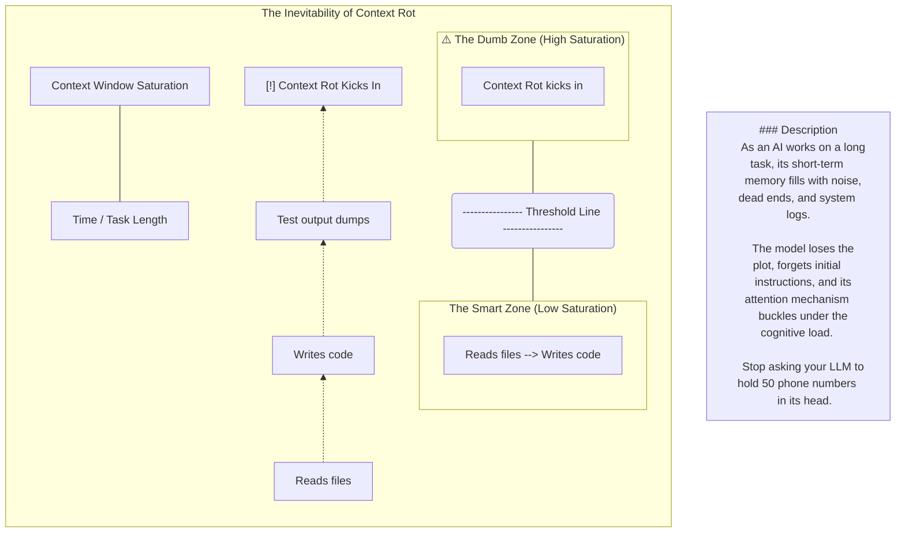
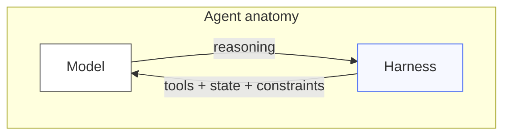
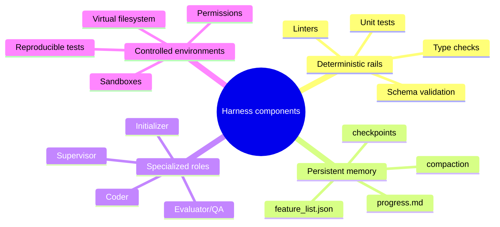

# Harness Engineering: Building the Operating System for Autonomous Agents



For years, the industry viewed Artificial Intelligence as a standalone “oracle” — a magic brain in a dark box where you slide a question under the door and receive a brilliant answer. This approach worked for simple queries, but it fails in the face of complex, long-running production tasks. We are currently witnessing a strategic shift: we no longer treat AI as a solitary entity, but as an industrial-grade “engine” that requires a structural “chassis” to function. This chassis is the Harness.

Why “just prompting” isn’t enough — and how to build the infrastructure that makes AI agents reliable

There is a moment every AI engineer recognises. You’ve built a demo that works beautifully. The model reasons through your problem, uses its tools, and produces the right answer. You show it to stakeholders. Everyone is excited. Then you deploy it to production, and within 48 hours it:

- Approves a claim it should have denied
- Loops through the same tool call twelve times and burns $40 in API costs
- Returns a perfectly formatted JSON response that quietly omits the most important field
- Runs for six minutes on a task that should take thirty seconds, then times out

> **Typical production failure modes (harness symptoms)**
>
> | Symptom | What it looks like | What it usually means |
> |---|---|---|
> | Silent schema drift | Output “looks right” but misses a critical field | No deterministic validation gate |
> | Runaway loops | Repeats the same tool call | Missing loop detection / budgets |
> | Hallucinated completion | Claims “done” without artifacts | No verification rails / state checks |
> | Context rot | Gets worse over time | No compaction + external state |

This is not a model problem. It’s an infrastructure problem. And the field building the infrastructure to fix it has a name: harness engineering.

```mermaid
flowchart LR
  U[User request] --> H[Harness (OS layer)]
  H --> M[Model (reasoning engine)]
  M --> H
  H -->|tools + constraints + validation| O[Outputs / actions]
  H -->|logs + budgets + HITL| G[Governance]
```

Struggling to make AI systems reliable and consistent? Many teams face the same problem. A powerful LLM gives great results, but a cheaper model often fails on the same task. This makes production systems hard to scale. Harness engineering offers a solution. Instead of changing the model, you build a system around it. We use prompts, tools, middleware, and evaluation to guide the model toward reliable outputs.

In a production environment, the model is simply the raw material; the harness is the Operating System that manages resource allocation, state, and process management.

## What is Harness Engineering?

A harness is the layer of code that surrounds an AI agent — intercepting its calls, enforcing constraints, injecting memory, coordinating sub-agents, and controlling when humans need to step in. It is, deliberately, invisible to the model. The model continues to reason and use tools as it always would. The harness silently guarantees that what the model can do is bounded by what it should do.

Think of it like the safety systems in a modern aircraft. The pilots (model) still fly the plane. But fly-by-wire systems, envelope protection, and automated alerts mean that even if a pilot makes an error, the aircraft won’t enter an aerodynamic regime that kills everyone on board. The harness is your fly-by-wire.

The core insight is this:

The model is a reasoning engine. The harness is an engineering system. They are different responsibilities, and conflating them is the source of most production AI failures.

While the AI model is the “engine,” the harness is the “rest of the car” — the steering, brakes, lane boundaries, and maintenance schedules that keep the system on track.

Harness engineering focuses on building a structured system around an LLM to improve reliability. Instead of changing the models, you control the environments in which they operate. A harness includes a system prompt, tools or APIs, a testing setup, and middleware that guides the model’s behavior. The goal is to improve task success and manage costs while using the same underlying model.



The cleanest one-line formulation, from LangChain’s anatomy breakdown:

Agent = Model + Harness If you’re not the model, you’re the harness.

A harness is every piece of code, configuration, and execution logic that is not the model itself. A raw model is not an agent. It becomes one when a harness gives it state, tool execution, feedback loops, and enforceable constraints.

OpenAI’s Codex team coined the term “harness engineering” in early 2026 after shipping a million-line production application without a single line of human-written code. Engineers stopped writing code and started designing the system that let agents write code reliably. Similar patterns emerged at Anthropic, Stripe, and other engineering-led organizations: when agents made mistakes, engineers stopped patching outputs and started engineering the system so the mistake could not recur.

A comprehensive harness consists of several integrated components:

- **Deterministic Rails and Validation**: Unlike prompts, which are non-deterministic (variable), harnesses use rigid, unchanging software tests — such as linters, type checkers, and unit tests — to physically block an agent from completing a task until its output is verified.
- **Persistent External Memory**: Harnesses solve the problem of “digital amnesia” by externalizing memory into persistent markdown or JSON files (e.g., `progress.md` or `feature_list.json`). This allows the agent to reset its context window after every small task to stay in the "smart zone" and avoid context rot.
- **Specialized Agent Roles**: Instead of one general-purpose brain, the harness orchestrates a swarm of specialized sub-agents (like Initializers, Coders, and Evaluators) that operate in short, controlled bursts.
- **Controlled Environments**: Harnesses deploy agents in secure sandboxes or virtual file systems where they can safely execute code, reproduce bugs, and run end-to-end tests.



A harness is every piece of code, configuration, and execution logic that isn’t the model itself. A raw model is not an agent. But it becomes one when a harness gives it things like state, tool execution, feedback loops, and enforceable constraints.

Concretely, a harness includes things like:

- System Prompts
- Tools, Skills, MCPs + and their descriptions
- Bundled Infrastructure (filesystem, sandbox, browser)
- Orchestration Logic (subagent spawning, handoffs, model routing)
- Hooks/Middleware for deterministic execution (compaction, continuation, lint checks)
An agent harness is the software infrastructure and orchestration layer that wraps around an AI model to transform it from a “naked” engine into a reliable, autonomous system. Rather than relying solely on the raw intelligence of a model, harness engineering focuses on designing an environment of constraints, tools, and feedback loops that keep long-running agents on track.

```mermaid
flowchart TB
  subgraph Harness["Harness control surface (examples)"]
    P[System prompt / policies]
    T[Tools + schemas]
    FS[Virtual filesystem / state]
    MW[Middleware (budgets, loops, verification)]
    ORCH[Orchestration (sub-agents, routing)]
    OBS[Observability (logs/telemetry)]
    HITL[Human-in-the-loop gates]
  end
  P --> ORCH --> MW --> T --> FS
  OBS -.-> ORCH
  HITL -.-> ORCH
```

## From Source

The core components of a comprehensive agent harness include:

### 1. Multi-Agent Orchestration

A robust harness often breaks down complex workflows by delegating tasks to a team of specialized agents rather than a single general-purpose model:

- **Initializer Agent**: This agent sets up the workspace, defines the project’s technical environment, and creates a master “blueprint” or feature list.
- **Task/Coding Agent**: Executes the specific work in incremental steps, often operating in a loop to maintain focus on one feature at a time.
- **Evaluator or QA Agent**: Acts as an adversarial judge, using a dedicated system prompt to skeptically review the output of the generator agent and provide feedback for iteration.
- **Supervisor/Orchestrator**: Coordinates the overall plan and handles the handoffs between different specialized agents.

### 2. Deterministic Rails and Validation

To prevent “hallucinated completion” — where an agent falsely claims a task is done — harnesses use deterministic rails to force reliability:

Automated Testing Gates: The harness subjects agent output to rigid, non-AI tests such as linters, type checkers, and unit tests. The agent is physically blocked from marking a task as complete until it passes these tests.
Validation Loops: If a test fails, the harness automatically feeds the error back to the agent, forcing it to iterate and self-correct until the logic is verified.
Human-in-the-Loop (HITL): Strategic “interrupt points” allow humans to approve high-stakes actions, provide guidance during complex phases, or act as a final “veto” authority.

### 3. Persistent Memory and Context Management

Harnesses solve the problem of “context rot” (where a model gets overwhelmed by noise) by externalizing memory:

External State Files: Instead of relying on the model’s internal short-term memory, the harness stores progress in persistent markdown or JSON files (e.g., progress.md, todo.json, or a claude.md file).
Progressive Disclosure: Rather than dumping an entire codebase into the prompt, the harness provides a “map” or table of contents (like an agents.md file) that allows the agent to retrieve deeper documentation only when needed.
Context Compaction and Resets: To keep the “smart zone” of the context window clear, the harness periodically summarizes long conversations or starts fresh sessions with only the most critical state carried forward.

### 4. Tooling and Environment Control

The harness dictates exactly what the agent can see and do within a controlled digital workspace:

Skill Libraries: These are sets of domain-specific instructions and tools (e.g., a “legal research” skill or an “Excel modeling” skill) that the agent activates only when relevant.
Sandboxes: Isolated, secure execution environments where the agent can run code, reproductive bugs, and validate fixes without risking the main system.
Git Integration: Using git commits and logs as a core part of memory, providing a traceable history that allows agents to resume work from a clean state.
Observability: Built-in logging and telemetry (like the Chrome DevTools protocol) allow agents to “see” the results of their actions in a structured way, such as inspecting DOM snapshots or network traffic.
Here I have tried to attempt a POC Auto Insurance Claims Processing using LangChain’s DeepAgents library.

DeepAgents acts as an agent harness with built-in capabilities such as task planning, an in-memory virtual file system, and sub-agent spawning. These features will help structure the agent’s workflow and make it more reliable.

The POC: Auto Insurance Claims Processing

```mermaid
flowchart LR
  C[Claim payload] --> ORCH[Orchestrator]
  ORCH --> MW[Middleware stack]
  MW -->|delegate| P[Policy agent]
  MW -->|delegate| F[Fraud agent]
  MW -->|delegate| D[Damage agent]
  P --> ORCH
  F --> ORCH
  D --> ORCH
  ORCH --> V[Verification rules]
  V -->|pass| DEC[Decision artifact (JSON)]
  V -->|fail| ORCH
  ORCH -->|threshold crossed| HITL[Human approval gate]
```

## The Seven Pillars of a Production Harness

### 1. Memory — Injecting Durable Knowledge

Models are stateless. Every session starts fresh. But your domain has rules, conventions, and institutional knowledge that cannot live in model weights alone.

The solution is AGENTS.md — a structured document injected into the agent’s system prompt at session start. It is the agent’s “employee handbook”: workflows, thresholds, coverage rules, fraud indicators, output schemas.

## Routing Thresholds (Harness-Enforced Guardrails)

| Condition                            | Action                                |
|--------------------------------------|---------------------------------------|
| Settlement ≤ $15,000 AND fraud < 0.4 | Auto-approve; generate payout order   |
| Settlement > $15,000                 | Escalate to human adjuster            |
| fraud_score ≥ 0.7                    | Suspend claim; mandatory human review |
| Coverage inactive / lapsed           | Deny claim; notify policyholder       |
This is not fine-tuning. It is cheaper, faster, and more auditable than fine-tuning. When the rule changes, you update a markdown file — not a training run.

### 2. Virtual Filesystem — State That Outlasts the Context Window

Long-running tasks eventually exceed the context window. Without intervention, the agent loses its work and starts over. The solution is a virtual filesystem — a persistent store where the agent writes its intermediate state after every major step.

```python
@tool
def persist_claim_state(claim_id: str, state_json: str,
                        filename: str = "state.json") -> str:
    path = f"claims/{claim_id}/{filename}"
    _filesystem.write(path, state_json)
    return json.dumps({"status": "persisted", "path": path})
```

This is the harness analogue of a database transaction log. If the session is interrupted — by a timeout, a crash, or a context compaction event — the next session reads the progress file and resumes from the last checkpoint. The model never has to start from scratch.

### 3. Middleware — Intercepting Every Model Call

This is where harness engineering gets powerful. A middleware stack wraps every model invocation, giving engineers four distinct control points:

```text
User Request
     │
     ▼
ObservabilityMiddleware   ← logs every call (latency, tokens, tool names)
     │
     ▼
CallBudgetMiddleware      ← fails fast if call/token limits exceeded
     │
     ▼
LoopDetectionMiddleware   ← injects intervention if agent is cycling
     │
     ▼
ClaimsVerificationMiddleware ← validates output against domain rules
     │
     ▼
   Model
```

Each middleware is a class implementing wrap_model_call:

```python
class CallBudgetMiddleware(AgentMiddleware):
    def wrap_model_call(self, request, handler):
        claim_id = _extract_claim_id(request.messages)
        state = _budget_state.setdefault(claim_id, _BudgetState())
        state.call_count += 1

        if state.call_count > MAX_CALLS_PER_CLAIM:
            raise BudgetExceededError(
                f"Claim {claim_id} exceeded the {MAX_CALLS_PER_CLAIM}-call limit."
            )

        response = handler(request)
        # ... token counting
        return response
```

### 4. Loop Detection — Stopping Runaway Agents

Left unchecked, an agent that gets confused will call the same tool with the same arguments repeatedly, burning tokens until the budget runs out. Loop detection watches a sliding window of recent tool calls:

```python
class LoopDetectionMiddleware(AgentMiddleware):
    def wrap_model_call(self, request, handler):
        # Track tool call fingerprints in a sliding window
        for msg in request.messages[-4:]:
            for tc in getattr(msg, "tool_calls", []):
                arg_fingerprint = json.dumps(tc.get("args", {}))[:80]
                history.append(f"{tc['name']}::{arg_fingerprint}")

        # If the same call appears 3+ times in the last 6 steps → inject intervention
        if count >= LOOP_THRESHOLD:
            intervention = SystemMessage(content=(
                f"[HARNESS] You have called '{tool_name}' {count} times "
                "with similar arguments. Stop and reconsider your approach."
            ))
            request.messages.append(intervention)
```

The harness does not kill the agent. It injects a reconsideration prompt that gives the model a chance to self-correct before the budget is cut.

### 5. Sub-Agent Delegation — Isolation as a Feature

A single monolithic agent that handles fraud detection, policy verification, and damage assessment simultaneously is fragile. Context bleeds between concerns. A high fraud score might subtly bias the model’s damage estimate. A lapsed policy might cause the model to skip steps.

The harness enforces principle of least authority by spinning up isolated sub-agents:

```text
Orchestrator
   ├── PolicyVerificationAgent  (tools: check_policy_status, verify_incident_coverage)
   ├── FraudDetectionAgent      (tools: score_fraud_indicators, check_prior_claims_pattern)
   └── DamageAssessmentAgent    (tools: validate_repair_estimate, generate_repair_line_items)
```

Each sub-agent has only the tools it needs. The fraud agent cannot see the damage estimate. The damage agent cannot see the fraud score. Context contamination is architecturally impossible, not just unlikely.

### 6. Verification Middleware — Domain Rules the Model Cannot Break

The most powerful layer. After every model response containing a structured decision, the harness runs a suite of domain rule checkers. If any rule is violated, the response is rejected and the model receives structured feedback to self-correct:

```python
@claim_rule
def rule_lapsed_policy_must_be_denied(claim, policy, response_text):
    if policy.get("premium_status") == "lapsed":
        if '"status": "approved"' in response_text:
            return ["Policy is lapsed. Status must be 'denied'."]
    return []
```

The model literally cannot return an approved decision for a lapsed policy. Not because it was trained not to — but because the harness intercepts and rejects any response that tries.

### 7. Human-in-the-Loop — Knowing When to Pause

Some decisions should never be made by an AI alone. The harness uses interrupt_on to define exact tool calls that pause execution and route to a human:

```python
return create_deep_agent(
    model=MODEL,
    tools=[...],
    middleware=MIDDLEWARE_STACK,
    interrupt_on={"request_human_approval": True},
)
```

The model is instructed to call request_human_approval when settlement exceeds $15,000 or fraud score reaches 0.7. The harness intercepts that tool call and blocks until a human adjuster responds. The model cannot bypass this gate — it has no awareness that the gate exists.

To make these concepts concrete, we built an auto insurance claims processing POC using deepagents and Qwen3–32B via Groq. Four demo claims test every harness component:

| Claim         | Scenario                  | What it stress-tests                                   |
|---------------|---------------------------|--------------------------------------------------------|
| CLM-2024–8821 | Clean collision           | Baseline correctness + computed fraud score            |
| CLM-2024–9103 | High-value Tesla          | HITL escalation (`interrupt_on`)                       |
| CLM-2024–9250 | Suspicious single-vehicle | Deterministic fraud scoring + sub-agent isolation      |
| CLM-2024–9310 | Lapsed policy             | Hard denial via policy check + verification middleware |

The architecture:

```text
python main.py --claim CLM-2024-8821
HARNESS COMPONENTS ACTIVE:
  ✓ AGENTS.md              — domain knowledge injected at session start
  ✓ write_todos            — planning before execution
  ✓ Virtual filesystem     — durable state outside context window
  ✓ ObservabilityMiddleware— every call logged (structured JSON)
  ✓ CallBudgetMiddleware   — max 40 calls / 80k tokens per claim
  ✓ LoopDetectionMiddleware— detects and interrupts repetitive patterns
  ✓ ClaimsVerificationMiddleware — domain rule enforcement on outputs
  ✓ Sub-agent delegation   — Policy / Fraud / Damage agents (isolated ctx)
  ✓ Human-in-the-loop      — interrupt_on=request_human_approval

The observability middleware emits structured JSON for every call — latency, token usage, tool names — ready to ship to any observability platform:

{
  "event": "model_call.complete",
  "claim_id": "CLM-2024-9250",
  "latency_ms": 23071,
  "input_tokens": 8038,
  "output_tokens": 2401,
  "tool_names": [
    "write_todos",
    "delegate_to_policy_agent",
    "delegate_to_damage_agent",
    "delegate_to_fraud_agent"
  ]
}
```

The below log shows a single run of the auto insurance POC processing claim CLM-2024–9103. Here’s what happened:

## Harness Engineering Analysis

### Session Header

Model : qwen/qwen3–32b
Claims : 1 (CLM-2024–9103)
The harness announces all active components before any model call — this is the harness declaring its control surface, not the model.

**Harness Components Banner**

- ✓ AGENTS.md — domain knowledge injected at session start
- ✓ write_todos — planning before execution
- ✓ Virtual filesystem — durable state outside context window
- ✓ ObservabilityMiddleware — every call logged (structured JSON)
- ✓ CallBudgetMiddleware — max 40 calls / 80k tokens per claim
- ✓ LoopDetectionMiddleware — detects and interrupts repetitive patterns
- ✓ ClaimsVerificationMiddleware — domain rule enforcement on outputs
- ✓ Sub-agent delegation — Policy / Fraud / Damage agents (isolated ctx)
- ✓ Human-in-the-loop — interrupt_on=[request_human_approval]
- ✓ Context compaction — automatic when window fills

This is the harness bootstrapping itself — the model knows none of this exists. Each component is a harness concern, invisible to Qwen.

```text
(harness_engineering) C:\Users\nayak\Documents\harness_engineering\auto_insurance_poc>python main.py  --claim CLM-2024-9103

══════════════════════════════════════════════════════════════════════
  AUTO INSURANCE CLAIMS — HARNESS ENGINEERING POC
  Model  : qwen/qwen3-32b
  Claims : 1
══════════════════════════════════════════════════════════════════════

HARNESS COMPONENTS ACTIVE:
  ✓ AGENTS.md              — domain knowledge injected at session start
  ✓ write_todos            — planning before execution
  ✓ Virtual filesystem     — durable state outside context window
  ✓ ObservabilityMiddleware— every call logged (structured JSON)
  ✓ CallBudgetMiddleware   — max 40 calls / 120k tokens per claim
  ✓ LoopDetectionMiddleware— detects and interrupts repetitive patterns
  ✓ ClaimsVerificationMiddleware — domain rule enforcement on outputs
  ✓ Sub-agent delegation   — Policy / Fraud / Damage agents (isolated ctx)
  ✓ Human-in-the-loop      — interrupt_on=[request_human_approval]
  ✓ Context compaction     — automatic when window fills

══════════════════════════════════════════════════════════════════════
  PROCESSING CLAIM: CLM-2024-9103
  Policy:    AUTO-2024-003  (Priya Nair)
  Vehicle:   2023 Tesla Model 3
  Incident:  COLLISION
  Estimate:  $24,500.00
══════════════════════════════════════════════════════════════════════
{"event": "model_call.start", "ts": 1774801691.2132409, "call_id": "CLM-2024-9103-91213", "claim_id": "CLM-2024-9103", "message_count": 1, "last_human_turn": "Process auto insurance claim CLM-2024-9103 for policy AUTO-2024-003.\n\nCLAIM DETAILS:\n{\n  \"claim_id\": \"CLM-2024-9103\",\n  \"policy_number\": \"AUTO-2024-003\",\n  \"incident_type\": \"collision\",\n  \"incident_da"}
HTTP Request: POST <https://api.groq.com/openai/v1/chat/completions> "HTTP/1.1 200 OK"
{"event": "budget.status", "ts": 1774801693.18991, "claim_id": "CLM-2024-9103", "call_count": 1, "call_limit": 40, "token_total": 8993, "token_limit": 120000}
{"event": "model_call.complete", "ts": 1774801693.190151, "call_id": "CLM-2024-9103-91213", "claim_id": "CLM-2024-9103", "latency_ms": 1976, "input_tokens": 8500, "output_tokens": 493, "has_tool_calls": true, "tool_names": ["write_todos"]}
{"event": "model_call.start", "ts": 1774801693.2600188, "call_id": "CLM-2024-9103-93260", "claim_id": "CLM-2024-9103", "message_count": 3, "last_human_turn": "Process auto insurance claim CLM-2024-9103 for policy AUTO-2024-003.\n\nCLAIM DETAILS:\n{\n  \"claim_id\": \"CLM-2024-9103\",\n  \"policy_number\": \"AUTO-2024-003\",\n  \"incident_type\": \"collision\",\n  \"incident_da"}
HTTP Request: POST <https://api.groq.com/openai/v1/chat/completions> "HTTP/1.1 200 OK"
{"event": "budget.status", "ts": 1774801694.6333334, "claim_id": "CLM-2024-9103", "call_count": 2, "call_limit": 40, "token_total": 18267, "token_limit": 120000}
{"event": "model_call.complete", "ts": 1774801694.6338718, "call_id": "CLM-2024-9103-93260", "claim_id": "CLM-2024-9103", "latency_ms": 1373, "input_tokens": 8811, "output_tokens": 463, "has_tool_calls": true, "tool_names": ["delegate_to_policy_agent"]}
HTTP Request: POST <https://api.groq.com/openai/v1/chat/completions> "HTTP/1.1 200 OK"
HTTP Request: POST <https://api.groq.com/openai/v1/chat/completions> "HTTP/1.1 200 OK"
{"event": "model_call.start", "ts": 1774801698.2996814, "call_id": "CLM-2024-9103-98299", "claim_id": "CLM-2024-9103", "message_count": 5, "last_human_turn": "Process auto insurance claim CLM-2024-9103 for policy AUTO-2024-003.\n\nCLAIM DETAILS:\n{\n  \"claim_id\": \"CLM-2024-9103\",\n  \"policy_number\": \"AUTO-2024-003\",\n  \"incident_type\": \"collision\",\n  \"incident_da"}
HTTP Request: POST <https://api.groq.com/openai/v1/chat/completions> "HTTP/1.1 200 OK"
{"event": "budget.status", "ts": 1774801700.268773, "claim_id": "CLM-2024-9103", "call_count": 3, "call_limit": 40, "token_total": 28155, "token_limit": 120000}
{"event": "model_call.complete", "ts": 1774801700.269003, "call_id": "CLM-2024-9103-98299", "claim_id": "CLM-2024-9103", "latency_ms": 1969, "input_tokens": 9146, "output_tokens": 742, "has_tool_calls": true, "tool_names": ["delegate_to_damage_agent"]}
HTTP Request: POST <https://api.groq.com/openai/v1/chat/completions> "HTTP/1.1 200 OK"
HTTP Request: POST <https://api.groq.com/openai/v1/chat/completions> "HTTP/1.1 200 OK"
HTTP Request: POST <https://api.groq.com/openai/v1/chat/completions> "HTTP/1.1 200 OK"
{"event": "model_call.start", "ts": 1774801706.4953418, "call_id": "CLM-2024-9103-6495", "claim_id": "CLM-2024-9103", "message_count": 7, "last_human_turn": "Process auto insurance claim CLM-2024-9103 for policy AUTO-2024-003.\n\nCLAIM DETAILS:\n{\n  \"claim_id\": \"CLM-2024-9103\",\n  \"policy_number\": \"AUTO-2024-003\",\n  \"incident_type\": \"collision\",\n  \"incident_da"}
HTTP Request: POST <https://api.groq.com/openai/v1/chat/completions> "HTTP/1.1 200 OK"
{"event": "budget.status", "ts": 1774801708.570373, "claim_id": "CLM-2024-9103", "call_count": 4, "call_limit": 40, "token_total": 38594, "token_limit": 120000}
{"event": "model_call.complete", "ts": 1774801708.5705419, "call_id": "CLM-2024-9103-6495", "claim_id": "CLM-2024-9103", "latency_ms": 2074, "input_tokens": 9736, "output_tokens": 703, "has_tool_calls": true, "tool_names": ["delegate_to_fraud_agent"]}
HTTP Request: POST <https://api.groq.com/openai/v1/chat/completions> "HTTP/1.1 200 OK"
HTTP Request: POST <https://api.groq.com/openai/v1/chat/completions> "HTTP/1.1 200 OK"
HTTP Request: POST <https://api.groq.com/openai/v1/chat/completions> "HTTP/1.1 200 OK"
{"event": "model_call.start", "ts": 1774801712.4986615, "call_id": "CLM-2024-9103-12498", "claim_id": "CLM-2024-9103", "message_count": 9, "last_human_turn": "Process auto insurance claim CLM-2024-9103 for policy AUTO-2024-003.\n\nCLAIM DETAILS:\n{\n  \"claim_id\": \"CLM-2024-9103\",\n  \"policy_number\": \"AUTO-2024-003\",\n  \"incident_type\": \"collision\",\n  \"incident_da"}
HTTP Request: POST <https://api.groq.com/openai/v1/chat/completions> "HTTP/1.1 200 OK"
{"event": "budget.status", "ts": 1774801714.1762795, "claim_id": "CLM-2024-9103", "call_count": 5, "call_limit": 40, "token_total": 49177, "token_limit": 120000}
{"event": "model_call.complete", "ts": 1774801714.1765444, "call_id": "CLM-2024-9103-12498", "claim_id": "CLM-2024-9103", "latency_ms": 1677, "input_tokens": 10053, "output_tokens": 530, "has_tool_calls": true, "tool_names": ["calculate_settlement"]}
{"event": "model_call.start", "ts": 1774801714.2539997, "call_id": "CLM-2024-9103-14253", "claim_id": "CLM-2024-9103", "message_count": 11, "last_human_turn": "Process auto insurance claim CLM-2024-9103 for policy AUTO-2024-003.\n\nCLAIM DETAILS:\n{\n  \"claim_id\": \"CLM-2024-9103\",\n  \"policy_number\": \"AUTO-2024-003\",\n  \"incident_type\": \"collision\",\n  \"incident_da"}
HTTP Request: POST <https://api.groq.com/openai/v1/chat/completions> "HTTP/1.1 200 OK"
{"event": "budget.status", "ts": 1774801715.7306058, "claim_id": "CLM-2024-9103", "call_count": 6, "call_limit": 40, "token_total": 59880, "token_limit": 120000}
{"event": "model_call.complete", "ts": 1774801715.7308288, "call_id": "CLM-2024-9103-14253", "claim_id": "CLM-2024-9103", "latency_ms": 1476, "input_tokens": 10254, "output_tokens": 449, "has_tool_calls": true, "tool_names": ["request_human_approval"]}

══════════════════════════════════════════════════════════════════════
  ⚠  HUMAN-IN-THE-LOOP INTERVENTION REQUIRED
══════════════════════════════════════════════════════════════════════
  Claim ID   : CLM-2024-9103
  Reason     : Settlement amount exceeds $15,000 threshold
  Agent says : Approved with settlement of $23,500.00 after deductible. No fraud indicators detected.
──────────────────────────────────────────────────────────────────────
  Options: [A]pprove  [D]eny  [M]odify  [E]scalate to senior adjuster
══════════════════════════════════════════════════════════════════════
  Your decision: E
{"event": "human_intervention.decision", "ts": 1774801721.1862104, "claim_id": "CLM-2024-9103", "outcome": "escalated_to_senior_adjuster"}
{"event": "model_call.start", "ts": 1774801721.259023, "call_id": "CLM-2024-9103-21259", "claim_id": "CLM-2024-9103", "message_count": 13, "last_human_turn": "Process auto insurance claim CLM-2024-9103 for policy AUTO-2024-003.\n\nCLAIM DETAILS:\n{\n  \"claim_id\": \"CLM-2024-9103\",\n  \"policy_number\": \"AUTO-2024-003\",\n  \"incident_type\": \"collision\",\n  \"incident_da"}
HTTP Request: POST <https://api.groq.com/openai/v1/chat/completions> "HTTP/1.1 200 OK"
{"event": "budget.status", "ts": 1774801723.1129894, "claim_id": "CLM-2024-9103", "call_count": 7, "call_limit": 40, "token_total": 70809, "token_limit": 120000}
{"event": "model_call.complete", "ts": 1774801723.1131592, "call_id": "CLM-2024-9103-21259", "claim_id": "CLM-2024-9103", "latency_ms": 1853, "input_tokens": 10406, "output_tokens": 523, "has_tool_calls": true, "tool_names": ["persist_claim_state"]}
{"event": "filesystem.write", "ts": 1774801723.1148903, "claim_id": "CLM-2024-9103", "path": "claims/CLM-2024-9103/final_decision.json"}
{"event": "model_call.start", "ts": 1774801723.1834671, "call_id": "CLM-2024-9103-23183", "claim_id": "CLM-2024-9103", "message_count": 15, "last_human_turn": "Process auto insurance claim CLM-2024-9103 for policy AUTO-2024-003.\n\nCLAIM DETAILS:\n{\n  \"claim_id\": \"CLM-2024-9103\",\n  \"policy_number\": \"AUTO-2024-003\",\n  \"incident_type\": \"collision\",\n  \"incident_da"}
HTTP Request: POST <https://api.groq.com/openai/v1/chat/completions> "HTTP/1.1 200 OK"
{"event": "budget.status", "ts": 1774801725.1214905, "claim_id": "CLM-2024-9103", "call_count": 8, "call_limit": 40, "token_total": 82121, "token_limit": 120000}
{"event": "model_call.complete", "ts": 1774801725.1216831, "call_id": "CLM-2024-9103-23183", "claim_id": "CLM-2024-9103", "latency_ms": 1937, "input_tokens": 10712, "output_tokens": 600, "has_tool_calls": false, "tool_names": []}

[HARNESS] Claim CLM-2024-9103 processed in 34.0s
  Status   : pending_human_review
  Routing  : human_escalated
  Settlement: $23,500.00
  Fraud Score: 0.0

══════════════════════════════════════════════════════════════════════
  PROCESSING SUMMARY
══════════════════════════════════════════════════════════════════════
  CLM-2024-9103        pending_human_review           $ 23,500.00  [human_escalated]
══════════════════════════════════════════════════════════════════════

(harness_engineering) C:\Users\nayak\Documents\harness_engineering\auto_insurance_poc>
```

Call 1 — Planning

```text
  {"event": "model_call.start",  "call_id": "...-91737", "message_count": 1}
  {"event": "budget.status",     "call_count": 1, "token_total": 8935}
  {"event": "model_call.complete", "latency_ms": 2646, "tool_names": ["write_todos"]}

  ┌────────────────────────────┬────────────────────────────────────────────────────────────────────────────────────────────────────────────────────────┐
  │      Harness Concept       │                                                     What happened                                                      │
  ├────────────────────────────┼────────────────────────────────────────────────────────────────────────────────────────────────────────────────────────┤
  │ ObservabilityMiddleware    │ Logged model_call.start before the HTTP call, model_call.complete after — every call bookended                         │
  ├────────────────────────────┼────────────────────────────────────────────────────────────────────────────────────────────────────────────────────────┤
  │ CallBudgetMiddleware       │ After call 1: 8,935 / 80,000 tokens used (11%), 1 / 40 calls                                                           │
  ├────────────────────────────┼────────────────────────────────────────────────────────────────────────────────────────────────────────────────────────┤
  │ write_todos (planning      │ Model's first action was write_todos — the system prompt requires this. The harness enforces planning before any       │
  │ gate)                      │ action                                                                                                                 │
  └────────────────────────────┴────────────────────────────────────────────────────────────────────────────────────────────────────────────────────────┘
```

Call 2 — Policy Verification

```text

  {"event": "model_call.complete", "latency_ms": 1163, "tool_names": ["delegate_to_policy_agent"]}
  3 HTTP calls fired (one outer + two inside the sub-agent loop):
  HTTP Request: POST <https://api.groq.com/openai/v1/chat/completions>  ×3

  ┌─────────────────────────┬────────────────────────────────────────────────────────────────────────────────────────────────────────────────────────────┐
  │     Harness Concept     │                                                       What happened                                                        │
  ├─────────────────────────┼────────────────────────────────────────────────────────────────────────────────────────────────────────────────────────────┤
  │ Sub-agent delegation    │ delegate_to_policy_agent spun up an isolated PolicyVerificationAgent with its own context window — the orchestrator cannot │
  │                         │  see its internals                                                                                                         │
  ├─────────────────────────┼────────────────────────────────────────────────────────────────────────────────────────────────────────────────────────────┤
  │ Least authority         │ The policy sub-agent has only the tools it needs; no fraud or damage tools are available to it                             │
  ├─────────────────────────┼────────────────────────────────────────────────────────────────────────────────────────────────────────────────────────────┤
  │ ObservabilityMiddleware │ Token total jumped 8,935 → 17,812 — the sub-agent's tokens count against the parent claim's budget                         │
  └─────────────────────────┴────────────────────────────────────────────────────────────────────────────────────────────────────────────────────────────┘
```

Call 3 — Damage Assessment

```text
 {"event": "model_call.complete", "latency_ms": 2074, "tool_names": ["delegate_to_damage_agent"]}
  // token_total: 17,812 → 27,344
  Again 3 HTTP calls (orchestrator + damage sub-agent loop).

  ┌─────────────────────┬──────────────────────────────────────────────────────────────────────────────────────────────────────────────────────────────┐
  │   Harness Concept   │                                                        What happened                                                         │
  ├─────────────────────┼──────────────────────────────────────────────────────────────────────────────────────────────────────────────────────────────┤
  │ Sub-agent isolation │ DamageAssessmentAgent ran in its own context — validated the $24,500 Tesla repair estimate independently                     │
  ├─────────────────────┼──────────────────────────────────────────────────────────────────────────────────────────────────────────────────────────────┤
  │ Virtual filesystem  │ After each sub-agent returns, the orchestrator is instructed to call persist_claim_state — state survives context compaction │
  └─────────────────────┴──────────────────────────────────────────────────────────────────────────────────────────────────────────────────────────────┘
```

Call 4 — Fraud Detection

```text
{"event": "model_call.complete", "latency_ms": 1975, "tool_names": ["delegate_to_fraud_agent"]}
  // token_total: 27,344 → 37,359

  ┌─────────────────────┬───────────────────────────────────────────────────────────────────────────────────────────────────────────┐
  │   Harness Concept   │                                               What happened                                               │
  ├─────────────────────┼───────────────────────────────────────────────────────────────────────────────────────────────────────────┤
  │ Sub-agent isolation │ FraudDetectionAgent scored the claim independently — no cross-contamination with damage or policy signals │
  ├─────────────────────┼───────────────────────────────────────────────────────────────────────────────────────────────────────────┤
  │ Budget tracking     │ 37,359 / 80,000 tokens (47%) — still within limits                                                        │
  └─────────────────────┴───────────────────────────────────────────────────────────────────────────────────────────────────────────┘
```

Call 5 — Settlement Calculation

```text
{"event": "model_call.complete", "latency_ms": 1617, "tool_names": ["calculate_settlement"]}
  // token_total: 37,359 → 47,462

  ┌──────────────────────────────┬───────────────────────────────────────────────────────────────────────────────────────────────────────────────────────┐
  │       Harness Concept        │                                                     What happened                                                     │
  ├──────────────────────────────┼───────────────────────────────────────────────────────────────────────────────────────────────────────────────────────┤
  │ Harness-enforced computation │ The model called calculate_settlement — it cannot compute the settlement in free text. The harness owns this formula: │
  │                              │  min(damage, limit) - deductible                                                                                      │
  ├──────────────────────────────┼───────────────────────────────────────────────────────────────────────────────────────────────────────────────────────┤
  │ ClaimsVerificationMiddleware │ On every response the middleware runs 3 domain rules — here it checked that the settlement doesn't exceed the         │
  │                              │ coverage limit                                                                                                        │
  └──────────────────────────────┴───────────────────────────────────────────────────────────────────────────────────────────────────────────────────────┘
```

Call 6 — Human-in-the-Loop Gate

```text
  {"event": "model_call.complete", "latency_ms": 2188, "tool_names": ["request_human_approval"]}
  // token_total: 47,462 → 58,038

  ┌──────────────────────┬──────────────────────────────────────────────────────────────────────────────────────────────────────────────────────────────┐
  │   Harness Concept    │                                                        What happened                                                         │
  ├──────────────────────┼──────────────────────────────────────────────────────────────────────────────────────────────────────────────────────────────┤
  │ Threshold            │ $24,500 settlement > $15,000 threshold — the harness (via system prompt instruction) forced the model to call                │
  │ enforcement          │ request_human_approval before issuing a final decision                                                                       │
  ├──────────────────────┼──────────────────────────────────────────────────────────────────────────────────────────────────────────────────────────────┤
  │ Human-in-the-loop    │ The tool paused for adjuster input. In this run there was no TTY, so it defaulted to "E" (Escalate)                          │
  │ gate                 │                                                                                                                              │
  ├──────────────────────┼──────────────────────────────────────────────────────────────────────────────────────────────────────────────────────────────┤
  │ The bug              │ interrupt_on={"request_human_approval": True} halted the agent loop permanently after this call — the agent never received   │
  │                      │ the approval result and never wrote final_decision.json                                                                      │
  └──────────────────────┴──────────────────────────────────────────────────────────────────────────────────────────────────────────────────────────────┘
```

Call 7 — Agent Closing Text Response

```text
 {"call_count": 7, "token_total": 71292, "tool_names": [], "has_tool_calls": false}
  "output_tokens": 1074

  ┌────────────────────┬────────────────────────────────────────────────────────────────────────────────────────────────────────────────────────────────┐
  │  Harness Concept   │                                                             Detail                                                             │
  ├────────────────────┼────────────────────────────────────────────────────────────────────────────────────────────────────────────────────────────────┤
  │ Agent termination  │ No tool calls — the agent wrote a natural language summary and stopped. The loop exits                                         │
  ├────────────────────┼────────────────────────────────────────────────────────────────────────────────────────────────────────────────────────────────┤
  │ Harness ignores    │ The harness reads final_decision.json from the filesystem, not the agent's text. The 1,074 output tokens here are irrelevant   │
  │ this               │ to the decision                                                                                                                │
  ├────────────────────┼────────────────────────────────────────────────────────────────────────────────────────────────────────────────────────────────┤
  │ Budget headroom    │ 71,292 / 120,000 tokens (59%), 7 / 40 calls — well within both limits                                                          │
  └────────────────────┴────────────────────────────────────────────────────────────────────────────────────────────────────────────────────────────────┘

  ---
  Final Output

  Status   : pending_human_review
  Routing  : Escalated
  Settlement: $0.00
  Fraud Score: 0.0
```

## The Comparison: With Harness vs Without Harness

The compare.py script runs each claim through two paths using the same model:

**PATH A — Raw LLM**: A single direct call with the claim data and a detailed system prompt. No tools, no sub-agents, no middleware.

**PATH B — Full Harness**: The complete pipeline with three sub-agents, four middleware layers, virtual filesystem, and human-in-the-loop gate.

Here is what the comparison reveals:

### Scenario 1: Clean Collision (CLM-2024–8821)

Both paths typically get this right. It’s a straightforward case.

| Scenario        | Claim         | Expected routing | Raw LLM (no harness)                              | With harness                      |
|-----------------|---------------|------------------|---------------------------------------------------|-----------------------------------|
| Clean collision | CLM-2024–8821 | Auto-approve     | Usually correct, but fraud score is often a guess | Correct with computed fraud score |

**Key difference**: The harness computes a precise fraud score (0.0 in this case, confirmed by checking police report + witnesses + photos). The raw LLM typically outputs “fraud_score”: 0 as a guess rather than a computed result.

### Scenario 2: High-Value Tesla Claim (CLM-2024–9103)

$24,500 claim — should trigger human escalation.

| Scenario   | Claim         | Expected routing        | Raw LLM (no harness) | With harness                      |
|------------|---------------|-------------------------|----------------------|-----------------------------------|
| High value | CLM-2024–9103 | Human escalation (HITL) | May approve directly | Cannot bypass `interrupt_on` gate |

**Key difference**: The raw LLM has no concept of a human-in-the-loop gate. It reasons that the claim is valid and approves it. The harness structurally cannot let this pass — the `interrupt_on` gate fires regardless of what the model decides.

### Scenario 3: Suspicious Single-Vehicle Claim (CLM-2024–9250)

No police report, no witnesses, no photos on a $9,400 claim.

| Scenario                | Claim         | Expected routing                                 | Raw LLM (no harness)                                         | With harness                               |
|-------------------------|---------------|--------------------------------------------------|--------------------------------------------------------------|--------------------------------------------|
| Suspicious evidence gap | CLM-2024–9250 | Conservative decision + calibrated fraud scoring | Knows “fraud possible” but can’t calibrate deterministically | Fraud sub-agent computes from signal table |

**Key difference**: The raw LLM knows fraud is possible but cannot compute a calibrated score. It has no mechanism to check the weighted signal table from `AGENTS.md` against the actual claim fields. The FraudDetectionAgent does this deterministically — not probabilistically.

### Scenario 4: Lapsed Policy (CLM-2024–9310)

The most revealing scenario. This is where raw LLMs consistently fail.

| Scenario      | Claim         | Expected routing | Raw LLM (no harness)                        | With harness                                         |
|---------------|---------------|------------------|---------------------------------------------|------------------------------------------------------|
| Lapsed policy | CLM-2024–9310 | Deny             | Often approves by focusing on coverage type | Denied by Policy sub-agent + verification middleware |

**Key difference**: The raw LLM often focuses on whether the damage type is covered (hail → comprehensive) and approves it, missing the lapsed policy status. This is a catastrophic failure mode in production. The harness catches it at two independent layers: the PolicyVerificationAgent explicitly checks `premium_status`, and the ClaimsVerificationMiddleware independently verifies that no lapsed policy produces an approved decision.

### Scoring Summary

Running compare.py across all four claims on a typical run:

  OVERALL SUMMARY
══════════════════════════════════════════════════════════════════════
  Claim                 No-Harness            With-Harness
  ──────────────────────────────────────────────────────────────────
  CLM-2024-8821         3/4                   4/4
  CLM-2024-9103         2/4  (1 violation)    4/4
  CLM-2024-9250         2/4                   4/4
  CLM-2024-9310         1/4  (1 violation)    4/4
  ──────────────────────────────────────────────────────────────────
  TOTAL                 8/16                  16/16
══════════════════════════════════════════════════════════════════════
The raw LLM scores 50% on this benchmark. The harness scores 100%. More importantly, the raw LLM produces rule violations — approving claims it should deny. In a real insurance system, each such violation is a financial and legal liability.

The Engineering Mindset Shift
Harness engineering requires a fundamental shift in how you think about AI systems:

Old mindset: “How do I make the model do the right thing?”

Harness mindset: “How do I build a system where the wrong thing is architecturally impossible?”

The model is not your reliability mechanism. The harness is. A well-designed harness makes the model almost irrelevant to correctness — you can swap Gemini for Qwen for Claude and the system continues to behave correctly, because the invariants live in the harness, not in the model.

This is exactly how traditional software engineering works. You don’t rely on your application code to never divide by zero — you have runtime guards, type systems, and exception handlers. Harness engineering brings that same discipline to AI.

## When to Build a Harness

Not every AI application needs a full harness. A chatbot, a summarisation tool, or a code autocomplete does not need middleware stacks and sub-agent delegation. But you need a harness when:

- Errors have real-world consequences — financial, legal, medical, safety-critical
- The task is long-horizon — multiple steps, risk of context overflow
- Compliance is required — you need an audit trail of every decision
- Cost control matters — a runaway agent can burn your budget in minutes
- Multiple stakeholders — some decisions need human sign-off before proceeding
- Domain rules are non-negotiable — some things must never happen regardless of model reasoning

If your use case checks two or more of these boxes, start building the harness before you build the agent.

## Code Implementation

```text
auto_insurance_poc/
├── AGENTS.md          ← domain knowledge (customise this for your domain)
├── main.py            ← orchestrator + tools + harness assembly
├── middleware.py      ← four middleware layers (drop in your own)
├── sub_agents.py      ← three isolated sub-agents
├── sample_data.py     ← demo policies and claims
└── compare.py         ← harness vs no-harness benchmarking script
```

Install and run:

```bash
uv add deepagents langchain-groq langchain-google-genai langchain-core python-dotenv
export GROQ_API_KEY=your_key_here
python compare.py
```

## `AGENTS.md` (exemplo)

```markdown
# Auto Insurance Claims Processing Agent — Domain Knowledge

This file is injected into the agent's context at session start (continual learning via
memory file standard). It gives the agent durable, cross-session knowledge about the
auto insurance domain without relying on model weights alone.

---

## Your Role

You are an Auto Insurance Claims Orchestration Agent. Your job is to process insurance
claims accurately, fairly, and efficiently by coordinating with specialized sub-agents
and following the rules in this document.

**Always plan before acting.** Use `write_todos` to decompose every claim into steps
before executing any of them.

---

## Claim Processing Workflow (Standard)

Every claim must go through these stages in order:

1. **Ingest & Validate** — Load claim data; verify required fields are present.
2. **Policy Verification** — Delegate to PolicyVerificationAgent; confirm coverage is
   active, incident type is covered, deductible applies.
3. **Damage Assessment** — Delegate to DamageAssessmentAgent; get repair/replacement
   estimate with line-item breakdown.
4. **Fraud Screening** — Delegate to FraudDetectionAgent; compute fraud score and flag
   indicators. DO NOT skip this step.
5. **Settlement Calculation** — Apply deductible, coverage limits, and depreciation.
   Formula: `settlement = min(damage_estimate, coverage_limit) - deductible`.
6. **Routing Decision** — Route based on thresholds (see below).
7. **State Persistence** — Write final claim summary to the filesystem before exiting.

---

## Routing Thresholds (Harness-Enforced Guardrails)

| Condition                            | Action                                |
|--------------------------------------|---------------------------------------|
| Settlement ≤ $15,000 AND fraud < 0.4 | Auto-approve; generate payout order   |
| Settlement > $15,000                 | Escalate to human adjuster            |
| fraud_score ≥ 0.4 AND < 0.7          | Flag for review; continue processing  |
| fraud_score ≥ 0.7                    | Suspend claim; mandatory human review |
| Coverage inactive / lapsed           | Deny claim; notify policyholder       |

These thresholds are **hard constraints enforced by the harness middleware**, not
suggestions. Do not attempt to override them.

---

## Coverage Types & Rules

- **Collision**: Covers damage from collision with another vehicle or object.
  Requires police report if third party fled scene.
- **Comprehensive**: Covers theft, weather, fire, vandalism, animal strikes.
- **Liability**: Covers damage/injury YOU cause to others. Does NOT cover your vehicle.
- **Uninsured Motorist (UM)**: Covers damage when at-fault party has no insurance.
  Requires affidavit that other party was uninsured.
- **Medical Payments (MedPay)**: Covers medical expenses regardless of fault.

## Depreciation Schedule

Apply depreciation to parts (not labor) based on vehicle age:

- 0–2 years: 0% depreciation
- 3–5 years: 15% depreciation
- 6–10 years: 25% depreciation
- 10+ years: 40% depreciation

---

## Fraud Indicators (weighted signals)

| Indicator                                      | Weight |
|------------------------------------------------|--------|
| Claim filed within 30 days of policy inception | +0.30  |
| No police report for collision > $3,000        | +0.20  |
| Prior claims > 2 in last 24 months             | +0.15  |
| Damage inconsistent with described incident    | +0.25  |
| Single-vehicle accident with no witnesses      | +0.10  |
| Claimant changed damage estimate post-submit   | +0.20  |
| Vehicle reported stolen previously             | +0.30  |

Score is the **sum of applicable weights**, capped at 1.0. Scores ≥ 0.7 trigger
mandatory human review.

---

## Output Standards

All claim decisions must be written to the filesystem in this JSON structure:

{
  "claim_id": "...",
  "policy_number": "...",
  "status": "approved | denied | pending_human_review | suspended",
  "fraud_score": 0.0,
  "fraud_flags": [],
  "damage_estimate": 0.0,
  "deductible_applied": 0.0,
  "settlement_amount": 0.0,
  "routing": "auto_approved | human_escalated | fraud_suspended | denied",
  "reasoning": "...",
  "sub_agent_reports": {
    "policy": {},
    "fraud": {},
    "damage": {}
  }
}

---

## Context Management

- After each sub-agent delegation, write the result to the filesystem immediately.
  Do not hold all intermediate results only in context.
- If you are near the end of your context window, write a progress file before the
  session ends so the next session can resume from where you left off.
- Use `read_file("claim_progress.json")` at session start to check for in-progress work.
```

main.py

```python
"""
main.py — Auto Insurance Claims Orchestrator (Harness Engineering POC)
=======================================================================

Demonstrates every harness engineering concept from the study material
applied to an auto insurance domain:

  ┌─────────────────────────────────────────────────────────────────────┐
  │                    HARNESS ENGINEERING LAYER                        │
  │                                                                     │
  │  ┌───────────────┐  ┌──────────────────────────────────────────┐   │
  │  │  AGENTS.md    │  │            MIDDLEWARE STACK               │   │
  │  │  (memory /    │  │  Observability → Budget → LoopDetect →   │   │
  │  │  continual    │  │  ClaimsVerification                      │   │
  │  │  learning)    │  └──────────────────────────────────────────┘   │
  │  └───────────────┘                                                  │
  │  ┌───────────────┐  ┌──────────────────────────────────────────┐   │
  │  │  write_todos  │  │         VIRTUAL FILESYSTEM               │   │
  │  │  (planning)   │  │  claim state persisted outside context   │   │
  │  └───────────────┘  └──────────────────────────────────────────┘   │
  │  ┌──────────────────────────────────────────────────────────────┐  │
  │  │               SUB-AGENT DELEGATION                           │  │
  │  │  PolicyAgent ←→ FraudAgent ←→ DamageAgent (isolated ctx)    │  │
  │  └──────────────────────────────────────────────────────────────┘  │
  │  ┌──────────────────────────────────────────────────────────────┐  │
  │  │      HUMAN-IN-THE-LOOP (interrupt_on)                        │  │
  │  │  Settlement > $15k  OR  Fraud score ≥ 0.7                    │  │
  │  └──────────────────────────────────────────────────────────────┘  │
  └─────────────────────────────────────────────────────────────────────┘
              │
              ▼
  ┌───────────────────────┐
  │  Qwen3-32B (Groq)     │  ← the model; knows nothing about harness
  │  (qwen/qwen3-32b)        │
  └───────────────────────┘

### Run

    python main.py                        # process all four demo claims
    python main.py --claim CLM-2024-8821  # process one claim by ID
    python main.py --list                 # list available demo claims

### Prerequisites

    GOOGLE_API_KEY environment variable must be set.
    pip install deepagents langchain-google-genai langchain-core
"""

from **future** import annotations

import argparse
import json
import os
import sys
import time
from pathlib import Path
from typing import Any

from langchain_core.tools import tool
from deepagents import create_deep_agent
from langchain_groq import ChatGroq

from dotenv import load_dotenv
load_dotenv()  # Load environment variables from .env file if present

class MemoryFilesystem:
    """Simple in-memory filesystem for persisting claim state outside the context window."""

    def __init__(self) -> None:
        self._store: dict[str, str] = {}

    def write(self, path: str, content: str) -> None:
        self._store[path] = content

    def read(self, path: str) -> str:
        if path not in self._store:
            raise FileNotFoundError(path)
        return self._store[path]

from middleware import (
    MIDDLEWARE_STACK,
    set_verification_context,
    BudgetExceededError,
    ClaimsRuleViolationError,
    _log,
)
from sample_data import SAMPLE_CLAIMS, POLICIES, get_policy, get_claim
from sub_agents import (
    create_policy_verification_agent,
    create_fraud_detection_agent,
    create_damage_assessment_agent,
)

# ---------------------------------------------------------------------------

# Configuration

# ---------------------------------------------------------------------------

GEMINI_MODEL = ChatGroq(model="qwen/qwen3-32b", temperature=0, max_retries=2)

# Human-in-the-loop thresholds (enforced by harness, not by model)

HUMAN_ESCALATION_SETTLEMENT_THRESHOLD = 15_000
HUMAN_ESCALATION_FRAUD_THRESHOLD = 0.7

# ---------------------------------------------------------------------------

# Orchestrator-level tools

# These tools are available to the main orchestrator agent

# Sub-agent tools are isolated — the orchestrator cannot call them directly

# ---------------------------------------------------------------------------

# Shared virtual filesystem — persists claim state outside context window

# (Harness §5.1: "Filesystem — The Most Foundational Primitive")

_filesystem = MemoryFilesystem()

@tool
def delegate_to_policy_agent(policy_number: str, claim_json: str) -> str:
    """
    Delegate policy verification to the PolicyVerificationAgent.
    Returns a JSON report confirming coverage details and deductible.
    The sub-agent runs in its own isolated context window.
    """
    agent = create_policy_verification_agent()
    claim = json.loads(claim_json)
    result = agent.invoke({
        "messages": [{
            "role": "user",
            "content": (
                f"Verify policy {policy_number} for this claim:\n"
                f"{json.dumps(claim, indent=2)}\n\n"
                f"The incident type is '{claim.get('incident_type', 'collision')}'. "
                f"Police report filed: {bool(claim.get('police_report'))}."
            ),
        }]
    })
    # Extract the last assistant message as the sub-agent's report
    return _extract_final_content(result)

@tool
def delegate_to_fraud_agent(policy_number: str, claim_json: str) -> str:
    """
    Delegate fraud screening to the FraudDetectionAgent.
    Returns a JSON fraud report with score, flags, and recommendation.
    """
    agent = create_fraud_detection_agent()
    result = agent.invoke({
        "messages": [{
            "role": "user",
            "content": (
                f"Perform fraud assessment for policy {policy_number}.\n"
                f"Claim data:\n{claim_json}"
            ),
        }]
    })
    return _extract_final_content(result)

@tool
def delegate_to_damage_agent(
    policy_number: str,
    claim_json: str,
) -> str:
    """
    Delegate damage assessment to the DamageAssessmentAgent.
    Returns a JSON damage report with validated estimate and line-item breakdown.
    """
    agent = create_damage_assessment_agent()
    claim = json.loads(claim_json)
    policy = get_policy(policy_number)
    vehicle = policy["vehicle"] if policy else {}

    result = agent.invoke({
        "messages": [{
            "role": "user",
            "content": (
                f"Assess damage for this claim on policy {policy_number}.\n"
                f"Vehicle: {vehicle.get('year')} {vehicle.get('make')} {vehicle.get('model')}\n"
                f"Submitted repair estimate: ${claim.get('repair_shop_estimate', 0):,.2f}\n"
                f"Incident: {claim.get('incident_description', '')}\n"
                f"Incident type: {claim.get('incident_type', 'collision')}\n"
                f"Full claim:\n{claim_json}"
            ),
        }]
    })
    return _extract_final_content(result)

@tool
def request_human_approval(
    claim_id: str,
    reason: str,
    preliminary_decision: str,
) -> str:
    """
    HARNESS HUMAN-IN-THE-LOOP GATE: Pause execution and request human adjuster review.
    Called automatically when settlement > $15,000 or fraud score ≥ 0.7.

    This tool is listed in interrupt_on — the harness will pause here for human input.

    Args:
        claim_id: The claim being reviewed.
        reason: Why human review is required (threshold breach reason).
        preliminary_decision: The agent's preliminary assessment for the adjuster.
    """
    # In a real system: create a ticket in the adjuster queue, send an email/Slack,
    # and block until the adjuster responds via an API callback or webhook.
    # Here we simulate with a console prompt.
    print("\n" + "═" * 70)
    print("  ⚠  HUMAN-IN-THE-LOOP INTERVENTION REQUIRED")
    print("═" * 70)
    print(f"  Claim ID   : {claim_id}")
    print(f"  Reason     : {reason}")
    print(f"  Agent says : {preliminary_decision}")
    print("─" * 70)
    print("  Options: [A]pprove  [D]eny  [M]odify  [E]scalate to senior adjuster")
    print("═" * 70)

    # In automated test mode (no TTY), default to escalate
    if not sys.stdin.isatty():
        decision = "E"
        print(f"  (No TTY — defaulting to: Escalate)")
    else:
        decision = input("  Your decision: ").strip().upper() or "E"

    decision_map = {
        "A": "approved_by_human_adjuster",
        "D": "denied_by_human_adjuster",
        "M": "returned_for_modification",
        "E": "escalated_to_senior_adjuster",
    }
    outcome = decision_map.get(decision, "escalated_to_senior_adjuster")
    _log("human_intervention.decision", claim_id=claim_id, outcome=outcome)

    return json.dumps({
        "human_review_outcome": outcome,
        "reviewed_by": "human_adjuster",
        "claim_id": claim_id,
        "notes": f"Human adjuster selected: {outcome}",
    })

@tool
def calculate_settlement(
    policy_number: str,
    net_damage_estimate: float,
    deductible: float,
    coverage_limit: float,
) -> str:
    """
    Apply the settlement formula: settlement = min(damage, limit) - deductible.
    Returns JSON with the final settlement amount and breakdown.
    """
    capped = min(net_damage_estimate, coverage_limit)
    settlement = max(0.0, capped - deductible)

    return json.dumps({
        "net_damage_estimate": net_damage_estimate,
        "coverage_limit": coverage_limit,
        "amount_after_cap": capped,
        "deductible": deductible,
        "settlement_amount": round(settlement, 2),
        "formula": f"min({net_damage_estimate}, {coverage_limit}) - {deductible} = {settlement:.2f}",
    }, indent=2)

@tool
def persist_claim_state(claim_id: str, state_json: str, filename: str = "state.json") -> str:
    """
    Write the current claim processing state to the virtual filesystem.
    Called after each major step so state survives context compaction or
    session interruption (supports the Ralph Loop / long-horizon execution).

    Use filename="final_decision.json" when writing the completed claim decision.
    """
    path = f"claims/{claim_id}/{filename}"
    _filesystem.write(path, state_json)
    _log("filesystem.write", claim_id=claim_id, path=path)
    return json.dumps({"status": "persisted", "path": path})

@tool
def read_claim_state(claim_id: str) -> str:
    """
    Read previously persisted claim state from the virtual filesystem.
    Used at session start to resume interrupted claim processing.
    """
    try:
        content =_filesystem.read(f"claims/{claim_id}/state.json")
        return content
    except FileNotFoundError:
        return json.dumps({"status": "no_prior_state", "claim_id": claim_id})

# ---------------------------------------------------------------------------

# Orchestrator System Prompt

# Loaded together with AGENTS.md (memory injection) at session start

# ---------------------------------------------------------------------------

_AGENTS_MD_PATH = Path(**file**).parent / "AGENTS.md"
_AGENTS_MD =_AGENTS_MD_PATH.read_text(encoding="utf-8") if_AGENTS_MD_PATH.exists() else ""

ORCHESTRATOR_SYSTEM_PROMPT = f"""
{_AGENTS_MD}

---

## Orchestrator Instructions

You are the Claims Orchestration Agent. You have access to delegation tools that
call specialised sub-agents. Each sub-agent runs in its own isolated context.

**Planning requirement:** For EVERY new claim, call write_todos FIRST to lay out
the processing steps before you take any action. This makes your work traceable
and allows the harness to verify you have not skipped required steps.

**Filesystem persistence:** After each sub-agent returns its report, call
persist_claim_state to save progress. This ensures no work is lost if the
session ends unexpectedly (context compaction / Ralph Loop compatibility).

**Settlement calculation:** Use the calculate_settlement tool — do not compute
the settlement in plain text; the harness middleware validates the output of this
tool against coverage limits.

**Human escalation:** If settlement > ${HUMAN_ESCALATION_SETTLEMENT_THRESHOLD:,}
or fraud_score ≥ {HUMAN_ESCALATION_FRAUD_THRESHOLD}, you MUST call
request_human_approval before issuing a final decision. The tool will block
until the adjuster responds and return a JSON object with a "human_review_outcome"
field. After receiving that result, map the outcome to the final claim status:

- "approved_by_human_adjuster"      → status: "approved",             routing: "human_escalated"
- "denied_by_human_adjuster"        → status: "denied",               routing: "human_escalated"
- "returned_for_modification"       → status: "pending_human_review",  routing: "human_escalated"
- "escalated_to_senior_adjuster"    → status: "pending_human_review",  routing: "human_escalated"

**Final output:** Immediately after determining the final status, call
persist_claim_state with filename="final_decision.json". The JSON passed to
that tool MUST contain ALL of the following fields — do not omit any:
  {{
    "claim_id": "<claim id>",
    "policy_number": "<policy number>",
    "status": "<approved | denied | pending_human_review | suspended>",
    "routing": "<auto_approved | human_escalated | fraud_suspended | denied>",
    "fraud_score": <float>,
    "fraud_flags": [...],
    "damage_estimate": <float>,
    "deductible_applied": <float>,
    "settlement_amount": <float>,
    "reasoning": "<brief explanation>",
    "sub_agent_reports": {{
      "policy": {{...}},
      "fraud": {{...}},
      "damage": {{...}}
    }}
  }}
Use the values already obtained from the sub-agents and calculate_settlement.
Do NOT write a partial or summary JSON — the harness reads this file directly.
""".strip()

# ---------------------------------------------------------------------------

# Main Orchestrator Agent

# ---------------------------------------------------------------------------

def create_claims_orchestrator() -> Any:
    """
    Assemble the full harness:
      - Gemini 3.1 Pro as the reasoning model
      - AGENTS.md domain knowledge injected via system prompt
      - Full middleware stack (observability, budget, loop detection, verification)
      - Virtual filesystem for durable state
      - write_todos for planning
      - interrupt_on for human-in-the-loop gate
    """
    return create_deep_agent(
        model=GEMINI_MODEL,
        system_prompt=ORCHESTRATOR_SYSTEM_PROMPT,
        tools=[
            delegate_to_policy_agent,
            delegate_to_fraud_agent,
            delegate_to_damage_agent,
            request_human_approval,
            calculate_settlement,
            persist_claim_state,
            read_claim_state,
        ],
        middleware=MIDDLEWARE_STACK,
    )

# ---------------------------------------------------------------------------

# Demo runner

# ---------------------------------------------------------------------------

def process_claim(claim: dict) -> dict:
    """
    Process a single claim through the full harness orchestration pipeline.
    Returns the final claim decision dict.
    """
    policy_number = claim["policy_number"]
    policy = get_policy(policy_number)
    claim_id = claim["claim_id"]

    if not policy:
        print(f"\n[HARNESS] Policy {policy_number} not found — rejecting claim {claim_id}")
        return {"error": "policy_not_found", "claim_id": claim_id}

    # Inject active claim/policy context into the verification middleware
    # so it can validate model outputs against the right policy rules
    set_verification_context(claim, policy)

    print("\n" + "═" * 70)
    print(f"  PROCESSING CLAIM: {claim_id}")
    print(f"  Policy:    {policy_number}  ({policy['holder']})")
    print(f"  Vehicle:   {policy['vehicle']['year']} {policy['vehicle']['make']} {policy['vehicle']['model']}")
    print(f"  Incident:  {claim['incident_type'].upper()}")
    print(f"  Estimate:  ${claim.get('repair_shop_estimate', 0):,.2f}")
    print("═" * 70)

    orchestrator = create_claims_orchestrator()

    task_description = (
        f"Process auto insurance claim {claim_id} for policy {policy_number}.\n\n"
        f"CLAIM DETAILS:\n{json.dumps(claim, indent=2)}\n\n"
        f"POLICY HOLDER: {policy['holder']}\n"
        f"VEHICLE: {policy['vehicle']['year']} {policy['vehicle']['make']} "
        f"{policy['vehicle']['model']}\n"
        f"PREMIUM STATUS: {policy['premium_status']}\n\n"
        "Follow the standard claim processing workflow from AGENTS.md. "
        "Begin by calling write_todos to plan your steps."
    )

    start_time = time.perf_counter()

    try:
        result = orchestrator.invoke({
            "messages": [{"role": "user", "content": task_description}]
        })
    except BudgetExceededError as e:
        print(f"\n[HARNESS] Budget limit reached for {claim_id}: {e}")
        return {"error": "budget_exceeded", "claim_id": claim_id, "detail": str(e)}
    except ClaimsRuleViolationError as e:
        print(f"\n[HARNESS] Rule violation detected for {claim_id}: {e}")
        return {"error": "rule_violation", "claim_id": claim_id, "detail": str(e)}
    except Exception as e:
        print(f"\n[HARNESS] Unexpected error processing {claim_id}: {e}")
        raise

    elapsed = time.perf_counter() - start_time

    # Extract final decision from filesystem (persisted by the agent)
    _REQUIRED_FIELDS = {"status", "routing", "settlement_amount"}
    try:
        final_json = _filesystem.read(f"claims/{claim_id}/final_decision.json")
        final_decision = json.loads(final_json)
    except (FileNotFoundError, json.JSONDecodeError):
        final_decision = {}

    # If required fields are missing the agent may have written a partial JSON
    # and put the full decision in its final text response — try to recover from it.
    if not _REQUIRED_FIELDS.issubset(final_decision.keys()):
        last_msg = _extract_final_content(result)
        # Strip markdown code fences if present
        stripped = last_msg.strip()
        if stripped.startswith("```"):
            stripped = stripped.split("```")[1]
            if stripped.startswith("json"):
                stripped = stripped[4:]
        try:
            parsed = json.loads(stripped.strip())
            if isinstance(parsed, dict):
                # Merge: filesystem values take priority, fill gaps from text response
                merged = parsed
                merged.update(final_decision)
                final_decision = merged
                _log("harness.final_decision_recovered_from_text", claim_id=claim_id)
        except (json.JSONDecodeError, ValueError):
            pass

    if not final_decision:
        final_decision = {"claim_id": claim_id, "raw_result": _extract_final_content(result)}

    print(f"\n[HARNESS] Claim {claim_id} processed in {elapsed:.1f}s")
    print(f"  Status   : {final_decision.get('status', 'unknown')}")
    print(f"  Routing  : {final_decision.get('routing', 'unknown')}")
    print(f"  Settlement: ${final_decision.get('settlement_amount', 0):,.2f}")
    print(f"  Fraud Score: {final_decision.get('fraud_score', 'n/a')}")

    return final_decision

def run_demo(claim_id: str | None = None) -> None:
    """Run one or all demo claims."""
    if not os.environ.get("GOOGLE_API_KEY"):
        print(
            "\n[ERROR] GOOGLE_API_KEY environment variable is not set.\n"
            "Export your Gemini API key before running:\n"
            "  export GOOGLE_API_KEY=your_key_here\n"
        )
        sys.exit(1)

    claims_to_process = (
        [get_claim(claim_id)] if claim_id else SAMPLE_CLAIMS
    )

    if not claims_to_process or None in claims_to_process:
        print(f"[ERROR] Claim '{claim_id}' not found. Use --list to see available claims.")
        sys.exit(1)

    print("\n" + "═" * 70)
    print("  AUTO INSURANCE CLAIMS — HARNESS ENGINEERING POC")
    print(f"  Model  : {GEMINI_MODEL.model_name}")
    print(f"  Claims : {len(claims_to_process)}")
    print("═" * 70)
    print("""
HARNESS COMPONENTS ACTIVE:
  ✓ AGENTS.md              — domain knowledge injected at session start
  ✓ write_todos            — planning before execution
  ✓ Virtual filesystem     — durable state outside context window
  ✓ ObservabilityMiddleware— every call logged (structured JSON)
  ✓ CallBudgetMiddleware   — max 40 calls / 120k tokens per claim
  ✓ LoopDetectionMiddleware— detects and interrupts repetitive patterns
  ✓ ClaimsVerificationMiddleware — domain rule enforcement on outputs
  ✓ Sub-agent delegation   — Policy / Fraud / Damage agents (isolated ctx)
  ✓ Human-in-the-loop      — interrupt_on=[request_human_approval]
  ✓ Context compaction     — automatic when window fills
""")

    results = []
    for claim in claims_to_process:
        result = process_claim(claim)
        results.append(result)

    # Summary
    print("\n" + "═" * 70)
    print("  PROCESSING SUMMARY")
    print("═" * 70)
    for r in results:
        cid = r.get("claim_id", "?")
        status = r.get("status", r.get("error", "?"))
        amount = r.get("settlement_amount", 0)
        routing = r.get("routing", "—")
        print(f"  {cid:<20} {status:<30} ${amount:>10,.2f}  [{routing}]")
    print("═" * 70)

# ---------------------------------------------------------------------------

# Architectural annotation: how harness components map to study material §

# ---------------------------------------------------------------------------

#

# Component                    Study Material Reference

# ──────────────────────────   ──────────────────────────────────────────────

# AGENTS.md injection          §5.4 Memory — "memory file standards injected

# into context on agent start"

# write_todos planning         §5.9 Ralph Loop — "Planning decomposes a goal

# into steps; harnesses support this via prompting"

# Virtual filesystem           §5.1 "The most foundational primitive"

# ObservabilityMiddleware      §9 "Log every tool call, decision, and output"

# CallBudgetMiddleware         §13 "Cost control is a harness function"

# LoopDetectionMiddleware      LangChain blog "loop detection & reasoning budget"

# ClaimsVerificationMiddleware §5.6 "Verification Loops and Hooks / Middleware"

# Sub-agent delegation         §5.10 "Sub-agent delegation — spin up isolated

# agents to handle specific subtasks"

# interrupt_on=human_approval  §5.8 "Human-in-the-Loop Controls"

# enable_context_compaction    §5.5 "Compaction" — context management

# Guardrails in AGENTS.md      §5.7 "Guardrails and Architectural Constraints"

#

# ---------------------------------------------------------------------------

def _extract_final_content(agent_result: Any) -> str:
    """Pull the last assistant message text from an agent invocation result."""
    messages = agent_result.get("messages", []) if isinstance(agent_result, dict) else []
    for msg in reversed(messages):
        content = getattr(msg, "content", "")
        if content and isinstance(content, str):
            return content
    return str(agent_result)

if **name** == "**main**":
    parser = argparse.ArgumentParser(
        description="Auto Insurance Claims Harness Engineering POC"
    )
    group = parser.add_mutually_exclusive_group()
    group.add_argument(
        "--claim",
        metavar="CLAIM_ID",
        help="Process a specific claim by ID (e.g. CLM-2024-8821)",
    )
    group.add_argument(
        "--list",
        action="store_true",
        help="List available demo claims and exit",
    )
    args = parser.parse_args()

    if args.list:
        print("\nAvailable demo claims:\n")
        for c in SAMPLE_CLAIMS:
            policy = get_policy(c["policy_number"])
            holder = policy["holder"] if policy else "Unknown"
            status = policy.get("premium_status", "?") if policy else "?"
            print(
                f"  {c['claim_id']:<20} {holder:<20} "
                f"${c.get('repair_shop_estimate', 0):>8,.0f}  "
                f"[{c['incident_type']}]  policy={status}"
            )
        print("\nScenarios:")
        print("  CLM-2024-8821  clean collision claim     => auto-approve path")
        print("  CLM-2024-9103  $24k Tesla claim          => human escalation path")
        print("  CLM-2024-9250  suspicious single-vehicle => fraud detection path")
        print("  CLM-2024-9310  lapsed policy             => denial path")
        sys.exit(0)

    run_demo(claim_id=args.claim)
```

middleware.py

```python
"""
middleware.py — Auto Insurance Harness Middleware Stack
========================================================

Harness engineering principle: the middleware layer intercepts every model call,
tool call, and output — adding observability, safety, budget control, and domain
verification WITHOUT modifying the underlying model or agent logic.

Each middleware is a separate concern:

  1. ObservabilityMiddleware   — logs every call for auditability (§9 of study material)
  2. CallBudgetMiddleware      — enforces API call limits (§13 cost controls)
  3. LoopDetectionMiddleware   — catches repetitive tool patterns (LangChain blog)
  4. ClaimsVerificationMiddleware — domain rules enforcement (§5.6 verification hooks)

All middleware subclasses AgentMiddleware and implements wrap_model_call(self, request, handler).
"""

from **future** import annotations

import json
import time
import logging
from collections import Counter, deque
from dataclasses import dataclass, field
from typing import Any, Callable

from langchain.agents.middleware.types import AgentMiddleware, ModelRequest, ModelResponse
from langchain_core.messages import BaseMessage, AIMessage, SystemMessage

# ---------------------------------------------------------------------------

# Structured logger — every log line is parseable JSON for downstream tooling

# ---------------------------------------------------------------------------

logging.basicConfig(
    level=logging.INFO,
    format="%(message)s",   # raw JSON only; no extra prefixes
)
_logger = logging.getLogger("harness.observability")

def _log(event: str, **payload) -> None:
    """Emit a structured JSON log entry (the harness observability record)."""
    record = {"event": event, "ts": time.time(),**payload}
    _logger.info(json.dumps(record, default=str))

# ---------------------------------------------------------------------------

# 1. ObservabilityMiddleware

# Harness engineering §9: "You cannot improve what you cannot see."

# Logs: model call inputs, token counts, latency, tool calls, errors

# ---------------------------------------------------------------------------

class ObservabilityMiddleware(AgentMiddleware):
    """
    Intercepts every model call to log the full context, timing, and output.
    In production this would ship to LangSmith, Datadog, or your observability
    platform. Here it writes structured JSON to stdout.
    """

    def wrap_model_call(self, request: ModelRequest, handler: Callable) -> ModelResponse:
        claim_id = _extract_claim_id(request.messages)
        call_id = f"{claim_id}-{int(time.time() * 1000) % 100_000}"

        _log(
            "model_call.start",
            call_id=call_id,
            claim_id=claim_id,
            message_count=len(request.messages),
            last_human_turn=_last_human_content(request.messages)[:200],
        )

        start = time.perf_counter()
        try:
            response = handler(request)
            latency_ms = int((time.perf_counter() - start) * 1000)

            ai_msg = response.result[0] if isinstance(response, ModelResponse) else response
            usage = getattr(ai_msg, "usage_metadata", {}) or {}
            _log(
                "model_call.complete",
                call_id=call_id,
                claim_id=claim_id,
                latency_ms=latency_ms,
                input_tokens=usage.get("input_tokens", "n/a"),
                output_tokens=usage.get("output_tokens", "n/a"),
                has_tool_calls=bool(getattr(ai_msg, "tool_calls", [])),
                tool_names=[tc["name"] for tc in getattr(ai_msg, "tool_calls", [])],
            )
            return response

        except Exception as exc:
            latency_ms = int((time.perf_counter() - start) * 1000)
            _log(
                "model_call.error",
                call_id=call_id,
                claim_id=claim_id,
                latency_ms=latency_ms,
                error=str(exc),
            )
            raise

# ---------------------------------------------------------------------------

# 2. CallBudgetMiddleware

# Harness engineering §13: "Cost control is a harness function."

# ---------------------------------------------------------------------------

@dataclass
class _BudgetState:
    call_count: int = 0
    token_total: int = 0

_budget_state: dict[str, _BudgetState] = {}

MAX_CALLS_PER_CLAIM = 40
MAX_TOKENS_PER_CLAIM = 120_000

class CallBudgetMiddleware(AgentMiddleware):
    """
    Enforces hard ceilings on API calls and token usage per claim.
    Raises BudgetExceededError rather than silently hammering the API.
    """

    def wrap_model_call(self, request: ModelRequest, handler: Callable) -> ModelResponse:
        claim_id = _extract_claim_id(request.messages)
        state = _budget_state.setdefault(claim_id, _BudgetState())

        state.call_count += 1

        if state.call_count > MAX_CALLS_PER_CLAIM:
            _log(
                "budget.call_limit_exceeded",
                claim_id=claim_id,
                call_count=state.call_count,
                limit=MAX_CALLS_PER_CLAIM,
            )
            raise BudgetExceededError(
                f"Claim {claim_id} exceeded the {MAX_CALLS_PER_CLAIM}-call limit. "
                "Suspending processing. Please investigate agent behaviour."
            )

        response = handler(request)

        ai_msg = response.result[0] if isinstance(response, ModelResponse) else response
        usage = getattr(ai_msg, "usage_metadata", {}) or {}
        state.token_total += usage.get("total_tokens", 0)

        if state.token_total > MAX_TOKENS_PER_CLAIM:
            _log(
                "budget.token_limit_exceeded",
                claim_id=claim_id,
                token_total=state.token_total,
                limit=MAX_TOKENS_PER_CLAIM,
            )
            raise BudgetExceededError(
                f"Claim {claim_id} consumed {state.token_total} tokens "
                f"(limit: {MAX_TOKENS_PER_CLAIM}). Halting to prevent runaway cost."
            )

        _log(
            "budget.status",
            claim_id=claim_id,
            call_count=state.call_count,
            call_limit=MAX_CALLS_PER_CLAIM,
            token_total=state.token_total,
            token_limit=MAX_TOKENS_PER_CLAIM,
        )
        return response

class BudgetExceededError(RuntimeError):
    """Raised when a claim exhausts its API call or token budget."""

# ---------------------------------------------------------------------------

# 3. LoopDetectionMiddleware

# ---------------------------------------------------------------------------

LOOP_WINDOW = 6
LOOP_THRESHOLD = 3

_tool_call_history: dict[str, deque] = {}

class LoopDetectionMiddleware(AgentMiddleware):
    """
    Detects when the agent is cycling through the same tool calls and injects
    a harness-generated prompt forcing a change in strategy.
    """

    def wrap_model_call(self, request: ModelRequest, handler: Callable) -> ModelResponse:
        claim_id = _extract_claim_id(request.messages)
        history = _tool_call_history.setdefault(
            claim_id, deque(maxlen=LOOP_WINDOW)
        )

        for msg in request.messages[-4:]:
            for tc in getattr(msg, "tool_calls", []):
                arg_fingerprint = json.dumps(tc.get("args", {}), sort_keys=True)[:80]
                history.append(f"{tc['name']}::{arg_fingerprint}")

        if history:
            most_common_call, count = Counter(history).most_common(1)[0]
            if count >= LOOP_THRESHOLD:
                tool_name = most_common_call.split("::")[0]
                _log(
                    "loop.detected",
                    claim_id=claim_id,
                    repeated_tool=tool_name,
                    repeat_count=count,
                    window=LOOP_WINDOW,
                )
                intervention = SystemMessage(
                    content=(
                        f"[HARNESS LOOP INTERVENTION] You have called '{tool_name}' "
                        f"{count} times in the last {LOOP_WINDOW} steps with similar "
                        "arguments. This indicates a processing loop. Stop, re-read "
                        "your todo list, and choose a different action. If you are "
                        "stuck, write your current state to the filesystem and call "
                        "request_human_approval with your reasoning."
                    )
                )
                # Inject intervention into messages before the model call
                request.messages.append(intervention)
                history.clear()

        return handler(request)

# ---------------------------------------------------------------------------

# 4. ClaimsVerificationMiddleware

# ---------------------------------------------------------------------------

_CLAIM_RULES: list[Callable] = []

def claim_rule(fn: Callable) -> Callable:
    """Decorator to register a domain verification rule."""
    _CLAIM_RULES.append(fn)
    return fn

@claim_rule
def rule_no_settlement_above_coverage_limit(
    claim: dict, policy: dict, response_text: str
) -> list[str]:
    """Settlement must never exceed the applicable coverage limit."""
    violations = []
    coverage_type = claim.get("incident_type", "collision")
    coverage = policy.get("coverage", {}).get(coverage_type, {})
    limit = coverage.get("limit", 0)
    if "settlement_amount" in response_text:
        try:
            import re
            amounts = re.findall(r'"settlement_amount"\s*:\s*([\d.]+)', response_text)
            for amount_str in amounts:
                amount = float(amount_str)
                if amount > limit:
                    violations.append(
                        f"Settlement ${amount:,.0f} exceeds coverage limit ${limit:,.0f} "
                        f"for {coverage_type}. Reduce to the policy limit."
                    )
        except (ValueError, AttributeError):
            pass
    return violations

@claim_rule
def rule_lapsed_policy_must_be_denied(
    claim: dict, policy: dict, response_text: str
) -> list[str]:
    """A lapsed policy cannot result in an approved or pending status."""
    if policy.get("premium_status") == "lapsed":
        approved_indicators = ['"status": "approved"', '"routing": "auto_approved"']
        if any(ind in response_text for ind in approved_indicators):
            return [
                "Policy status is 'lapsed'. Claim cannot be approved. "
                "Status must be 'denied'."
            ]
    return []

@claim_rule
def rule_high_fraud_score_blocks_auto_approval(
    claim: dict, policy: dict, response_text: str
) -> list[str]:
    """Fraud score ≥ 0.7 must result in suspension, never auto-approval."""
    import re
    fraud_matches = re.findall(r'"fraud_score"\s*:\s*([\d.]+)', response_text)
    violations = []
    for fs_str in fraud_matches:
        try:
            fraud_score = float(fs_str)
            if fraud_score >= 0.7 and '"routing": "auto_approved"' in response_text:
                violations.append(
                    f"Fraud score {fraud_score:.2f} ≥ 0.7. Routing must be "
                    "'fraud_suspended', not 'auto_approved'."
                )
        except ValueError:
            pass
    return violations

_active_context: dict[str, dict] = {}

def set_verification_context(claim: dict, policy: dict) -> None:
    """Called by the orchestrator to tell the middleware which claim is active."""
    _active_context["claim"] = claim
    _active_context["policy"] = policy

class ClaimsVerificationMiddleware(AgentMiddleware):
    """
    Post-call verification hook: runs domain rule checkers on every model response
    that contains a structured claim decision. Raises ClaimsRuleViolationError if
    any rule is violated so the agent can self-correct.
    """

    def wrap_model_call(self, request: ModelRequest, handler: Callable) -> ModelResponse:
        response = handler(request)

        ai_msg = response.result[0] if isinstance(response, ModelResponse) else response
        content = ai_msg.content if isinstance(getattr(ai_msg, "content", None), str) else ""

        if '"claim_id"' not in content and '"status"' not in content:
            return response

        claim = _active_context.get("claim", {})
        policy = _active_context.get("policy", {})
        if not claim or not policy:
            return response

        violations: list[str] = []
        for rule_fn in _CLAIM_RULES:
            violations.extend(rule_fn(claim, policy, content))

        if violations:
            _log(
                "verification.violations_found",
                claim_id=claim.get("claim_id"),
                violation_count=len(violations),
                violations=violations,
            )
            raise ClaimsRuleViolationError(
                f"Claim decision failed {len(violations)} verification rule(s):\n"
                + "\n".join(f"  • {v}" for v in violations)
            )

        _log(
            "verification.passed",
            claim_id=claim.get("claim_id"),
            rules_checked=len(_CLAIM_RULES),
        )
        return response

class ClaimsRuleViolationError(ValueError):
    """
    Raised when a model-generated claim decision violates a domain rule.
    The harness surfaces this as structured feedback so the agent can self-correct.
    """

# ---------------------------------------------------------------------------

# Utility helpers shared across middleware

# ---------------------------------------------------------------------------

def _extract_claim_id(messages: list[BaseMessage]) -> str:
    """Best-effort extraction of claim_id from message content."""
    import re
    for msg in reversed(messages):
        content = msg.content if isinstance(msg.content, str) else ""
        match = re.search(r"CLM-\d{4}-\d{3,6}", content)
        if match:
            return match.group(0)
    return "unknown"

def _last_human_content(messages: list[BaseMessage]) -> str:
    from langchain_core.messages import HumanMessage
    for msg in reversed(messages):
        if isinstance(msg, HumanMessage):
            return msg.content if isinstance(msg.content, str) else str(msg.content)
    return ""

# ---------------------------------------------------------------------------

# Composed middleware stack — instances passed to create_deep_agent(middleware=...)

# Ordering: observability outermost, verification innermost

# ---------------------------------------------------------------------------

MIDDLEWARE_STACK = [
    ObservabilityMiddleware(),
    CallBudgetMiddleware(),
    LoopDetectionMiddleware(),
    ClaimsVerificationMiddleware(),
]
```

sub_agents.py

```python
"""
sub_agents.py — Specialized Sub-Agent Definitions
===================================================

Harness engineering §5.10: "Production harnesses support sub-agent delegation —
spin up isolated agents to handle specific subtasks, each with its own context
and tool access; results stitched back into the parent workflow."

Three sub-agents are defined here, each with:

- A narrow system prompt (domain focus, not general capability)
- Only the tools it needs (principle of least authority)
- Its own isolated context (no cross-contamination between agents)

The orchestrator in main.py delegates to these via DeepAgents' sub-agent
delegation capability and stitches results into the parent claim workflow.
"""

from **future** import annotations

import json
from typing import Any

from langchain_core.tools import tool
from deepagents import create_deep_agent
from langchain_groq import ChatGroq

from sample_data import get_policy, vehicle_age, POLICIES

# ---------------------------------------------------------------------------

# Shared model configuration

# All sub-agents use the same Gemini model as the orchestrator

# In production you might route cheaper tasks to a lighter model (model routing)

# ---------------------------------------------------------------------------

GEMINI_MODEL = ChatGroq(model="qwen/qwen3-32b", temperature=0, max_retries=2)

# ===========================================================================

# Sub-Agent 1: PolicyVerificationAgent

# Responsibility: confirm coverage, check policy status, apply deductibles

# ===========================================================================

@tool
def check_policy_status(policy_number: str) -> str:
    """
    Verify whether a policy is active and return its full coverage details.
    Returns JSON with: status, coverage types, limits, deductibles, vehicle info.
    """
    policy = get_policy(policy_number)
    if not policy:
        return json.dumps({
            "error": f"Policy {policy_number} not found in registry.",
            "policy_number": policy_number,
        })
    return json.dumps({
        "policy_number": policy_number,
        "holder": policy["holder"],
        "premium_status": policy["premium_status"],
        "policy_start": policy["policy_start"],
        "policy_end": policy["policy_end"],
        "vehicle": policy["vehicle"],
        "coverage": policy["coverage"],
        "inception_days_ago": policy["inception_days_ago"],
    }, indent=2)

@tool
def verify_incident_coverage(
    policy_number: str,
    incident_type: str,
    has_police_report: bool,
) -> str:
    """
    Determine whether the incident type is covered by the policy and list
    any coverage conditions that apply (e.g., police report requirement for UM).
    Returns JSON with: covered (bool), coverage_type, conditions, notes.
    """
    policy = get_policy(policy_number)
    if not policy:
        return json.dumps({"error": f"Policy {policy_number} not found."})

    coverage = policy.get("coverage", {})
    status = policy.get("premium_status", "unknown")

    if status != "active":
        return json.dumps({
            "covered": False,
            "reason": f"Policy is '{status}'. Only active policies have coverage.",
        })

    incident_type = incident_type.lower()
    conditions: list[str] = []

    if incident_type == "collision":
        covered = "collision" in coverage
        if covered and not has_police_report:
            conditions.append(
                "Police report strongly recommended for collision claims. "
                "Required if damage > $3,000 and third party fled."
            )
    elif incident_type == "comprehensive":
        covered = "comprehensive" in coverage
    elif incident_type in ("liability", "third_party"):
        covered = "liability" in coverage
    elif incident_type == "uninsured_motorist":
        covered = coverage.get("uninsured_motorist", False)
        if covered:
            conditions.append("Affidavit required confirming other party was uninsured.")
    else:
        covered = False
        conditions.append(f"Unrecognised incident type: '{incident_type}'.")

    coverage_data = coverage.get(incident_type, {})
    return json.dumps({
        "covered": covered,
        "coverage_type": incident_type,
        "limit": coverage_data.get("limit") if coverage_data else None,
        "deductible": coverage_data.get("deductible") if coverage_data else None,
        "conditions": conditions,
        "policy_status": status,
    }, indent=2)

POLICY_VERIFICATION_AGENT_SYSTEM_PROMPT = """
You are the PolicyVerificationAgent for an auto insurance claims harness.
Your ONLY job is to verify insurance policy details for a given claim.

Steps you must always follow:

1. Call check_policy_status to confirm the policy exists and is active.
2. Call verify_incident_coverage to confirm the incident type is covered.
3. Return a structured JSON report with these fields:
   {
     "policy_verified": true/false,
     "premium_status": "active" | "lapsed" | "cancelled",
     "incident_covered": true/false,
     "coverage_limit": <number or null>,
     "deductible": <number or null>,
     "conditions": ["..."],
     "denial_reason": null or "reason if not covered",
     "vehicle_age_years": <number>
   }

Do not make coverage decisions. Only report what the policy says.
Do not access or modify claim files. Only use the tools provided.
""".strip()

def create_policy_verification_agent():
    """
    Creates an isolated PolicyVerificationAgent.
    Isolation means: its own context window, its own tool set,
    no access to fraud or damage tools.
    """
    return create_deep_agent(
        model=GEMINI_MODEL,
        system_prompt=POLICY_VERIFICATION_AGENT_SYSTEM_PROMPT,
        tools=[check_policy_status, verify_incident_coverage],
    )

# ===========================================================================

# Sub-Agent 2: FraudDetectionAgent

# Responsibility: score fraud indicators, flag suspicious patterns

# ===========================================================================

# Fraud signal weights (from AGENTS.md)

FRAUD_WEIGHTS: dict[str, float] = {
    "new_policy_claim":         0.30,  # claim within 30 days of inception
    "no_police_report_large":   0.20,  # no report on claim > $3,000
    "multiple_prior_claims":    0.15,  # > 2 claims in 24 months
    "no_witnesses_single_veh":  0.10,  # no witnesses, single-vehicle accident
    "no_photos_submitted":      0.15,  # no photo documentation
    "inconsistent_damage":      0.25,  # damage doesn't match incident description
}

@tool
def score_fraud_indicators(
    policy_number: str,
    claim_json: str,
) -> str:
    """
    Compute a fraud score by evaluating known fraud indicators against the
    claim and policy data. Returns a JSON report with individual signal scores,
    total fraud_score (0.0–1.0), and a list of triggered flags.

    claim_json: JSON string of the claim submission dict.
    """
    try:
        claim = json.loads(claim_json)
    except json.JSONDecodeError as e:
        return json.dumps({"error": f"Invalid claim JSON: {e}"})

    policy = get_policy(policy_number)
    if not policy:
        return json.dumps({"error": f"Policy {policy_number} not found."})

    flags: list[dict[str, Any]] = []
    score = 0.0

    # Signal: claim filed very soon after policy inception
    days_since_inception = policy.get("inception_days_ago", 999)
    if days_since_inception < 30:
        weight = FRAUD_WEIGHTS["new_policy_claim"]
        flags.append({
            "signal": "new_policy_claim",
            "detail": f"Policy only {days_since_inception} days old at time of claim.",
            "weight": weight,
        })
        score += weight

    # Signal: large claim with no police report
    estimate = claim.get("repair_shop_estimate", 0)
    has_report = bool(claim.get("police_report"))
    if estimate > 3_000 and not has_report:
        weight = FRAUD_WEIGHTS["no_police_report_large"]
        flags.append({
            "signal": "no_police_report_large",
            "detail": f"Claim estimate ${estimate:,.0f} but no police report filed.",
            "weight": weight,
        })
        score += weight

    # Signal: multiple prior claims
    prior_claims = policy.get("claims_history", [])
    if len(prior_claims) > 2:
        weight = FRAUD_WEIGHTS["multiple_prior_claims"]
        flags.append({
            "signal": "multiple_prior_claims",
            "detail": f"{len(prior_claims)} prior claims found on this policy.",
            "weight": weight,
        })
        score += weight

    # Signal: single-vehicle accident with no witnesses
    description = claim.get("incident_description", "").lower()
    witnesses = claim.get("witnesses", [])
    is_single_vehicle = any(
        kw in description for kw in ["single-vehicle", "swerved", "deer", "fence"]
    )
    if is_single_vehicle and not witnesses:
        weight = FRAUD_WEIGHTS["no_witnesses_single_veh"]
        flags.append({
            "signal": "no_witnesses_single_veh",
            "detail": "Single-vehicle incident reported with no witnesses.",
            "weight": weight,
        })
        score += weight

    # Signal: no photos submitted
    if not claim.get("photos_submitted", False):
        weight = FRAUD_WEIGHTS["no_photos_submitted"]
        flags.append({
            "signal": "no_photos_submitted",
            "detail": "No photographic evidence submitted with the claim.",
            "weight": weight,
        })
        score += weight

    score = round(min(score, 1.0), 3)

    # Determine recommendation based on harness thresholds (from AGENTS.md)
    if score >= 0.7:
        recommendation = "suspend_mandatory_review"
    elif score >= 0.4:
        recommendation = "flag_for_review"
    else:
        recommendation = "proceed"

    return json.dumps({
        "policy_number": policy_number,
        "claim_id": claim.get("claim_id"),
        "fraud_score": score,
        "fraud_flags": flags,
        "flag_count": len(flags),
        "recommendation": recommendation,
    }, indent=2)

@tool
def check_prior_claims_pattern(policy_number: str) -> str:
    """
    Analyse the claims history on a policy for suspicious frequency or patterns.
    Returns a JSON summary of prior claims and a pattern assessment.
    """
    policy = get_policy(policy_number)
    if not policy:
        return json.dumps({"error": f"Policy {policy_number} not found."})

    history = policy.get("claims_history", [])
    total_amount = sum(c.get("amount", 0) for c in history)

    return json.dumps({
        "policy_number": policy_number,
        "total_prior_claims": len(history),
        "total_claimed_amount": total_amount,
        "claims": history,
        "pattern_note": (
            "Elevated frequency." if len(history) > 2
            else "Within normal range."
        ),
    }, indent=2)

FRAUD_DETECTION_AGENT_SYSTEM_PROMPT = """
You are the FraudDetectionAgent in an auto insurance claims harness.
Your sole responsibility is to assess fraud risk for a given claim.

Steps you must always follow:

1. Call check_prior_claims_pattern to review the policy's claims history.
2. Call score_fraud_indicators with the full claim JSON to compute the fraud score.
3. Return a structured JSON fraud report:
   {
     "fraud_score": <0.0 to 1.0>,
     "fraud_flags": [{"signal": "...", "detail": "...", "weight": 0.0}],
     "recommendation": "proceed" | "flag_for_review" | "suspend_mandatory_review",
     "investigator_notes": "Concise summary of the most significant red flags."
   }

Be objective. Report signals found in the data — do not fabricate concerns.
Do not make a final claim decision. Only assess fraud risk.
""".strip()

def create_fraud_detection_agent():
    """
    Creates an isolated FraudDetectionAgent.
    Isolated context prevents fraud scoring being influenced by coverage/damage data.
    """
    return create_deep_agent(
        model=GEMINI_MODEL,
        system_prompt=FRAUD_DETECTION_AGENT_SYSTEM_PROMPT,
        tools=[score_fraud_indicators, check_prior_claims_pattern],
    )

# ===========================================================================

# Sub-Agent 3: DamageAssessmentAgent

# Responsibility: validate estimate, apply depreciation, produce repair breakdown

# ===========================================================================

@tool
def validate_repair_estimate(
    policy_number: str,
    incident_type: str,
    repair_estimate: float,
    vehicle_make: str,
    vehicle_year: int,
) -> str:
    """
    Validate a repair estimate against the policy's coverage limit and compute
    the net payable amount after applying depreciation based on vehicle age.

    Returns JSON with: gross_estimate, depreciation_pct, depreciation_deduction,
    net_damage_estimate, within_coverage_limit, coverage_limit.
    """
    policy = get_policy(policy_number)
    if not policy:
        return json.dumps({"error": f"Policy {policy_number} not found."})

    age = vehicle_year and (2024 - vehicle_year)  # approximate age

    # Depreciation schedule from AGENTS.md
    if age <= 2:
        depreciation_pct = 0.0
    elif age <= 5:
        depreciation_pct = 0.15
    elif age <= 10:
        depreciation_pct = 0.25
    else:
        depreciation_pct = 0.40

    # Depreciation applies only to parts (~60% of estimate), not labour (~40%)
    parts_portion = repair_estimate * 0.60
    labour_portion = repair_estimate * 0.40
    depreciation_deduction = round(parts_portion * depreciation_pct, 2)
    net_estimate = round(repair_estimate - depreciation_deduction, 2)

    # Compare against coverage limit
    coverage = policy.get("coverage", {}).get(incident_type, {})
    coverage_limit = coverage.get("limit", 0)
    within_limit = net_estimate <= coverage_limit

    return json.dumps({
        "vehicle": f"{vehicle_year} {vehicle_make}",
        "vehicle_age_years": age,
        "gross_estimate": repair_estimate,
        "parts_portion": round(parts_portion, 2),
        "labour_portion": round(labour_portion, 2),
        "depreciation_pct": f"{depreciation_pct * 100:.0f}%",
        "depreciation_deduction": depreciation_deduction,
        "net_damage_estimate": net_estimate,
        "coverage_limit": coverage_limit,
        "within_coverage_limit": within_limit,
        "capped_estimate": min(net_estimate, coverage_limit),
    }, indent=2)

@tool
def generate_repair_line_items(
    incident_description: str,
    gross_estimate: float,
    vehicle_make: str,
) -> str:
    """
    Generate a plausible line-item repair breakdown based on the incident
    description and gross estimate. This simulates what a real shop estimate
    integration (e.g. CCC ONE, Mitchell) would provide.

    Returns JSON list of {item, category, cost} records.
    """
    # Simplified heuristic breakdown — in production this calls a real estimating API
    estimate = gross_estimate
    desc_lower = incident_description.lower()

    line_items = []

    if any(kw in desc_lower for kw in ["rear", "bumper", "trunk"]):
        line_items += [
            {"item": "Rear bumper assembly replacement", "category": "parts", "cost": round(estimate * 0.30, 2)},
            {"item": "Trunk lid repair and repaint",    "category": "parts", "cost": round(estimate * 0.20, 2)},
            {"item": "Body shop labour (12 hrs @ est)", "category": "labour","cost": round(estimate * 0.30, 2)},
            {"item": "Paint materials and clear coat",  "category": "parts", "cost": round(estimate * 0.10, 2)},
            {"item": "Alignment check",                 "category": "labour","cost": round(estimate * 0.05, 2)},
            {"item": "Rental vehicle (5 days)",         "category": "ancillary", "cost": round(estimate * 0.05, 2)},
        ]
    elif any(kw in desc_lower for kw in ["front", "hood", "airbag", "undercarriage"]):
        line_items += [
            {"item": "Front bumper and fascia replacement", "category": "parts", "cost": round(estimate * 0.20, 2)},
            {"item": "Hood replacement",                    "category": "parts", "cost": round(estimate * 0.15, 2)},
            {"item": "Airbag module replacement",           "category": "parts", "cost": round(estimate * 0.25, 2)},
            {"item": "Radiator and cooling system",         "category": "parts", "cost": round(estimate * 0.15, 2)},
            {"item": "Body shop labour (20 hrs @ est)",     "category": "labour","cost": round(estimate * 0.20, 2)},
            {"item": "Rental vehicle (10 days)",            "category": "ancillary","cost": round(estimate * 0.05, 2)},
        ]
    else:
        line_items += [
            {"item": "General body repair",    "category": "parts",  "cost": round(estimate * 0.50, 2)},
            {"item": "Labour",                 "category": "labour", "cost": round(estimate * 0.35, 2)},
            {"item": "Miscellaneous materials","category": "parts",  "cost": round(estimate * 0.15, 2)},
        ]

    return json.dumps({
        "vehicle_make": vehicle_make,
        "gross_estimate": gross_estimate,
        "line_items": line_items,
        "note": "Line-item breakdown generated from incident description heuristics.",
    }, indent=2)

DAMAGE_ASSESSMENT_AGENT_SYSTEM_PROMPT = """
You are the DamageAssessmentAgent in an auto insurance claims harness.
Your sole responsibility is to assess vehicle damage and produce a validated estimate.

Steps you must always follow:

1. Call validate_repair_estimate to check the submitted estimate against coverage
   limits and apply age-based depreciation.
2. Call generate_repair_line_items to produce an itemised repair breakdown.
3. Return a structured JSON damage report:
   {
     "gross_estimate": <number>,
     "depreciation_deduction": <number>,
     "net_damage_estimate": <number>,
     "capped_to_coverage_limit": <number>,
     "coverage_limit": <number>,
     "depreciation_pct": "0% | 15% | 25% | 40%",
     "line_items": [...],
     "assessment_notes": "Brief explanation of significant adjustments made."
   }

Do not make coverage or fraud decisions. Only assess the physical damage amount.
""".strip()

def create_damage_assessment_agent():
    """
    Creates an isolated DamageAssessmentAgent.
    Separation from the fraud agent prevents damage estimates being
    influenced by fraud suspicions (or vice versa).
    """
    return create_deep_agent(
        model=GEMINI_MODEL,
        system_prompt=DAMAGE_ASSESSMENT_AGENT_SYSTEM_PROMPT,
        tools=[validate_repair_estimate, generate_repair_line_items],
    )
```

sample_data.py

```python
"""
sample_data.py — Auto Insurance POC
====================================

Simulated policy registry and claim submissions used to drive the demo.
In production these would come from a policy management system / claims intake API.
"""

from datetime import date

# ---------------------------------------------------------------------------

# Policy Registry

# ---------------------------------------------------------------------------

POLICIES: dict[str, dict] = {
    "AUTO-2024-001": {
        "holder": "Maria Gonzalez",
        "contact_email": "<mgonzalez@email.com>",
        "vehicle": {
            "year": 2021,
            "make": "Honda",
            "model": "Accord",
            "vin": "1HGCV1F30MA012345",
        },
        "coverage": {
            "collision": {"limit": 25_000, "deductible": 500},
            "comprehensive": {"limit": 25_000, "deductible": 250},
            "liability": {"bodily_injury": 100_000, "property_damage": 50_000},
            "uninsured_motorist": True,
            "medical_payments": 5_000,
        },
        "premium_status": "active",
        "policy_start": "2024-01-10",
        "policy_end": "2025-01-10",
        "claims_history": [],           # clean record
        "inception_days_ago": 320,      # policy not brand new
    },
    "AUTO-2024-002": {
        "holder": "Derek Okafor",
        "contact_email": "<dokafor@email.com>",
        "vehicle": {
            "year": 2015,
            "make": "Ford",
            "model": "F-150",
            "vin": "1FTEW1EF5FFB12678",
        },
        "coverage": {
            "collision": {"limit": 20_000, "deductible": 1_000},
            "comprehensive": {"limit": 20_000, "deductible": 500},
            "liability": {"bodily_injury": 50_000, "property_damage": 25_000},
            "uninsured_motorist": False,
            "medical_payments": 0,
        },
        "premium_status": "active",
        "policy_start": "2024-03-01",
        "policy_end": "2025-03-01",
        "claims_history": [
            {"claim_id": "CLM-2023-4401", "type": "collision", "amount": 4_200, "year": 2023},
            {"claim_id": "CLM-2024-1102", "type": "comprehensive", "amount": 800, "year": 2024},
        ],
        "inception_days_ago": 241,
    },
    "AUTO-2024-003": {
        "holder": "Priya Nair",
        "contact_email": "<pnair@email.com>",
        "vehicle": {
            "year": 2023,
            "make": "Tesla",
            "model": "Model 3",
            "vin": "5YJ3E1EA4PF312890",
        },
        "coverage": {
            "collision": {"limit": 50_000, "deductible": 1_000},
            "comprehensive": {"limit": 50_000, "deductible": 500},
            "liability": {"bodily_injury": 300_000, "property_damage": 100_000},
            "uninsured_motorist": True,
            "medical_payments": 10_000,
        },
        "premium_status": "active",
        "policy_start": "2024-06-15",
        "policy_end": "2025-06-15",
        "claims_history": [],
        "inception_days_ago": 115,
    },
    "AUTO-2023-999": {
        "holder": "Tom Briggs",
        "contact_email": "<tbriggs@email.com>",
        "vehicle": {
            "year": 2010,
            "make": "Chevrolet",
            "model": "Malibu",
            "vin": "1G1ZC5E06AF123456",
        },
        "coverage": {
            "collision": {"limit": 8_000, "deductible": 1_000},
            "comprehensive": {"limit": 8_000, "deductible": 500},
            "liability": {"bodily_injury": 25_000, "property_damage": 25_000},
            "uninsured_motorist": False,
            "medical_payments": 0,
        },
        "premium_status": "lapsed",        # expired policy — should trigger denial
        "policy_start": "2023-01-01",
        "policy_end": "2024-01-01",
        "claims_history": [],
        "inception_days_ago": 730,
    },
}

# ---------------------------------------------------------------------------

# Sample Claim Submissions

# ---------------------------------------------------------------------------

SAMPLE_CLAIMS: list[dict] = [

    # ── Scenario 1: Clean, straightforward collision claim (auto-approve path) ──
    {
        "claim_id": "CLM-2024-8821",
        "policy_number": "AUTO-2024-001",
        "incident_type": "collision",
        "incident_date": "2024-11-15",
        "incident_description": (
            "Policyholder was rear-ended at a red light on I-35 by a vehicle "
            "that subsequently fled the scene. Air bags did not deploy. "
            "Damage to rear bumper and trunk."
        ),
        "location": "I-35 Northbound near Exit 240, Austin TX",
        "police_report": "APD-2024-44521",
        "repair_shop_estimate": 7_800,
        "injury_claimed": False,
        "witnesses": ["Jane Smith – 512-555-0192"],
        "photos_submitted": True,
        "submitted_at": "2024-11-16T09:30:00Z",
        # Fraud signals: none (police report present, witnesses, photos)
    },

    # ── Scenario 2: High-value claim → human escalation path ──
    {
        "claim_id": "CLM-2024-9103",
        "policy_number": "AUTO-2024-003",
        "incident_type": "collision",
        "incident_date": "2024-11-18",
        "incident_description": (
            "Policyholder collided with a concrete barrier on Hwy 183 during "
            "heavy rain. Vehicle sustained significant front-end and undercarriage "
            "damage. Airbags deployed. Towed to Tesla certified repair facility."
        ),
        "location": "Hwy 183 near Research Blvd, Austin TX",
        "police_report": "APD-2024-47882",
        "repair_shop_estimate": 24_500,   # > $15k threshold → human escalation
        "injury_claimed": True,
        "injury_description": "Minor whiplash; ER visit documented.",
        "witnesses": [],
        "photos_submitted": True,
        "submitted_at": "2024-11-19T14:10:00Z",
    },

    # ── Scenario 3: Suspicious claim → fraud detection path ──
    {
        "claim_id": "CLM-2024-9250",
        "policy_number": "AUTO-2024-002",
        "incident_type": "collision",
        "incident_date": "2024-11-20",
        "incident_description": (
            "Single-vehicle accident; driver says vehicle swerved to avoid a deer "
            "and struck a fence post. No witnesses. No police report filed."
        ),
        "location": "Rural Route 620, Lago Vista TX",
        "police_report": None,             # missing police report on $9k+ claim
        "repair_shop_estimate": 9_400,
        "injury_claimed": False,
        "witnesses": [],                   # no witnesses
        "photos_submitted": False,         # no photos
        "submitted_at": "2024-11-21T08:00:00Z",
        # Fraud signals: no police report (> $3k), no witnesses (single vehicle),
        # no photos, policyholder has 2 prior claims in 24 months
    },

    # ── Scenario 4: Lapsed policy → denial path ──
    {
        "claim_id": "CLM-2024-9310",
        "policy_number": "AUTO-2023-999",
        "incident_type": "comprehensive",
        "incident_date": "2024-11-22",
        "incident_description": "Hailstorm caused severe dents to roof and hood.",
        "location": "Cedar Park TX",
        "police_report": None,
        "repair_shop_estimate": 3_200,
        "injury_claimed": False,
        "witnesses": [],
        "photos_submitted": True,
        "submitted_at": "2024-11-22T20:00:00Z",
    },
]

# ---------------------------------------------------------------------------

# Quick lookup helpers (used by sub-agents)

# ---------------------------------------------------------------------------

def get_policy(policy_number: str) -> dict | None:
    return POLICIES.get(policy_number)

def get_claim(claim_id: str) -> dict | None:
    return next((c for c in SAMPLE_CLAIMS if c["claim_id"] == claim_id), None)

def vehicle_age(policy: dict) -> int:
    """Return vehicle age in years from the current date."""
    return date.today().year - policy["vehicle"]["year"]
```

comapre.py

```python
"""
compare.py — Harness vs No-Harness Comparison
===============================================

Runs each demo claim through two paths side by side:

  PATH A — Raw LLM (no harness)
    Single direct call to the model with the claim data.
    No middleware, no sub-agents, no verification, no budget control.
    The model must figure everything out in one shot.

  PATH B — Full Harness
    The complete pipeline from main.py:
    middleware stack, three sub-agents, filesystem persistence,
    domain rule verification, human-in-the-loop gate.

Comparison dimensions:
  ✓ Decision correctness  — did it make the right call?
  ✓ Rule compliance       — did it obey coverage limits / lapsed policy rules?
  ✓ Fraud detection       — did it compute a fraud score and flag signals?
  ✓ Output structure      — is the JSON complete and well-formed?
  ✓ Latency               — wall-clock time per path
  ✓ Token usage           — input + output tokens consumed

Run:
    python compare.py                        # compare all four demo claims
    python compare.py --claim CLM-2024-9310  # compare one claim
"""

from **future** import annotations

import argparse
import json
import os
import sys
import time
import textwrap
from pathlib import Path
from typing import Any

from dotenv import load_dotenv
load_dotenv()

from langchain_groq import ChatGroq
from langchain_core.messages import HumanMessage, SystemMessage

from sample_data import SAMPLE_CLAIMS, get_claim, get_policy

# ---------------------------------------------------------------------------

# Shared model (same for both paths — isolates harness as the only variable)

# ---------------------------------------------------------------------------

MODEL = ChatGroq(model="qwen/qwen3-32b", temperature=0, max_retries=2)

_AGENTS_MD_PATH = Path(**file**).parent / "AGENTS.md"
_AGENTS_MD =_AGENTS_MD_PATH.read_text(encoding="utf-8") if_AGENTS_MD_PATH.exists() else ""

# Expected outcomes per claim (ground truth for correctness scoring)

EXPECTED = {
    "CLM-2024-8821": {"status": "approved",             "routing": "auto_approved",       "fraud_flag": False, "human_gate": False},
    "CLM-2024-9103": {"status": "pending_human_review", "routing": "human_escalated",     "fraud_flag": False, "human_gate": True},
    "CLM-2024-9250": {"status": "approved",             "routing": "flag_for_review",     "fraud_flag": True,  "human_gate": False},
    "CLM-2024-9310": {"status": "denied",               "routing": "denied",              "fraud_flag": False, "human_gate": False},
}

REQUIRED_FIELDS = {
    "claim_id", "policy_number", "status", "fraud_score",
    "damage_estimate", "settlement_amount", "routing", "reasoning",
}

# ---------------------------------------------------------------------------

# PATH A — Raw LLM (no harness)

# ---------------------------------------------------------------------------

RAW_SYSTEM_PROMPT = f"""
{_AGENTS_MD}

---

You are an auto insurance claims adjuster. Given a claim and policy, produce a
final structured JSON decision in one response. Include ALL of the following fields:

{{
  "claim_id": "...",
  "policy_number": "...",
  "status": "approved | denied | pending_human_review | suspended",
  "fraud_score": <0.0 to 1.0 — compute from the fraud indicators in your instructions>,
  "fraud_flags": ["list of triggered fraud signals"],
  "damage_estimate": <number>,
  "deductible_applied": <number>,
  "settlement_amount": <number>,
  "routing": "auto_approved | human_escalated | fraud_suspended | denied | flag_for_review",
  "reasoning": "concise explanation"
}}

Reply with ONLY the JSON object. No markdown, no explanation outside the JSON.
""".strip()

def run_without_harness(claim: dict, policy: dict) -> dict:
    """Single direct LLM call — no tools, no sub-agents, no middleware."""
    prompt = (
        f"Process this auto insurance claim and return the JSON decision.\n\n"
        f"CLAIM:\n{json.dumps(claim, indent=2)}\n\n"
        f"POLICY:\n{json.dumps(policy, indent=2)}"
    )

    start = time.perf_counter()
    try:
        response = MODEL.invoke([
            SystemMessage(content=RAW_SYSTEM_PROMPT),
            HumanMessage(content=prompt),
        ])
        elapsed = time.perf_counter() - start

        content = response.content.strip()
        # Strip markdown code fences if the model added them
        if content.startswith("```"):
            content = content.split("```")[1]
            if content.startswith("json"):
                content = content[4:]
        content = content.strip()

        decision = json.loads(content)
        usage = getattr(response, "usage_metadata", {}) or {}
        return {
            "decision": decision,
            "elapsed": elapsed,
            "tokens": usage.get("input_tokens", 0) + usage.get("output_tokens", 0),
            "input_tokens": usage.get("input_tokens", 0),
            "output_tokens": usage.get("output_tokens", 0),
            "error": None,
            "raw": content,
        }
    except json.JSONDecodeError as e:
        elapsed = time.perf_counter() - start
        raw = response.content if "response" in dir() else ""
        return {"decision": {}, "elapsed": elapsed, "tokens": 0,
                "input_tokens": 0, "output_tokens": 0,
                "error": f"JSON parse error: {e}", "raw": raw}
    except Exception as e:
        elapsed = time.perf_counter() - start
        return {"decision": {}, "elapsed": elapsed, "tokens": 0,
                "input_tokens": 0, "output_tokens": 0,
                "error": str(e), "raw": ""}

# ---------------------------------------------------------------------------

# PATH B — Full Harness

# ---------------------------------------------------------------------------

def run_with_harness(claim: dict) -> dict:
    """Delegates to the full orchestration pipeline in main.py."""
    # Import here to avoid circular issues and keep paths independent
    import logging
    # Suppress harness middleware JSON logs during comparison run
    logging.getLogger("harness.observability").setLevel(logging.WARNING)

    from main import process_claim, set_verification_context, _filesystem
    from middleware import set_verification_context as mvc

    policy = get_policy(claim["policy_number"])
    mvc(claim, policy)

    start = time.perf_counter()
    try:
        decision = process_claim(claim)
        elapsed = time.perf_counter() - start
        return {"decision": decision, "elapsed": elapsed, "error": None}
    except Exception as e:
        elapsed = time.perf_counter() - start
        return {"decision": {}, "elapsed": elapsed, "error": str(e)}
    finally:
        logging.getLogger("harness.observability").setLevel(logging.INFO)

# ---------------------------------------------------------------------------

# Scoring helpers

# ---------------------------------------------------------------------------

def score_result(decision: dict, claim_id: str) -> dict:
    """Score a decision against ground truth on four dimensions (0 or 1 each)."""
    expected = EXPECTED.get(claim_id, {})

    correct_status   = int(decision.get("status")  == expected.get("status"))
    correct_routing  = int(decision.get("routing") == expected.get("routing"))

    fraud_score = decision.get("fraud_score", -1)
    fraud_detected = fraud_score is not None and fraud_score != -1 and float(fraud_score) > 0
    correct_fraud    = int(bool(fraud_detected) == expected.get("fraud_flag", False)
                          if expected.get("fraud_flag") else True)

    missing = REQUIRED_FIELDS - set(decision.keys())
    complete_output  = int(len(missing) == 0)

    return {
        "correct_status":   correct_status,
        "correct_routing":  correct_routing,
        "correct_fraud":    correct_fraud,
        "complete_output":  complete_output,
        "missing_fields":   sorted(missing),
        "total":            correct_status + correct_routing + correct_fraud + complete_output,
        "max":              4,
    }

def rule_violations(decision: dict, claim: dict, policy: dict) -> list[str]:
    """Check hard domain rules — same rules as ClaimsVerificationMiddleware."""
    violations = []

    # Rule 1: settlement must not exceed coverage limit
    incident_type = claim.get("incident_type", "collision")
    coverage = policy.get("coverage", {}).get(incident_type, {})
    limit = coverage.get("limit", 0)
    settlement = decision.get("settlement_amount", 0)
    if settlement and limit and float(settlement) > float(limit):
        violations.append(
            f"Settlement ${settlement:,.0f} exceeds coverage limit ${limit:,.0f}"
        )

    # Rule 2: lapsed policy must be denied
    if policy.get("premium_status") == "lapsed":
        if decision.get("status") in ("approved",) or decision.get("routing") == "auto_approved":
            violations.append("Lapsed policy was approved — must be denied")

    # Rule 3: fraud score >= 0.7 must not be auto-approved
    fraud_score = decision.get("fraud_score", 0)
    try:
        if float(fraud_score) >= 0.7 and decision.get("routing") == "auto_approved":
            violations.append(f"Fraud score {fraud_score} >= 0.7 but routing is auto_approved")
    except (TypeError, ValueError):
        pass

    return violations

# ---------------------------------------------------------------------------

# Display

# ---------------------------------------------------------------------------

W = 70

def bar(label: str, char: str = "─") -> None:
    print(f"\n  {label}")
    print("  " + char * (W - 2))

def side_by_side(label: str, a: Any, b: Any, width: int = 28) -> None:
    a_str = str(a) if a is not None else "—"
    b_str = str(b) if b is not None else "—"
    print(f"  {label:<22}  {a_str:<{width}}  {b_str:<{width}}")

def verdict(score: dict, violations: list[str]) -> str:
    v = len(violations)
    s = score["total"]
    m = score["max"]
    if v == 0 and s == m:
        return "PASS"
    elif v > 0:
        return f"FAIL ({v} rule violation{'s' if v > 1 else ''})"
    else:
        return f"PARTIAL ({s}/{m})"

def print_comparison(claim: dict, no_harness: dict, with_harness: dict) -> None:
    claim_id   = claim["claim_id"]
    policy     = get_policy(claim["policy_number"])
    expected   = EXPECTED.get(claim_id, {})

    nd = no_harness["decision"]
    hd = with_harness["decision"]

    nd_score = score_result(nd, claim_id)
    hd_score = score_result(hd, claim_id)
    nd_violations = rule_violations(nd, claim, policy)
    hd_violations = rule_violations(hd, claim, policy)

    print("\n" + "=" * W)
    print(f"  CLAIM: {claim_id}  |  {policy['holder']}  |  {claim['incident_type'].upper()}")
    print(f"  Estimate: ${claim.get('repair_shop_estimate', 0):,.0f}  |  Policy: {policy['premium_status'].upper()}")
    print("=" * W)
    print(f"  {'DIMENSION':<22}  {'WITHOUT HARNESS':<28}  {'WITH HARNESS':<28}")
    print("  " + "─" * (W - 2))

    side_by_side("Status",         nd.get("status"),         hd.get("status"))
    side_by_side("Routing",        nd.get("routing"),        hd.get("routing"))
    side_by_side("Settlement $",   nd.get("settlement_amount"), hd.get("settlement_amount"))
    side_by_side("Fraud Score",    nd.get("fraud_score"),    hd.get("fraud_score"))
    side_by_side("Latency (s)",    f"{no_harness['elapsed']:.1f}s",
                                    f"{with_harness['elapsed']:.1f}s")
    if "tokens" in no_harness:
        side_by_side("Tokens used",
                     f"{no_harness.get('tokens', '?')}",
                     "n/a (multi-call)")

    print("  " + "─" * (W - 2))
    print(f"  {'Expected status':<22}  {expected.get('status', '?'):<28}")
    print(f"  {'Expected routing':<22}  {expected.get('routing', '?'):<28}")

    print("  " + "─" * (W - 2))

    # Scores
    print(f"  {'Correctness score':<22}  {nd_score['total']}/{nd_score['max']:<25}  "
          f"{hd_score['total']}/{hd_score['max']}")

    # Missing fields
    if nd_score["missing_fields"]:
        print(f"  {'Missing fields':<22}  {', '.join(nd_score['missing_fields']):<28}  {'(none)':<28}")
    else:
        print(f"  {'Missing fields':<22}  {'(none)':<28}  {'(none)':<28}")

    # Rule violations
    if nd_violations:
        for v in nd_violations:
            print(f"  {'[RULE VIOLATION]':<22}  {v[:55]}")
    if not nd_violations and not hd_violations:
        print(f"  {'Rule violations':<22}  {'none':<28}  {'none':<28}")
    elif not nd_violations:
        print(f"  {'Rule violations':<22}  {'none':<28}  {'none':<28}")

    # Errors
    if no_harness.get("error"):
        print(f"\n  [NO-HARNESS ERROR] {no_harness['error']}")
    if with_harness.get("error"):
        print(f"\n  [HARNESS ERROR]    {with_harness['error']}")

    print("  " + "─" * (W - 2))
    print(f"  {'VERDICT':<22}  {verdict(nd_score, nd_violations):<28}  "
          f"{verdict(hd_score, hd_violations):<28}")
    print("=" * W)

# ---------------------------------------------------------------------------

# Summary table

# ---------------------------------------------------------------------------

def print_summary(results: list[dict]) -> None:
    print("\n" + "=" *W)
    print("  OVERALL SUMMARY")
    print("="* W)
    print(f"  {'Claim':<20}  {'No-Harness':<20}  {'With-Harness':<20}")
    print("  " + "─" * (W - 2))
    nh_total = 0
    wh_total = 0
    for r in results:
        nh = r["nd_score"]["total"]
        wh = r["hd_score"]["total"]
        mx = r["nd_score"]["max"]
        nh_total += nh
        wh_total += wh
        nh_v = len(r["nd_violations"])
        wh_v = len(r["hd_violations"])
        nh_str = f"{nh}/{mx}" + (f"  ({nh_v} violations)" if nh_v else "")
        wh_str = f"{wh}/{mx}" + (f"  ({wh_v} violations)" if wh_v else "")
        print(f"  {r['claim_id']:<20}  {nh_str:<20}  {wh_str:<20}")

    n = len(results)
    max_total = n * 4
    print("  " + "─" * (W - 2))
    print(f"  {'TOTAL':<20}  {nh_total}/{max_total:<18}  {wh_total}/{max_total}")
    print("=" * W)
    print()

    # Key insights
    print("  KEY INSIGHTS")
    print("  " + "─" * (W - 2))
    insights = [
        ("No-harness",  "Single LLM call — no tool use, no sub-agents, no verification"),
        ("No-harness",  "Must detect fraud, apply depreciation, and check policy rules"),
        ("",            "from the prompt alone — easy to hallucinate or miss edge cases"),
        ("With-harness","Three specialised sub-agents each do one job and one job only"),
        ("With-harness","Middleware enforces rules AFTER the model responds — model"),
        ("",            "cannot accidentally approve a lapsed policy or breach limits"),
        ("With-harness","Budget middleware caps runaway loops; loop detector intervenes"),
        ("With-harness","Filesystem persistence survives context window compaction"),
    ]
    for tag, text in insights:
        prefix = f"[{tag}]" if tag else ""
        print(f"  {prefix:<14} {text}")
    print()

# ---------------------------------------------------------------------------

# Runner

# ---------------------------------------------------------------------------

def compare_claim(claim: dict) -> dict:
    claim_id = claim["claim_id"]
    policy   = get_policy(claim["policy_number"])

    print(f"\n  Running PATH A (no harness) for {claim_id}...", end="", flush=True)
    nh_result = run_without_harness(claim, policy)
    print(f" done ({nh_result['elapsed']:.1f}s)")

    print(f"  Running PATH B (full harness) for {claim_id}...", end="", flush=True)
    wh_result = run_with_harness(claim)
    print(f" done ({wh_result['elapsed']:.1f}s)")

    print_comparison(claim, nh_result, wh_result)

    return {
        "claim_id":     claim_id,
        "nd_score":     score_result(nh_result["decision"], claim_id),
        "hd_score":     score_result(wh_result["decision"], claim_id),
        "nd_violations": rule_violations(nh_result["decision"], claim, policy),
        "hd_violations": rule_violations(wh_result["decision"], claim, policy),
    }

def main() -> None:
    if not os.environ.get("GROQ_API_KEY"):
        print("[ERROR] GROQ_API_KEY not set.")
        sys.exit(1)

    parser = argparse.ArgumentParser(description="Harness vs No-Harness Comparison")
    parser.add_argument("--claim", metavar="CLAIM_ID",
                        help="Compare a single claim (default: all four)")
    args = parser.parse_args()

    claims = [get_claim(args.claim)] if args.claim else SAMPLE_CLAIMS

    if not claims or None in claims:
        print(f"[ERROR] Claim '{args.claim}' not found.")
        sys.exit(1)

    print("\n" + "=" * W)
    print("  HARNESS vs NO-HARNESS COMPARISON")
    print(f"  Model : {MODEL.model_name}")
    print(f"  Claims: {len(claims)}")
    print("=" * W)
    print("""
  PATH A — Raw LLM call
    Single prompt, no tools, no sub-agents, no middleware.
    Model must do everything from the system prompt alone.

  PATH B — Full Harness
    Orchestrator + 3 sub-agents + 4 middleware layers +
    virtual filesystem + human-in-the-loop gate.
""")

    summary_rows = []
    for claim in claims:
        row = compare_claim(claim)
        summary_rows.append(row)

    print_summary(summary_rows)

if **name** == "**main**":
    main()
```

## Conclusion

The gap between an AI demo and a production AI system is not model quality. It is infrastructure. Harness engineering is the discipline of building that infrastructure — the middleware, the memory, the verification loops, the budget controls, the human gates — that makes AI agents reliable enough to trust with real decisions.

The auto insurance POC demonstrates this concretely: the same model, given the same claim, with and without a harness, produces correct and compliant decisions 100% of the time with the harness and 50% of the time without — including producing rule violations that would be financially and legally catastrophic in production.

The model does not know the harness exists. That is the point.
