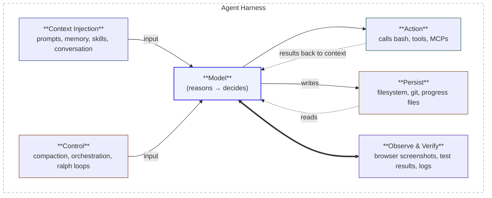
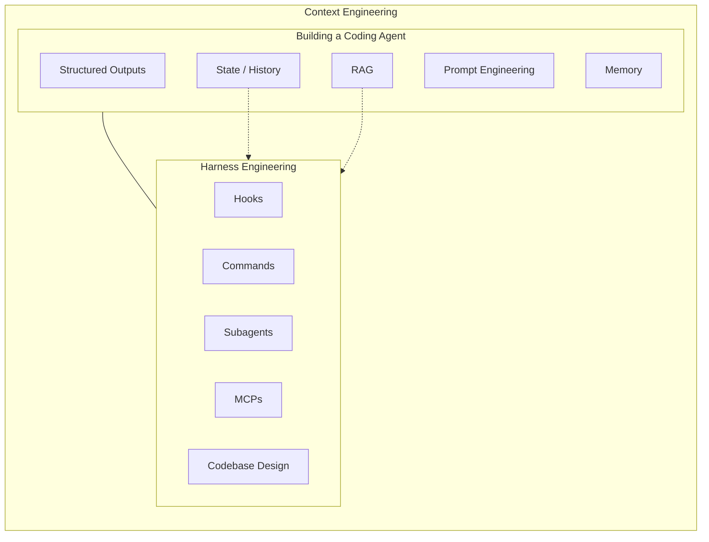
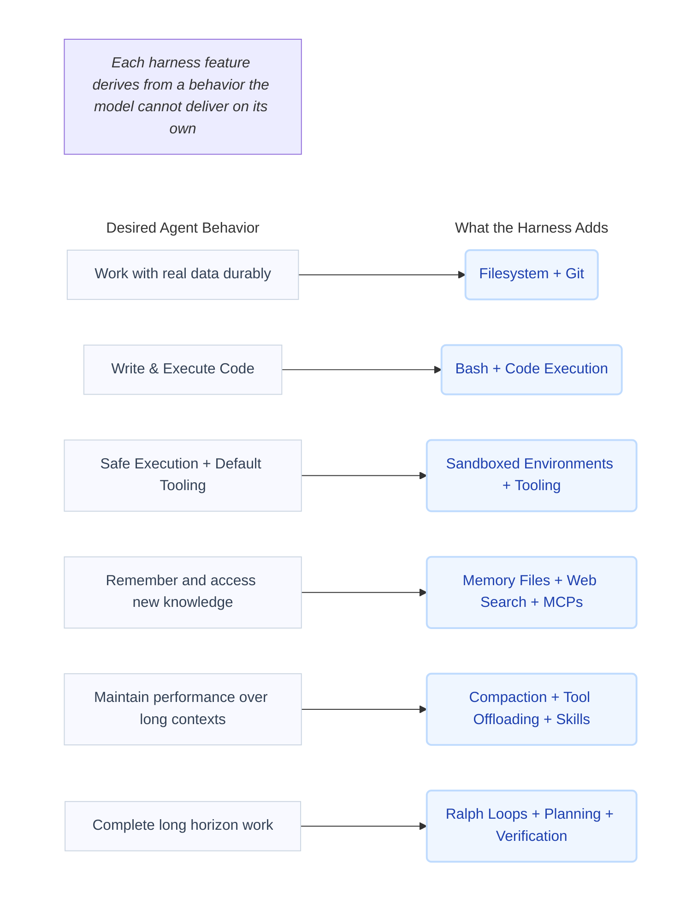
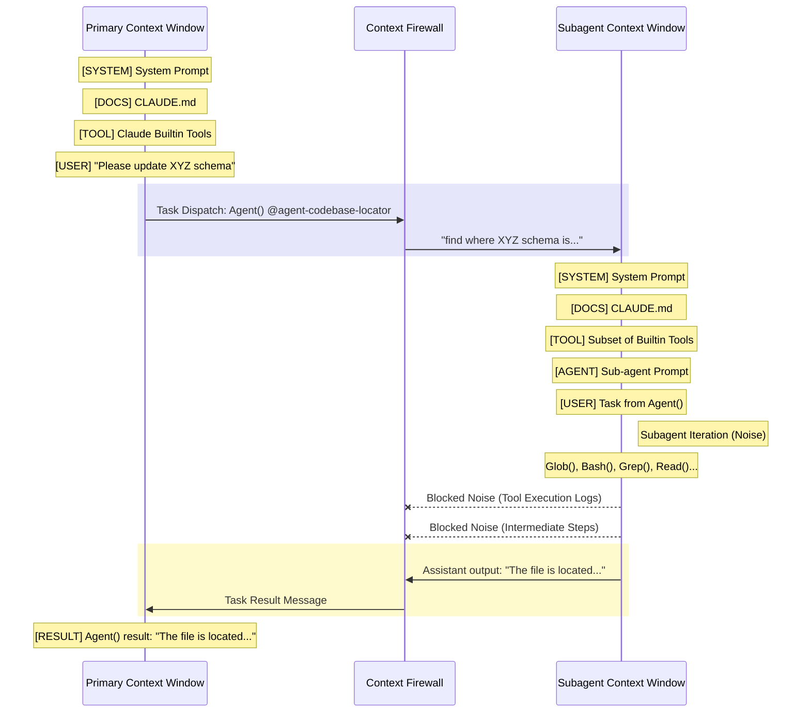
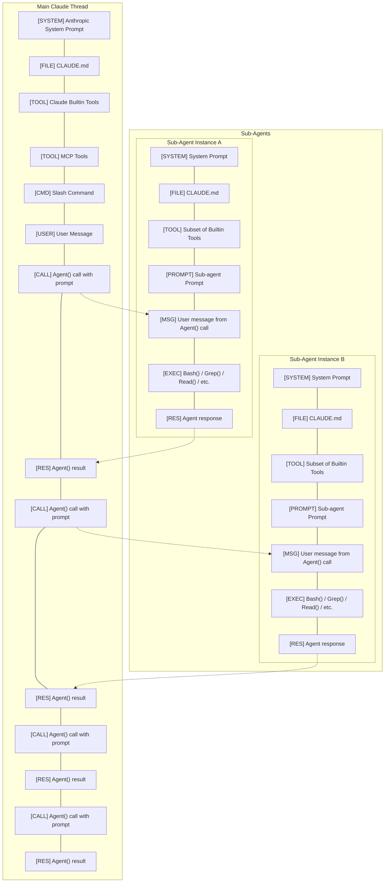

# Skill Issue: Harness Engineering for Coding Agents

We've spent the past year watching coding agents fail in every conceivable way: ignoring instructions, executing dangerous commands un-prompted, and going in circles on the simplest of tasks.

We've seen teams ship immense amounts of slop. We've even shipped a little bit of slop ourselves.

Every time, the instinct was the same:

- "We just need better models, GPT-6 will fix it"
- "We just need better instruction-following"
- "It'll work once [niche library I'm using] is in the training data"

But over the course of dozens of projects and hundreds of agent sessions, we kept arriving at the same conclusion: it's not a model problem. It's a **configuration problem**.

Yes, models will get smarter, and some existing failure modes will disappear. And then because they are smarter, we will give them new problems which are bigger and harder, and they will **continue to fail in unexpected ways**. Unexpected failures modes are a fundamental problem for non-deterministic systems.

So instead of praying for gpt-6.4-codex-ultrahigh_extended to save us all, we try to focus on answering the question of "how do we get the most out of today's models?"

There are lots of ways to get better performance out of your coding agent. If you use coding agents for moderately hard tasks, you've probably configured your coding agent a bit. Have you used skills? MCP servers? Sub-agents? Memory? AGENTS.md files?

```text
coding agent = AI model(s) + harness
```

These are all technically separate concepts, but they are all part of the coding agent's configuration surface. We call this the coding agent's harness, and we think of it as the agent’s runtime, or as its peripherals: what does the model use to interact with its environment?

## Harness Engineering

Harness engineering, coined by Viv, describes the practice of leveraging these configuration points to customize and improve your coding agent's output quality and reliability.



`As Mitchell Hashimoto put it`, harness engineering

> [...] is the idea that anytime you find an agent makes a mistake, you take the time to engineer a solution such that the agent never makes that mistake again.

Full text:

```text
At risk of stating the obvious: agents are much more efficient when they produce the right result the first time, or at worst produce a result that requires minimal touch-ups. The most sure-fire way to achieve this is to give the agent fast, high quality tools to automatically tell it when it is wrong.

I don't know if there is a broad industry-accepted term for this yet, but I've grown to calling this "harness engineering." It is the idea that anytime you find an agent makes a mistake, you take the time to engineer a solution such that the agent never makes that mistake again. I don't need to invent any new terms here; if another one exists, I'll jump on the bandwagon.

This comes in two forms:

1. Better implicit prompting (AGENTS.md). For simple things, like the agent repeatedly running the wrong commands or finding the wrong APIs, update the AGENTS.md (or equivalent). Here is an example from Ghostty. Each line in that file is based on a bad agent behavior, and it almost completely resolved them all.

2. Actual, programmed tools. For example, scripts to take screenshots, run filtered tests, etc etc. This is usually paired with an AGENTS.md change to let it know about this existing.

This is where I'm at today. I'm making an earnest effort whenever I see an agent do a Bad Thing to prevent it from ever doing that bad thing again. Or, conversely, I'm making an earnest effort for agents to be able to verify they're doing a Good Thing.
```

## ... as a Subset of Context Engineering

We view harness engineering as a subset of context engineering. Coined by my cofounder Dex in 12-factor agents, context engineering is a superset of “prompt engineering” and a variety of other techniques for systematically improving AI agents’ reliability. You can find the original talk on here.

Harness engineering then is the subset of context engineering which primarily involves leveraging harness configuration points to carefully manage the context windows of coding agents.



It answers:

- How do we give our coding agent new capabilities?
- How do we teach it things about our codebase that aren’t in the training data?
- How do we add determinism beyond `CRITICAL: always do XYZ` in the system message?
- How do we adapt the agent’s behavior for our specific codebase?
- How do we increase task success rates beyond “magic prompts”?
- How do we prevent our context window from inflating too rapidly, or with too much bad context?

Skills, MCP servers, sub-agents, hooks, and back-pressure mechanisms are all tactical solutions we’ve arrived at.

### Views on Harness Engineering

Viv’s posts on harness engineering are worth reading alongside this one — the first frames the four customization levers (system prompt, tools/MCPs, context, sub-agents), and the second works backwards from what models can’t do natively to derive why each harness component exists.



We’d add two levers he doesn’t emphasize:

1. **hooks** for automated integration and deterministic control flow
2. **skills** for progressive disclosure of knowledge. (Dex likes to refer to them as "Instruction Modules" - more on this in another post.)

After months of solving hard problems in complex brownfield enterprise-scale codebases, we have found that sub-agents are a particularly powerful lever. When working on hard problems that require many, many context windows to solve, **sub-agents are the key to maintaining coherency across many sessions**. Sub-agents **function as a "context firewall"** that ensures discrete tasks can run in isolated context windows so none of the intermediate noise accumulates in your parent thread which is responsible for orchestration, and you can maintain coherency for much, much longer.



OpenAI recently wrote a blog post on the topic as well. There's some great content in there, and it seems to indicate that they view harness engineering as configuring everything outside of the agent's runtime. It's more focused on back-pressure and verification mechanisms. (Although this may be a mis-reading; the post is somewhat unclear: the word "harness" only appears once in the text of the post, and in reference to evals rather than harness engineering itself.)

### But What About Post-Training?

Given that frontier coding models are post-trained on their harnesses (e.g. Claude in Claude Code, GPT-5 Codex in Codex), some will argue that the best harness and/or configuration is the one that the model was trained on.

For example, the Codex models are so tightly coupled with the Codex harness's apply_patch tool that OpenCode — built as an open-source alternative to Claude Code — had to add an apply_patch tool specifically for GPT/Codex models to mimic the Codex harness to improve the Codex models' performance in the OpenCode harness - while Claude and other models still use normal edit and write tools.

This can mean that a model will perform better when coupled with the harness it was post-trained on, and some might infer that this means you shouldn't customize the harness at all.

But it cuts both ways: models can be over-fitted to their harness. Viv cites Terminal Bench 2.0 where Opus 4.6 in Claude Code comes in position #33, but when placed in a different harness that wasn't seen during post-training, it comes in at #5 (+/- about 4 positions in either direction).

terminal bench

## Engineering Your Harness

With that in mind, let's walk through the configuration surfaces we've found most impactful.

### CLAUDE.md & AGENTS.md

Before touching any other harness configuration points, it's usually worth customizing your CLAUDE.md / AGENTS.md files. These are markdown files at the top-level of your repository that get deterministically injected into the agent's system prompt by the harness.

We have already shared some opinions about what makes a good CLAUDE.md file and how to use it correctly, so give that a read if you're not familiar with it. Matt Pocock also wrote a great follow-up that more generally applies to AGENTS.md.

#### The ETH Zurich Study

After ETH Zurich published `their study testing 138 agentfiles across various repos` which indicated that most agentfiles were useless-or-worse, we got a lot of feedback on our CLAUDE.md post:

- See, CLAUDE.md files don't even help — they're a waste of time.

Indeed: the study tested many agentfiles across a wide variety of repos, and found:

- that LLM-generated ones actually hurt performance while costing 20%+ more
- human-written ones only helped about 4%.
- Agents spent 14-22% more reasoning tokens processing context file instructions, took more steps to complete tasks, and ran more tools — all without improving resolution rates.
- Codebase overviews and directory listings didn't help at all; agents discover repository structure on their own just fine.

A careful reading of the study indicates that what we said in our post was correct:

- Agent-generated files were worse. Yes, we said:

> avoid auto-generating it. You should carefully craft its contents for best results.

- Lots of files too-heavily-steered the model to use specific tools, causing worse outcomes. Yep, we said:

> Less (instructions) is more. While you shouldn't omit necessary instructions, you should include as few instructions as reasonably possible in the file.

- Files contained irrelevant context. Yep, we said:

> Use Progressive Disclosure

- The human-written ones barely helped because of too many conditional rules. Yep, we said:

> Keep the contents of your CLAUDE.md concise and universally applicable.

Our CLAUDE.md is under 60 lines.

### MCP Servers Are for Tools

MCP servers are primarily for plugging tools into your coding agent to extend its capabilities beyond file I/O and bash commands. The MCP specification includes additional features like resources, prompts, and elicitations, but **these are generally not well-supported by MCP clients and coding agent harnesses**.

The MCP spec supports servers that run on your (or the agent's) local machine which allow the agent to interact with its local environment, but it also supports HTTP-based MCP servers that can connect your agent with remote tools and services like Linear, Sentry, and more.

When you plug an MCP server into your coding agent, the list of available tools, their descriptions, and the arguments needed to invoke them **are injected into your coding agent's system prompt**. As a result, the MCP server can use the tool descriptions to customize your agent’s behavior by providing your agent with instructions about when to use them.

**WARNING**: because MCP servers’ tool descriptions are added to your coding agent’s system prompt, never connect to one you don’t trust. This can be a dangerous vector for prompt injection! STDIO servers and other servers that run client-side with npx or uvx can also execute code on your host in the absence of prompt injection.

#### Too Many Tools Is Bad

We’ve seen this firsthand: plug too many MCP tools into your agent, and the context window fills up with tool descriptions, pushing you into the `dumb zone much` faster:

| **Feature**         | **Without MCP Tools**                 | **Too Many MCP Tools**                        |
|:--------------------|:--------------------------------------|:----------------------------------------------|
| **System Layer**    | 🟦 System Prompt                      | 🟦 System Prompt                              |
|                     | 🟦 CLAUDE.md                          | 🟦 CLAUDE.md                                  |
|                     | 🟦 Claude Builtin Tools               | 🟦 Claude Builtin Tools                       |
| **Tool/User Layer** | 🟩 User Message: *"Please update..."* | 🟥 GitHub MCP Tools                           |
|                     | 🟪 Read()                             | 🟥 Linear MCP Tools                           |
|                     | 🟪 Read()                             | 🟥 Snowflake MCP Tools                        |
| **--- LINE ---**    | **<center>The "Smart Zone"</center>** | **<center>------------------------</center>** |
| **--- LINE ---**    | **<center>The "Dumb Zone"</center>**  | **<center>------------------------</center>** |
| **Post-Threshold**  | 🟨 Assistant: *"Ready for review..."* | 🟥 Postgres MCP Tools                         |
|                     |                                       | 🟩 User Message: *"Please update..."*         |
|                     |                                       | 🟪 Read()                                     |
|                     |                                       | 🟪 Read()                                     |
|                     |                                       | 🟪 Edit()                                     |
|                     |                                       | 🟪 Write()                                    |
|                     |                                       | 🟪 Bash()                                     |
|                     |                                       | 🟨 Assistant: *"Ready for review..."*         |
The instruction budget matters too — every irrelevant tool description is an instruction the agent has to process without any benefit.

In fact, these failure modes are so common that Anthropic released experimental support for MCP tool search to progressively disclose tools to Claude when the user has too many MCP tools connected. TL;DR: if you’re not actively using a server which provides a large number of tools, turn it off.

We also found that if an MCP server duplicates functionality that’s already available as a CLI well-represented in training data, it works better to just prompt the agent to use the CLI. For things like GitHub, Docker, or most databases, your coding agent can just use the right CLIs and shell commands. The model has seen these tools enough during training that it already knows how to use them, and you gain the added benefit of composability with tools like `grep` and `jq` to enable additional context-efficiency.

#### Always Be Context-Engineering

At HumanLayer, we used the Linear MCP server for a while before realizing that we really only used a small subset of the tools it provides - so we wrote a small CLI that wraps the Linear API and provides very context-efficient responses, and we included 6 example usages in our CLAUDE.md file:

```text
## Linear

Use the Linear CLI for:

- **fetching issues**: `linear get-issue ENG-XXXX`
- **listing issues**: `linear list-issues` or `linear my-issues`
- **adding comments**: `linear add-comment -i ENG-XXXX "comment"`
- **adding links**: `linear add-link ENG-XXXX "url" -t "link title"`
- **updating status**: `linear update-status ENG-XXXX "status name"` ("spec needed", "research needed", "research in progress", "research in review", "ready for plan", "plan in progress", "plan in review", "ready for dev", "in dev", "code review")
- **get branch name**: `linear get-issue-v2 ENG-XXXX --fields branch` (use this when creating a worktree)
- **get images from the ticket**: `linear fetch-images ENG-XXXX` (do this any time the ticket has images in the description)
```

This saved us thousands of tokens from the MCP server's tool definitions that were ending up in our agent’s system prompt, and many more from the verbose MCP server responses.

### Skills Are for Reusable Knowledge (and Tools)

Skills were originally introduced by Anthropic for use with Claude Code, but have since become an open standard supported by other harnesses like Codex and OpenCode. You can read about how they're structured in the Anthropic docs — what matters here is why they're useful.

Before we go further: skill registries have already been caught distributing hundreds of malicious skills. Treat skills like you'd treat npm install random-package — read what you're installing. Registries like ClawHub and skills.sh can execute arbitrary code on your machine.

#### Progressive Disclosure

We learned this one early: we kept stuffing every instruction and tool into the system prompt, and the agent kept getting worse. We were blowing through our instruction budget before the agent even started working. Skills solve this through **progressive disclosure** — the agent only gets access to specific instructions, knowledge, or tools when it decides (or you decide for it) that it needs them.

#### Skill Activation

When a skill is activated, the `SKILL.md` file in the skill's directory is loaded into the agent's context window as a user message, and the agent is informed of the directory that the skill file was loaded from. The `SKILL.md` file may inform the agent of anything else it's bundled with:

```text
example-skill/
|--- SKILL.md
|--- response_template.md
|--- CLIs/
   |--- linear-cli
   |--- tunnel-cli
```

Since each skill has its own directory, you can get even more creative with progressive disclosure: you might bundle several markdown files in the skill, each of which contains different information about different functionalities or for different purposes, and the main `SKILL.md` file can tell the agent what the other files in the skill are and if/when it should read them.

#### Distributing Tools with Skills

Unfortunately, it's not possible to bundle MCP servers or custom agent tools directly into a skill - you have to write them into an executable, a CLI, an NPM package, or something else which you can either distribute with your skill or instruct the agent to install in the skill file.

For example, instead of configuring a Playwright MCP server, you could just provide your agent with a skill for web browsing using BrowserBase's agent browser skills or Vercel's agent browser CLI.

### Sub-Agents Are for Context Control

Sub-agents are a popular but often misunderstood harness configuration point. We tried the "frontend engineer" sub-agent and "backend engineer" sub-agent and "data analyst" sub-agent thing. It doesn't work. What does work is using sub-agents for context control.

They provide a way to encapsulate an entire coding agent session's worth of work such that the dispatching agent only sees the prompt it writes for the sub-agent, and the sub-agent's final result. None of the intermediate tool calls, tool results, or other messages end up in the parent coding agent's context window.

#### Agentic Workflow: Main Thread vs. Sub-agent Thread

| Main Claude Thread (Parent)                                             | Interaction | Sub-agent thread: @agent-codebase-locator     |
|:------------------------------------------------------------------------|:-----------:|:----------------------------------------------|
| 🟦 [SYSTEM] System Prompt                                               |             |                                               |
| 🟦 [FILE] CLAUDE.md                                                     |             | 🟦 [SYSTEM] System Prompt                     |
| 🟦 [TOOL] Claude Builtin Tools                                          |             | 🟦 [FILE] CLAUDE.md                           |
| 🟦 [TOOL] MCP Tools                                                     |             | 🟦 [TOOL] Subset of Builtin Tools             |
| 🟥 [PLAN] Slash Command: `/implement_plan`                              |             | 🟦 [TOOL] Subset of MCP Tools                 |
| 🟩 [USER] "Please update XYZ schema"                                    |             | 🟥 [PROMPT] Sub-agent Prompt                  |
| 🟪 **[TASK] @agent-codebase-locator** <br> "Fix where XYZ schema is..." |     ➡️      | 🟩 [PARENT MSG] "find where XYZ schema is..." |
|                                                                         |             | 🟪 [TOOL] Glob()                              |
|                                                                         |             | 🟪 [TOOL] List()                              |
|                                                                         |             | 🟪 [TOOL] .... 40 more tool calls             |
| ⬜ [RESULT] "The file is located..."                                     |     ⬅️      | 🟨 [OUTPUT] "The file is located..."          |
| 🟪 [TOOL] Edit()                                                        |             |                                               |
| 🟪 [TOOL] Write()                                                       |             |                                               |
| 🟪 [TOOL] Bash()                                                        |             |                                               |
| 🟪 [TOOL] Bash()                                                        |             |                                               |
| 🟨 [OUTPUT] "Ready for review..."                                       |             |                                               |

**Table Key Characteristics:**
- **Context Control:** User can specify a subset of tools for the sub-agent for better precision.
- **Modular Execution:** The Main Thread delegates specific discovery tasks to a specialized sub-thread to keep the main context clean.

Breaking work up into discrete tasks and delegating it to sub-agents is how we keep our primary coding agent thread in the `"smart zone."` This is how we handle research, implementation, and a number of other context-heavy tasks in our day-to-day workflows.

#### Sub-Agents Avoid Context Rot

Chroma's `context rot research` provides empirical backing to what we've been saying for a long time: models perform worse at longer context lengths. Avoid the dumb zone.

Chroma researchers tested 18 models on needle-in-a-haystack tasks, which is admittedly quite different from agentic coding. But the finding matches our experience exactly: performance degrades as context length increases — even on simple tasks.

Worse, when there's low semantic similarity between the question and the relevant information in context, the degradation is steeper. We’ve watched this happen in real time: every intermediate tool call, every grep result, every file read in the parent session that doesn’t end up being relevant is a potential distractor, and the Chroma research confirms that distractor effects compound at longer context windows.

#### Aside: Long-Context Models

This is also why we're skeptical of the "just make the context window bigger" approach to coding agents. When a lab offers an extended-context version of a given model, you are usually not getting a bigger model with a larger "instruction budget" - you're getting the same model with some clever math (e.g. YaRN) to extend the length of the sequence the model can attend to.

Consider the needle-in-a-haystack problem. A bigger context window doesn't make the model better at finding the needle — it just makes the haystack bigger. For our purposes, it means you can stuff more instructions (each user message is at least one instruction, and usually several) into the context window - putting you deeper and deeper into the "dumb zone".

If you think you need longer context, you may just need better context window isolation. Sub-agents solve this structurally: each one gets a fresh, small, high-relevance context window with a fresh "instruction budget" for its task, and only the condensed result flows back to the parent - allowing you to stitch together many context windows for a single problem.

The limit case probably looks something like this, although at some point you're crossing Recursive Language Model territory.



(Note: some arrows omitted for brevity.)

#### Sub-Agent Use-Cases

Great examples of things to use sub-agents for include:

- Locating specific definitions or implementations in the codebase
- Analyzing the codebase to identify patterns for a specific type of work
- Tracing the flow of information through the codebase, e.g. tracing a request across service boundaries
- Other general code/documentation/web research tasks

These types of tasks often have a straightforward question and simple answer, but require lots of intermediate tool calls that you don't want or need in your parent session. Sub-agents should return highly condensed responses that also follow the principle of progressive disclosure. For example, our sub-agents provide an answer to the question but also cite sources in `filepath:line` format or with URLs so that the parent agent isn't exposed to all the sources the sub-agent used, but if it needs more details or confirmation, it has the information that it needs to go find the relevant context:

```markdown
## Component Usage Flow

### Modal Path (Working)

1. `ToolResultModal.tsx:136` calls `getToolIcon(toolCall?.toolName)`
2. `getToolIcon()` returns `<Terminal />` for Bash
3. Icon displays correctly with terminal symbol

### Message Stream Path (Broken)

1. `ConversationContent.tsx:103` calls `eventToDisplayObject(event)`
2. Default `<Wrench />` assigned at line 76
3. No Bash-specific override in lines 189-228
4. Generic wrench icon displays

---

## Code References

- `humanlayer-wui/src/components/internal/SessionDetail/eventToDisplayObject.tsx:76` - Default wrench assignment
- `humanlayer-wui/src/components/internal/SessionDetail/eventToDisplayObject.tsx:189-228` - Tool-specific overrides (missing Bash)
- `humanlayer-wui/src/components/internal/SessionDetail/eventToDisplayObject.tsx:657` - Correct Bash $\rightarrow$ Terminal mapping
- `humanlayer-wui/src/components/internal/SessionDetail/components/ToolResultModal.tsx:136` - Modal icon rendering
- `humanlayer-wui/src/components/internal/SessionDetail/ConversationContent.tsx:103` - Message stream rendering
```

Claude Code and some other coding agents even provide built-in, task-specific sub-agents, e.g. Claude Code's `Explore` sub-agent for codebase exploration, or their `Bash` sub-agent which is designed to execute verbose bash commands and extract information to return to the parent agent without polluting its context. Other coding agents support sub-agents but don't define their own, and require that the user manually configure them if desired.

#### Sub-Agents Are (Also) for Cost Control

Sub-agents can also help with cost control. We use an expensive model (Opus) for the parent session where thinking-heavy tasks like planning and orchestration happen, and a cheaper, faster model like Sonnet or Haiku for each sub-agent. Sub-agents receive much smaller and more discrete tasks that can be handled by a less-intelligent model with a smaller "instruction budget" — no need to burn Opus tokens on a codebase grep.

#### So We Heard You Like Sub-Agents

Some harnesses don't support sub-agents at all! Even Codex didn't until recently, and support is still experimental.

Fortunately you can still use this powerful context encapsulation pattern by writing an MCP server that provides a tool for launching a new agent session which receives a prompt from the parent agent, launches a new coding agent session with that prompt as the user message, and which returns the sub-agent's final response message to the parent.

A very rough approximation of a server to do this can be found here. Warning: using this pattern with a coding agent that supports sub-agents will allow the harness's native sub-agents to dispatch sub-agents via MCP. This can result in an unpredictable game of telephone:

```mermaid
graph LR
    subgraph Main_Thread ["Main Claude Thread"]
        direction TB
        M1["[SYSTEM] Anthropic System Prompt"] --- M2["[CONFIG] CLAUDE.md"]
        M2 --- M3["[TOOL] Claude Builtin Tools"]
        M3 --- M4["[TOOL] MCP Tools"]
        M4 --- M5["[INPUT] Slash Command"]
        M5 --- M6["[USER] 'Please update XYZ Postgres schema'"]
        M6 --> M7["[MCP] agent-launch(agent-locator)"]
        M7 --- M11["[ASSISTANT] 'Here's your new mongoose schema'"]
        M11 --- M12["[TOOL] Edit()"]
        M12 --- M13["[TOOL] Write()"]
        M13 --- M14["[TOOL] Bash()"]
        M14 --- M15["[OUTPUT] 'Successfully dropped all tables and migrated...'"]
    end

    subgraph Sub_Agent_1 ["@agent-codebase-locator"]
        direction TB
        S1_1["[SYSTEM] Anthropic System Prompt"] --- S1_2["[CONFIG] CLAUDE.md"]
        S1_2 --- S1_3["[TOOL] Subset of Builtin Tools"]
        S1_3 --- S1_4["[TOOL] Subset of MCP Tools"]
        S1_4 --- S1_5["[PROMPT] Sub-agent Prompt"]
        S1_5 --- S1_6["[USER] FROM PARENT: 'Find XYZ postgres schema...'"]
        S1_6 --- S1_7["[TOOL] Glob()"]
        S1_7 --- S1_8["[TOOL] List()"]
        S1_8 --- S1_9["[TOOL] Read()"]
        S1_9 --> S1_10["[MCP] agent-launch(agent-web-search)"]
        S1_10 --- S1_11["[USER] 'no, you should migrate back to MySQL'"]
        S1_11 --- S1_12["[TOOL] Write()"]
        S1_12 --- S1_13["[TOOL] Write()"]
        S1_13 --- S1_14["[ASSISTANT] 'Here's your new mongoose schema'"]
    end

    subgraph Sub_Agent_2 ["@agent-web-search #1"]
        direction TB
        S2_1["[SYSTEM] Anthropic System Prompt"] --- S2_2["[CONFIG] CLAUDE.md"]
        S2_2 --- S2_3["[TOOL] Subset of Builtin Tools"]
        S2_3 --- S2_4["[TOOL] Subset of MCP Tools"]
        S2_4 --- S2_5["[PROMPT] Sub-agent Prompt"]
        S2_5 --- S2_6["[USER] FROM PARENT: 'how migrate to MongoDB'"]
        S2_6 --- S2_7["[TOOL] WebSearch()"]
        S2_7 --- S2_8["[TOOL] WebSearch()"]
        S2_8 --- S2_9["[TOOL] WebFetch()"]
        S2_9 --> S2_10["[MCP] agent-launch(agent-web-search)"]
        S2_10 --- S2_11["[USER] 'no, you should migrate back to MySQL'"]
        S2_11 --- S2_12["[TOOL] WebSearch()"]
        S2_12 --- S2_13["[TOOL] WebFetch()"]
        S2_13 --- S2_14["[ASSISTANT] 'Here's how to migrate from MongoDB to MySQL'"]
    end

    subgraph Sub_Agent_3 ["@agent-web-search #2"]
        direction TB
        S3_1["[SYSTEM] Anthropic System Prompt"] --- S3_2["[CONFIG] CLAUDE.md"]
        S3_2 --- S3_3["[TOOL] Subset of Builtin Tools"]
        S3_3 --- S3_4["[TOOL] Subset of MCP Tools"]
        S3_4 --- S3_5["[PROMPT] Sub-agent Prompt"]
        S3_5 --- S3_6["[USER] FROM PARENT: 'Determine if MongoDB is web scale'"]
        S3_6 --- S3_7["[TOOL] WebSearch()"]
        S3_7 --- S3_8["[TOOL] WebSearch()"]
        S3_8 --- S3_9["[TOOL] WebFetch()"]
        S3_9 --- S3_10["[ASSISTANT] 'No, you should migrate to MySQL'"]
    end

    %% Connection Logic
    M7 -.-> S1_6
    S1_14 -.-> M11
    
    S1_10 -.-> S2_6
    S2_14 -.-> S1_11
    
    S2_10 -.-> S3_6
    S3_10 -.-> S2_11
```



Jokes aside, practically you have to be very careful when you write your sub-agents' system prompts to carefully specify the scope of their role:

- What is the agent's role - what should it do, but also what should it not do
- What information should the agent return, and how should it return it
- What tools should the sub-agent have?

It's also worth noting that many harnesses have an MCP tool call timeout - if you implement this pattern, you may need to configure your harness to increase the MCP tool call timeout.

### Hooks Are for Control Flow

Claude Code has the concept of hooks: user-defined commands or scripts that are automatically executed when certain events occur and at various points of the agent's lifecycle. Similarly, Opencode has the concept of plugins which do the same thing. Other coding agents may have similar configuration points. (Sadly, Codex doesn't have an equivalent.)

Hooks are conceptually similar to git hooks, but they're quite flexible. They can be used to add new features, integrate with external services, automate routine actions, modify permissions, and configure default behavior.

Implementation details vary between harnesses, but generally a hook can:

- run something automatically but silently when an event occurs
- run when a tool is called, and return additional context to the agent in addition to the tool result
- surface build/type errors to a coding agent before it finishes, so that it's forced to keep working until it resolves the error

Common use cases include...

- **Notifications**: We wire our agents up to play sounds when they finish or when they need attention (e.g. an approval has been pending for too long)

- **Approvals**: We automatically approve or deny tool calls based on input values and more expressive rules than the coding agent’s default permissions model. For example, we automatically deny any `Bash()` tool calls that try to run migrations, with an instruction to ask the user to run them instead.

- **Integrations**: We have our agents send a Slack message when they’re finished, create a GitHub PR, or set up a preview environment.

- **Verification**: If your framework and repository can run a typecheck or build in under a handful of seconds, run it every time the agent stops to surface errors to it — this is exactly what the hook below does.

#### An Example Hook

Here's a hook I (via Claude) wrote for our repo which implements the last example I gave. When Claude stops, it runs our biome formatter and TypeScript type checks. If there are errors, they are raised to Claude. If not, the script exits silently.

```bash
#!/bin/bash
cd "$CLAUDE_PROJECT_DIR"

# prebuild generates types and builds internal SDK packages so typecheck has
# everything it needs. runs bun install afterward to pick up any new generated files.
PREBUILD_OUTPUT=$(bun run generate-cache-key && turbo run build --filter=@humanlayer/hld-sdk && bun install 2>&1)
if [ $? -ne 0 ]; then
  echo "prebuild failed:" >&2
  echo "$PREBUILD_OUTPUT" >&2
  exit 2
fi

# biome and typecheck run in parallel to keep the feedback loop tight.
# one quirk: biome --write exits with code 1 if it made any changes, even if it
# successfully fixed everything. so we run it twice with ||: if the first pass
# makes changes and exits 1, the second pass will exit 0 since there's nothing
# left to fix. if there are unfixable errors, both passes fail and exit 2.
OUTPUT=$(bun run --parallel \
  "biome check . --write --unsafe || biome check . --write --unsafe" \
  "turbo run typecheck" 2>&1)

if [ $? -ne 0 ]; then
  echo "$OUTPUT" >&2
  exit 2
fi
```

On success the hook is completely silent — nothing ends up in the agent's context. On failure, only the errors are surfaced, and exit code `2` tells the harness to re-engage the agent so it fixes them before finishing.

## Back-Pressure Increases Your Chances of Success

We've written about back-pressure before. The core insight is that your likelihood of successfully solving a problem with a coding agent is strongly correlated with the agent's ability to verify its own work. We've spent a lot of time building out tests and other back-pressure mechanisms into our repository, and it remains one of the `highest-leverage things we have spent time on`.

Our codebase has verification mechanisms that allow the agent to check its own work:

- typechecks and build steps (probably in a strongly-typed language)
- unit tests and/or integration tests
- code coverage reporting (we have a Stop hook that prompts the agent to increase coverage if it drops)
- UI interaction and testing integrations (playwright, agent-browser, etc)

Critically, these verification mechanisms need to be context-efficient. We learned this one the hard way — early on we had our agent run the full test suite after every change, and 4,000 lines of passing tests would flood the context window. The agent would then lose track of the actual task and start hallucinating about test files it had just read. Now we swallow the output and only surface errors. We do the same with builds — success is silent, and only failures produce verbose output.

We give Claude concise instructions about how to use all of these mechanisms in our CLAUDE.md file. Some are even bundled inside skills for progressive disclosure.

## Closing Notes

It is entirely possible to spend more time optimizing your coding agent setup than actually shipping code with it — we’ve been there.

Our approach: bias towards shipping. We only spend time on harness configuration to the extent that it’s actually enabling us to ship more high-quality code faster. When the agent fails, we take the time to engineer a solution so it doesn’t fail that way again — but we don’t go looking for problems to solve preemptively.

**What didn’t work for us**:

- Trying to design the ideal harness configuration upfront before we’d even hit real failures
- Installing dozens of skills and MCP servers "just in case"
- Running our entire test suite (5+ minutes) at the end of every agent session (run a subset instead)
- Trying to micro-optimize which sub-agents could access which tools. This led to a lot of tool thrash which gave us worse results, not better ones. Most coding agents don't have a robust configuration surface for this anyways.

**What did work**:

- Starting simple and adding configuration only when the agent actually failed
- Designing, testing, iterating — and throwing away things that didn’t help. I have thrown away many more hooks than we actually use today.
- Distributing battle-tested configurations to the whole team via repository-level config
- Optimizing for iteration speed, not "likelihood of 1-shotting it on the first attempt"
- Giving the agent a set of capabilities (Linear) and then carefully paring down what we exposed to the model once we knew what we needed.

The next time your coding agent isn’t performing the way you expect, before you blame the model, check the harness. Agentfiles, MCP servers, skills, sub-agents, hooks, and back-pressure — that’s where we’ve found most of the leverage. The model is probably fine. It’s just a skill issue.
