## **Evaluating AGENTS.md: Are Repository-Level Context Files Helpful for Coding Agents?**

**Thibaud Gloaguen**[1] **Niels Mündler**[1] **Mark Müller**[2] **Veselin Raychev**[2] **Martin Vechev**[1]

## **Abstract**

A widespread practice in software development is to tailor coding agents to repositories using context files, such as `AGENTS.md` , by either manually or automatically generating them. Although this practice is strongly encouraged by agent developers, there is currently no rigorous investigation into whether such context files are actually effective for real-world tasks. In this work, we study this question and evaluate coding agents’ task completion performance in two complementary settings: established SWEbench tasks from popular repositories, with LLM-generated context files following agentdeveloper recommendations, and a novel collection of issues from repositories containing developer-committed context files.

Across multiple coding agents and LLMs, we find that context files tend to _reduce_ task success rates compared to providing no repository context, while also _increasing inference cost_ by over 20%. Behaviorally, both LLM-generated and developer-provided context files encourage broader exploration (e.g., more thorough testing and file traversal), and coding agents tend to respect their instructions. Ultimately, we conclude that unnecessary requirements from context files make tasks harder, and human-written context files should describe only minimal requirements.

## **1. Introduction**

Coding agents are being rapidly adopted across the software engineering industry (Sarkar, 2025), and providing context files like `AGENTS.md` , a `README` specifically targeting agents, has become common practice. With various in-

> 1Department of Computer Science, ETH Zurich

> 2LogicStar.ai. Correspondence to: Thibaud Gloaguen <thibaud.gloaguen@inf.ethz.ch>, Niels Mündler <niels.mundler@inf.ethz.ch>.

_Preprint. February 13, 2026._

dustry leaders (AGENTS.md, 2025; Anthropic, 2025b) recommending this approach to adapt their agents to specific repositories, context files are now supported by most popular agent frameworks, and included in over 60’000 opensource repositories at the time of writing, as reported by AGENTS.md (2025).

These context files typically contain a repository overview and information on relevant developer tooling, aiming to help coding agents to navigate a given repository more efficiently, run build and test commands correctly, adhere to style guides and design patterns, and ultimately to solve tasks to the user’s satisfaction more frequently. To date, despite their widespread adoption, the impact of context files on the coding agent’s ability to solve complex software engineering tasks has not been rigorously studied. This is due to two key challenges: i) because of their recent introduction, context files are not available for instances of prior benchmarks, and ii) popular, well-known repositories, typically used to create such benchmarks, are not representative of most codebases. As a result, a rigorous evaluation of the context files used in practice requires a new, complementary benchmark that contains only issues from less popular repositories with developer-committed context files.

**This work: Benchmarking context files’ impact on resolving GitHub issues** In this work, we investigate the effect of actively used context files on the resolution of real-world coding tasks. We evaluate agents both in popular and less-known repositories, and, importantly, with context files provided by repository developers. For this purpose, we construct a novel benchmark (Figure 1, left), AGENTBENCH, comprising Python software engineering tasks, created specifically from real GitHub issues. The benchmark contains 138 unique instances, covering both bug-fixing and feature addition tasks across 12 recent and niche repositories, which all feature developer-written context files. AGENTBENCH complements SWE-BENCH LITE, which we leverage for the evaluation of automatically generated context files on popular repositories. We evaluate coding agents in three settings (Figure 1, middle): without any context file, with context files automatically generated using agent-developer recommendations, and with the developer-provided context file. Our code

**Evaluating AGENTS.md: Are Repository-Level Context Files Helpful for Coding Agents?**


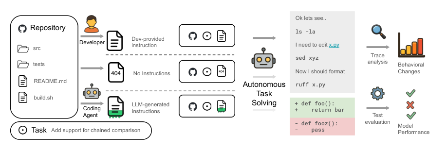


**----- Start of picture text -----**<br>
Ok lets see..<br>Repository ls -la<br>Dev-provided<br>src Developer instruction I need to edit x.py<br>sed xyz Trace<br>tests analysis Behavioral<br>No Instructions Now I should format Changes<br>README.md Autonomous ruff x.py<br>Task<br>build.sh<br>LLM-generated Solving + def foo():<br>Coding instructions +    return bar<br>Agent Test<br>- def fooz(): evaluation Model<br> Task Add support for chained comparison -    pass Performance<br>**----- End of picture text -----**<br>


_Figure 1._ Overview of our evaluation pipeline. We begin with real-world repositories and tasks derived from past pull requests. For each repository state, we generate three settings: _⃝_ 1 If a developer-provided context file exists, we include it in the repository. In _⃝_ 2 , we omit the context file. _⃝_ 3 We use the coding agent’s recommended settings to generate the context file. Then we pass the repository and context file to the coding agent and instruct it to autonomously resolve the task. We finally analyze the trace for behavioral changes and apply the generated patch to check for task resolution success.

## to generate AGENTBENCH instances and evaluate coding agents is available here.

Surprisingly, we observe that _developer-provided files only marginally improve performance_ compared to omitting them entirely (an increase of 4% on average), while _LLMgenerated context files have a small negative effect_ on agent performance (a decrease of 3% on average). These observations are robust across different LLMs and prompts used to generate the context files. In a more detailed analysis (Figure 1, right), we observe that context files lead to increased exploration, testing, and reasoning by coding agents, and, as a result, increase costs by over 20%. We therefore suggest omitting LLM-generated context files for the time being, contrary to agent developers’ recommendations, and including only minimal requirements (e.g., specific tooling to use with this repository). We hope our evaluation framework will aid agent and model developers to improve the helpfulness of LLM-generated context files.

## **Key contributions** Our key contributions are:

## **2. Background and Related Work**

**Coding agents** Coding agents are LLM-based systems designed for autonomous resolution of coding tasks (Yang et al., 2024). Typically, they consist of a harness that allows an LLM to interact with its environment using specialized tools for, e.g., executing bash commands, conducting web searches, or reading, creating, or modifying files (Wang et al., 2025; Yang et al., 2024).

Their impressive performance on repository-level coding tasks like SWE-bench (Jimenez et al., 2024) led to rapid adoption in the software engineering community (Sarkar, 2025) and the development of new agents by specialized companies (Aider, 2024; Wang et al., 2025) and model providers (OpenAI, 2025c; Google, 2025; QwenLM, 2025; Anthropic, 2025a). Model providers now train their LLMs to use the tools exposed by their harnesses (QwenLM, 2025), which can substantially improve coding ability relative to simpler harnesses (Lieret et al., 2025). Accordingly, in §4, we evaluate each LLM only within its corresponding harness.

1. AGENTBENCH, a new curated benchmark for the impact of actively used context files on agents’ ability to solve real-world software engineering tasks.

2. An extensive evaluation of different coding agents and underlying models on AGENTBENCH and SWEBENCH LITE, showing that LLM-generated context files tend to decrease agent performance, across models or prompts used to generate them, while developerwritten context files tend to slightly improve it.

3. A detailed investigation of agent traces, showing that context files lead to more thorough testing and exploration by coding agents.

**Context files** As coding agents were more broadly adopted, a common need arose to provide the agent with additional context about novel and little-known codebases (Boyina, 2025; Sewell, 2025). To address this issue, model and agent developers recommend including _context files_ , such as `AGENTS.md` or `CLAUDE.md` , with codebases (OpenAI, 2025a; Anthropic, 2025b). Many agent harnesses provide built-in commands to initialize such context files automatically using the coding agent itself, e.g., by providing a dedicated `/init` command in the agent interface (OpenAI, 2025c; QwenLM, 2025; Anthropic, 2025a). At the time of writing, AGENTS.md (2025) report that over 60’000 public GitHub repositories include a context file.

**Evaluating AGENTS.md: Are Repository-Level Context Files Helpful for Coding Agents?**

**Evaluating context files** Prior work collected and categorized the content of context files (Chatlatanagulchai et al., 2025; Mohsenimofidi et al., 2025), deriving mostly descriptive metrics about their content without investigating their effectiveness (Nigh, 2025). While individual developers report anecdotal evidence of better alignment and solution capabilities when providing context files (Sewell, 2025; Sawers, 2025), we are the first to investigate the impact of actively used context files on agent behavior and performance at scale.

**Repository-level evaluation** Spearheaded by Jimenez et al. (2024), evaluating coding agents on the autonomous resolution of real-world repository-level tasks quickly became the gold standard for assessing their capabilities. While initial work focuses on issue resolution (Jimenez et al., 2024), follow-up work proposed benchmarks on feature addition (Li et al., 2025; Du et al., 2025), unit test generation (Mündler et al., 2024), function generation (Liang et al., 2024), code performance (He et al., 2025), and security (Chen et al., 2025). Our work evaluates whether autonomous issue resolution and feature addition capabilities improve with actively used context files.

Orthogonally, benchmarks have also been extended by mining more recent and more difficult problems (Badertdinov et al., 2025; Zhang et al., 2025a), as well as instances focusing on end-user applications (Vergopoulos et al., 2025). We follow their approaches to mining novel task instances to obtain a specialized set of tasks in repositories that feature context files.

## **3. AGENTBENCH**

In this Section, we discuss the requirements for AGENTBENCH, a SWE-BENCH-like benchmark that targets the evaluation of developer-provided context files, its generation process, and its statistics.

such as resolving a bug or implementing a requested feature. We denote quadruples of ( _I, R, T , X[∗]_ ) as _instances_ , where the coding agent is tasked with predicting a patch _X_[ˆ] given issue _I_ and repository state _R_ such that exec _R◦X_ ˆ[(] _[T]_[ )][=][PASS][, and] _[ X][∗]_[is the golden patch for that] instance. We define the _success rate S_ as the percentage of predicted patches _X_[ˆ] _i_ for instances ( _Ii, Ri, Ti, Xi[∗]_[)][where] exec _Ri◦X_ ˆ _i_[(] _[T][i]_[) =][PASS][.]

## **3.2. Generation of AGENTBENCH Instances**

To construct AGENTBENCH, we use a five-stage construction process summarized below. We defer all the prompts used for this process to §B.

**Requirements** We aim to evaluate the impact of both automatically generated context files and developer-written context files on the success rate of coding agents on realworld tasks and codebases. The primary source for realworld codebases is open-source projects and their publicly tracked and documented changes, so-called pull requests (PRs). In order to obtain developer-written context files, we need to source PRs from projects that adopted context files. This is challenging, because context files have only been formalized in August 2025, and have not been frequently used before. Further, the adoption of context file is not uniform across the industry: even at the time of writing, many repositories do not include context files.

**Finding repositories** We first use GitHub search to build a list of potential candidate repositories to extract instances from. Specifically, we select codebases that contain a context file such as `AGENTS.md` or `CLAUDE.md` at the root directory. Next, we filter down to those using Python as the main language and featuring a test suite. Finally, we filter for projects with many publicly documented changes, requiring at least 400 PRs. This criterion allows us to select codebases from which we can extract at least 10 instances after our rigorous post-processing.

## **3.1. Notation and Definitions**

We first introduce the notation to describe codebases, their test suites, and changes to these codebases in the form of patches. Following the notation of Mündler et al. (2024), we denote a codebase, or repository _R_ after applying patch _X_ as _R ◦ X_ . Several patches can be applied sequentially, i.e., _R◦X ◦Y_ is the codebase _R_ after applying a first patch _X_ and then a second one _Y_ .

A _test suite T_ is a collection of tests that is used to validate the functionality of code in the repository. Executing a test suite _T_ on repository state _R_ returns exec _R_ ( _T_ ) _∈ {_ PASS _,_ FAIL _}_ either indicating that all tests in the suite passed or that at least one test failed. An _issue I_ is a task for autonomous completion by the coding agent,

**Filtering pull requests** Given a repository, we filter PRs to retain those that are most likely to generate higherquality instances using a combination of rule-based checks and an LLM agent. We only keep PRs that satisfy the following two criteria: they should reference at least one issue, and they should modify at least one Python file. Further, we filter for PRs that are assessed by the agent to introduce deterministic, testable behaviors that are suitable for SWE-BENCH LITE-like regression tests. We notice that, because the use of context files is a recently emerging trend, most repositories containing context files are niche. These niche repositories have less strict rules regarding pull requests, and thus most PRs may not include specific tests. To enable building instances from these more niche repos-

**Evaluating AGENTS.md: Are Repository-Level Context Files Helpful for Coding Agents?**

itories, we therefore do not require PRs to edit unit tests that validate the code changes, in contrast to SWE-BENCH LITE, which focused on large and popular repositories and requires PRs to contain unit tests.

**Environment Set-Up** For every PR and corresponding repository state, we set up an execution environment such that its test suite can be run, using a coding agent. Specifically, we ask the agent to produce a small script that i) sets up the execution environment, ii) runs the test suite and iii) stores the results as a machine-readable dictionary at the root of the repository. We only keep PRs where the resulting dictionary contains at least one passing test, which corresponds to 87% of the filtered instances.

**Task Descriptions** Many of the smaller repositories we used to source AGENTBENCH do not enforce strict requirements on the quality of PR and issue descriptions. As a result, many issues are too imprecise and underspecified to solve the task in a testable manner (e.g., in some cases, the PR body is empty). Further, some PRs implement new features, which would require detailed descriptions about expected behavior and interfaces. We therefore use a third LLM agent to produce a standardized and detailed task description _I_ based on the PR description, associated issues if available, and the original patch _X[∗]_ . This standardized task description is divided into 6 sections: description, steps to reproduce, expected behavior, observed behavior, specification, and additional information. Importantly, we ask the agent not to leak the solution in the generated task description, and to provide precise specifications. We randomly sampled and inspected 10% of the generated instances, and found that none of them leaked the solution.

**Generating Unit Tests** As most collected PRs do not modify or add unit tests that we could use to check the correctness of any given implementation, we use an LLM agent to generate such unit tests. We provide the agent with the standardized task description _I_ , the test files modified by the PR, if available, the original code changes _X[∗]_ made by the PR, and the base state of the repository _R_ . We then ask it to generate tests that pass for any implementation that resolves the described task. We verify that the added tests fail on _R_ and pass on _R ◦ X[∗]_ . Finally, we manually improve tests that are over-specified (i.e., tests that check for implementation details not specified in the task description), resulting in newly generated tests _Ti[X]_[.][We][further] determine all tests of the repository test suite _Ti[R]_ that pass on the patched code, i.e., the maximal set _Ti[R][∗] ⊆Ti[R]_[, such] that exec _Ri◦Xi[∗]_[(] _[T] i[R][∗]_ ) = PASS, and obtain the final test set _Ti_ = _Ti[X] ⊎Ti[R][∗]_ . The resulting tests achieve an average coverage of 75% of the modified code (see Table 1).


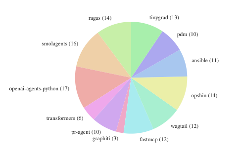


**----- Start of picture text -----**<br>
ragas (14) tinygrad (13)<br>pdm (10)<br>smolagents (16)<br>ansible (11)<br>openai-agents-python (17)<br>opshin (14)<br>transformers (6)<br>wagtail (12)<br>pr-agent (10)<br>graphiti (3) fastmcp (12)<br>**----- End of picture text -----**<br>


_Figure 2._ Distribution of AGENTBENCH instances across 12 open-source GitHub repositories, each containing context files.

_Table 1._ Average, minimum, and maximum of key statistics of AGENTBENCH across the 138 instances. For context files, a section is the content between Markdown headers.

|||Mean|Min|Max|
|---|---|---|---|---|
|PR body|# words|415.3|5|4961|
|Issue_I_|# words|211.6|96|500|
|Codebase|# fles|3337|151|26602|
|PR patch|# lines edited<br># fles edited|118.9<br>2.5|12<br>1|1973<br>23|
|Test|Coverage|75%|2.5%|100%|
|Context fle|# words<br># sections|641.0<br>9.7|24<br>1|2003<br>29|


**Evaluation** We thus obtain AGENTBENCH instances _i_ , each consisting of a task description _Ii_ , a codebase _Ri_ , golden patch _Xi[∗]_[, and a set of tests] _[ T][i]_[.][During evaluation,] we first set up the environment before prompting the coding agent with the task description _Ii_ , retrieving the predicted patch _X_[ˆ] _i_ , and measuring exec _Ri◦X_ ˆ _i_[(] _[T][i]_[)][.]

**Overview of AGENTBENCH** Using this process, we obtained 138 instances from a total of 5694 PRs from 12 repositories that meet our criteria, using GPT-5.2 with CODEX as the agent. We visualize the distribution over repositories in Figure 2 and show key statistics of AGENTBENCH in Table 1. In comparison to SWE-BENCH LITE, our dataset is both more evenly distributed over repositories and has otherwise similar statistics.

## **4. Experimental Evaluation**

In this Section, we investigate what effect context files have on the behavior of coding agents and how strong this effect is. To this end, we conduct an extensive evaluation of various coding agents on SWE-BENCH LITE and AGENTBENCH, considering both automatically generated and developer-provided context files.

**Evaluating AGENTS.md: Are Repository-Level Context Files Helpful for Coding Agents?**


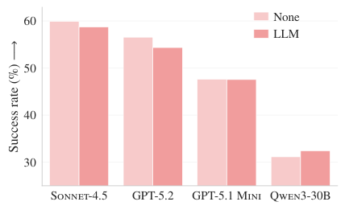


**----- Start of picture text -----**<br>
60 None<br>LLM<br>50<br>40<br>30<br>Sonnet-4.5 GPT-5.2 GPT-5.1 Mini Qwen3-30B<br> −→<br>Success rate (%)<br>**----- End of picture text -----**<br>


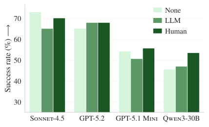


**----- Start of picture text -----**<br>
None<br>70 LLM<br>Human<br>60<br>50<br>40<br>30<br>Sonnet-4.5 GPT-5.2 GPT-5.1 Mini Qwen3-30B<br> −→<br>Success rate (%)<br>**----- End of picture text -----**<br>


_Figure 3._ Resolution rate for 4 different models, without context files, with LLM-generated context files, and with developer-written context files, on SWE-BENCH LITE (left) and AGENTBENCH (right).

## **4.1. Experimental Setup**

We describe the experimental setup below, deferring further details to §A.1.

**Coding Agents** We consider four coding agents, paired with suitable models: CLAUDE CODE (Anthropic, 2025a) with SONNET-4.5 (Anthropic, 2025), CODEX (OpenAI, 2025c) with GPT-5.2 and GPT-5.1 MINI (Singh et al., 2026), and QWEN CODE (QwenLM, 2025) with QWEN330B-CODER (Team, 2025). For CLAUDE CODE, we use the default settings and set the temperature of SONNET4.5 to 0. Similarly, for CODEX, we also use the default settings and set the temperature of GPT-5.2 and GPT-5.1 MINI to 0. For QWEN CODE, we enable chat compression upon reaching 60% of the total context limit (set to 256K tokens), restrict shell outputs to 2000 tokens, and set the temperature of QWEN3-30B-CODER to 0 _._ 7 with top- _p_ sampling at 0 _._ 8. We deploy QWEN3-30B-CODER locally using vLLM (Kwon et al., 2023). We sample completions for each agent once. For all agents, the context file is fed into their context, either by writing it to `AGENTS.md` for CODEX and QWEN CODE, or to `CLAUDE.md` for CLAUDE CODE.

**Datasets** We use SWE-BENCH LITE (Jimenez et al., 2024), which consists of 300 tasks sourced from GitHub issues across 11 popular Python repositories, none containing developer-written context files, and our novel AGENTBENCH, consisting of 138 instances from 12 repositories, all containing developer-provided context files (see §3).

**Settings** We consider three context file settings:

- NONE: No context files are available, i.e., we remove developer-provided files for AGENTBENCH.

- LLM: An LLM-generated context file is available. We use the recommended initialization command and model for each agent individually to generate the context file using the pre-patch repository state _R_ .

_Table 2._ The average number of steps (lower is better) and execution cost (in USD — lower is better) per SWE-BENCH LITE and AGENTBENCH instance without context files (NONE), with LLM-generated context files (LLM), and with developer-written context files (HUM). We **bold** the best setting.

||Type|SONNET-4.5<br>GPT-5.2<br>GPT-5.1 M.<br>QWEN3-30B|
|---|---|---|
|||Steps<br>Cost<br>Steps<br>Cost<br>Steps<br>Cost<br>Steps<br>Cost|
|SWE-<br>BENCH<br>LITE|NONE|**54.4**<br>**1.30**<br>**12.5**<br>**0.32**<br>**40.9**<br>**0.18**<br>**29.7**<br>**0.12**|
||LLM|57.2<br>1.51<br>12.7<br>0.43<br>45.2<br>0.22<br>32.2<br>0.13|
|AGENT-<br>BENCH|NONE|**40.7**<br>**1.15**<br>**12.1**<br>**0.38**<br>**40.6**<br>**0.18**<br>**31.5**<br>**0.13**|
||LLM|46.5<br>1.33<br>13.1<br>0.57<br>46.9<br>0.20<br>34.2<br>0.15|
||HUM.|45.3<br>1.30<br>13.6<br>0.54<br>46.6<br>0.19<br>32.8<br>0.15|


- HUMAN: A developer-provided context file is available. We use the context file of the pre-patch repository state _R_ . Only available for AGENTBENCH.

**Metrics** The main metric for agent performance is success rate (§3.1), i.e., the portion of instances for which the agent produces a patch that leads to all tests passing. We additionally consider the number of _steps_ the agent requires to complete a task. Each step is one interaction with the environment, e.g., calling a shell tool or modifying a file. Finally, we report the total _cost_ of LLM inference required to complete a task. For QWEN3-30B-CODER, we estimate the cost from the average OpenRouter API price.

## **4.2. Main Results**

**LLM-generated context files increase cost and reduce performance** LLM-generated context files cause performance drops in 5 out of 8 settings across SWE-BENCH LITE and AGENTBENCH (see Figure 3). In more detail, the average resolution rate is reduced by 0 _._ 5% and 2% on average on SWE-BENCH LITE and AGENTBENCH, respectively. Meanwhile, the context files increase the # steps in every setting on average by 2 _._ 45 and 3 _._ 92 steps, respectively, which leads to a cost increase of 20% and 23% on average, respectively (see Table 2).

**Evaluating AGENTS.md: Are Repository-Level Context Files Helpful for Coding Agents?**


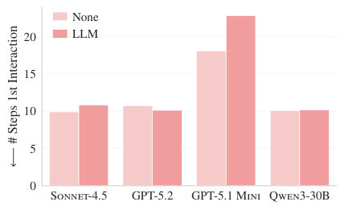


**----- Start of picture text -----**<br>
None<br>20 LLM<br>15<br>10<br>5<br>0<br>Sonnet-4.5 GPT-5.2 GPT-5.1 Mini Qwen3-30B<br># Steps 1st Interaction<br>←−<br>**----- End of picture text -----**<br>


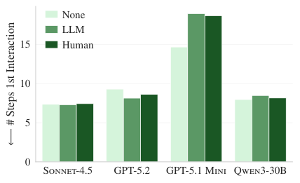


**----- Start of picture text -----**<br>
None<br>LLM<br>15 Human<br>10<br>5<br>0<br>Sonnet-4.5 GPT-5.2 GPT-5.1 Mini Qwen3-30B<br># Steps 1st Interaction<br>←−<br>**----- End of picture text -----**<br>


_Figure 4._ Number of steps before the first interaction between the agent and a file included in the PR patch (lower is better) is generally lower without context files than with LLM-generated context files or with developer-written context files (Human) on SWE-BENCH LITE (left) and AGENTBENCH (right).

**Human context files increase cost and performance** We observe that the developer-provided context files outperform the LLM-generated ones for all four agents, despite not being agent-specific, and improve the performance compared to no context files for all agents but CLAUDE CODE (see Figure 3 right). However, developerprovided context files also increase the average number of steps and costs required to solve the task, on average by 3 _._ 34 steps and at most 19%, respectively.

**Context files do not provide effective overviews** One recommendation for context files is to include a codebase overview (AGENTS.md, 2025). Across the 12 developerprovided context files in AGENTBENCH, 8 include a dedicated codebase overview, with 4 explicitly enumerating and describing the directories and subdirectories in the repository. Similarly, both the CODEX and QWEN CODE context file generation prompts explicitly instruct the agent to include an overview section, while the CLAUDE CODE prompt advocates for a high-level overview only and warns against listing components that are easily discoverable. We use GPT-OSS-120B to assess which of the LLMgenerated context files contain codebase overviews. Surprisingly, 100% of SONNET-4.5-generated context files are flagged for overviews, and 95% and 99% for QWEN3-30BCODER and GPT-5.2 respectively. Only GPT-5.1 MINI has significantly fewer overviews (36%).

To assess the usefulness of these overviews, we measure how quickly agents discover files relevant to the described issue _I_ . Concretely, we measure the average number of steps before the coding agent interacts with any file modified in the original PR patch _X[∗]_ . We exclude the 3% of instances in which the agent never interacts with any file modified in _X[∗]_ . Both on SWE-BENCH LITE and AGENTBENCH the presence of context files does not meaningfully reduce this metric, as shown in Figure 4.

While context files appear to increase the number of required steps significantly for GPT-5.1 MINI, we observe


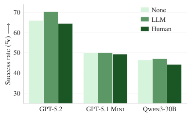


**----- Start of picture text -----**<br>
70 None<br>LLM<br>Human<br>60<br>50<br>40<br>30<br>GPT-5.2 GPT-5.1 Mini Qwen3-30B<br> −→<br>Success rate (%)<br>**----- End of picture text -----**<br>


_Figure 5._ When removing all documentation-related files from the codebase, LLM-generated context files tend to outperform developer-provided (Human) ones on AGENTBENCH .

in manual trace inspection that this increase is due to it (i) issuing multiple commands to find the context files and (ii) reading them (multiple times) despite them being already included in the agent’s context. Interestingly, we only observed this behavior if context files were present at all. We conclude that context files, even developer-provided ones, are not effective at providing a repository overview.

**Context files are redundant documentation** Our hypothesis is that LLM-generated context files are highly redundant with existing documentation, while developerprovided context files add additional information. To confirm this, we manually remove all documentation (files ending with `.md` , example code, and the folder `docs/` ) after generating the context file, and before evaluating the coding agents. We show the results in Figure 5, excluding CLAUDE CODE due to its hight cost. In this setting, where context files are the only source of documentation available, LLM-generated context files not only consistently improve performance by 2 _._ 7% on average, but also outperform developer-written documentation. This may explain anecdotal evidence reporting that coding agents perform better after adding context files (Sewell, 2025), since many less popular repositories contain little to no documentation.

**Evaluating AGENTS.md: Are Repository-Level Context Files Helpful for Coding Agents?**


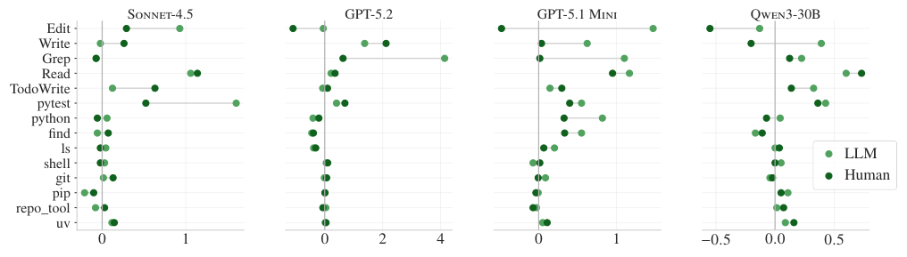


**----- Start of picture text -----**<br>
Sonnet-4.5 GPT-5.2 GPT-5.1 Mini Qwen3-30B<br>Edit<br>Write<br>Grep<br>Read<br>TodoWrite<br>pytest<br>python<br>find<br>ls LLM<br>shell<br>git Hum an<br>pip<br>repo_tool<br>uv<br>0 1 0 2 4 0 1 −0 . 5 0 . 0 0 . 5<br>**----- End of picture text -----**<br>


_Figure 6._ Increase in average tool use when including LLM-generated (bright green) or developer-provided (dark green) context files, compared to the average tool use without context files. For tool names, we map CODEX and QWEN CODE tools to the CLAUDE CODE equivalents (we detail the mapping in §A).

## **4.3. Trace analysis**

We now analyze the impact of context files on agent behavior in more detail by analysing the frequency of agent tool calls and length of reasoning traces. We describe our setup in more detail in §B.2.

**Context files lead to more testing and exploration** In

Figure 6, we show the increase in average tool use when including LLM-generated (bright green) or developerprovided (dark green) context files. Negative values imply a decrease in tool use. We find that, across all models, when context files are present, the coding agents run more tests. They also tend to navigate the repository more: they search more files ( `grep` ), read more files, and write more files. Lastly, adding context files causes agents to use more repository-specific tooling (e.g., `uv` and `repo[_] tool` ). In Figure 10 (§A), we perform a similar analysis using the intent of the tool call, leading to the same conclusion.

**Instructions in context files are typically followed** We find that agents generally follow instructions present in the context files. For instance, `uv` is used 1.6 times per instance on average when mentioned in the context files, compared to fewer than 0.01 times when it is not mentioned, and repository-specific tools are used 2.5 times per instance on average when mentioned, compared to fewer than 0.05 times when they are not mentioned. This effect is observable across almost all measured tools displayed in Figure 6, as we show in a more in-depth analysis in §A. In particular, this result implies that the absence of improvements with context files is not due to a lack of instruction-following.

**Following context files requires more thinking** We hypothesize that these additional instructions make the task harder. To confirm this, we analyze the average number of reasoning tokens used by GPT-5.2 and GPT-5.1 MINI, as their adaptive reasoning (OpenAI, 2025b) allows them to


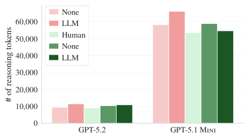


**----- Start of picture text -----**<br>
None<br>60,000 LLM<br>Human<br>50,000<br>None<br>40,000 LLM<br>30,000<br>20,000<br>10,000<br>0<br>GPT-5.2 GPT-5.1 Mini<br># of reasoning tokens<br>**----- End of picture text -----**<br>


_Figure 7._ Number of reasoning tokens spent on average by GPT-5.2 and GPT-5.1 MINI, without context files, with LLMgenerated context files, and with developer-written context files, on SWE-BENCH LITE (left) and AGENTBENCH (right).

use more reasoning tokens for tasks that they deem harder. In Figure 7, we show that LLM-generated context files indeed increase the average number of reasoning tokens by 22% for GPT-5.2 and 14% for GPT-5.1 MINI on SWEBENCH LITE (respectively 14% and 10% on AGENTBENCH), and that developer-written context files increase the number of reasoning tokens by 20% and 2% for GPT5.2 and GPT-5.1 MINI, respectively.

## **4.4. Ablations**

In this Section we analyze differences between the context files generated by different models, and the impact of the prompt used to create the context files.

**Stronger models don’t generate better context files** We compare context files generated with GPT-5.2 + CODEX to those created by our standard agents in Figure 8. This improves performance on SWE-BENCH LITE across all models (2% on average), but degrades performance on AGENTBENCH across all models (3% on average). We

**Evaluating AGENTS.md: Are Repository-Level Context Files Helpful for Coding Agents?**


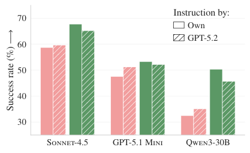


**----- Start of picture text -----**<br>
Instruction by:<br>70<br>Own<br>GPT-5.2<br>60<br>50<br>40<br>30<br>Sonnet-4.5 GPT-5.1 Mini Qwen3-30B<br> −→<br>Success rate (%)<br>**----- End of picture text -----**<br>


_Figure 8._ On SWE-BENCH LITE , performance is improved with context files generated by GPT-5.2 compared to using the model underlying the agent, while on AGENTBENCH performance is degraded.


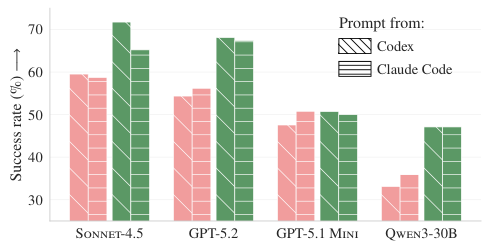


**----- Start of picture text -----**<br>
70 Prompt from:<br>Codex<br>60 Claude Code<br>50<br>40<br>30<br>Sonnet-4.5 GPT-5.2 GPT-5.1 Mini Qwen3-30B<br> −→<br>Success rate (%)<br>**----- End of picture text -----**<br>


_Figure 9._ When generating context files using the prompt from CODEX or from CLAUDE CODE on SWE-BENCH LITE and AGENTBENCH , there is no consistent impact on success rate.

thus conclude that stronger models do not necessarily generate superior context files.

**No difference between the specific prompts** We compare context files generated using the prompt of CODEX and CLAUDE CODE across all agents and models in Figure 9. Surprisingly, CLAUDE CODE performs better with context files generated using the CODEX prompt, while both GPT-5.2 and GPT-5.1 MINI perform better on SWE-BENCH LITE with the CODEX prompt but worse on AGENTBENCH. Overall, neither the prompt matching the underlying model and agent, nor a specific prompt performs consistently best, indicating that sensitivity to different (good) prompts is generally small.

## **5. Limitations and Future Work**

While our work addresses important shortcomings in the literature, exciting opportunities for future research remain.

knowledge about tooling, dependencies, and other repository specifics might be present in the models’ parametric knowledge, nullifying the effect of context files. Future work may investigate the effect of context files on more niche programming languages and toolchains that are less represented in the training data, and known to be more difficult for LLMs (Cassano et al., 2022; Orlanski et al., 2023).

**Context files beyond task resolution** In this work, we evaluate the impact of context files on task resolution rate. However, there are many other relevant aspects of coding agents, such as code efficiency (He et al., 2025) and security (Chen et al., 2025), that we believe could be explored in future work. Specifically, for security, prior work found that prompting LLMs to generate secure code significantly improves the security of generated code (Vero et al., 2025).

**Improving context file generation** Another interesting avenue opened by this work is how to improve the automatic generation of _useful_ context files. Here, human developers appear to dominate per our evaluation. Several related works in the direction of planning and continuous learning from prior tasks may be applicable for this task (Suzgun et al., 2025; Zhang et al., 2025b; Cheng et al., 2025). By tackling this challenge, future agents could gain a long-term capability at meaningful self-improvement.

## **6. Conclusion**

We present an extensive evaluation of the impact of context files on coding agent performance for four common coding agents on SWE-BENCH LITE and AGENTBENCH. The latter is a new benchmark we built from recent GitHub issues and less popular repositories containing developerwritten context files. We find that all context files consistently increase the number of steps required to complete tasks. LLM-generated context files have a marginal negative effect on task success rates, while developer-written ones provide a marginal performance gain.

Our trace analyses show that instructions in context files are generally followed and lead to more testing and a broader exploration, however they do not function as effective repository overviews. Overall, our results suggest that context files have only marginal effect on agent behavior, and are likely only desirable when manually written. This highlights a concrete gap between current agent-developer recommendations and observed outcomes, and motivates future work on principled ways to automatically generate concise, task-relevant guidance for coding agents.

**Niche programming languages** The current evaluation is focused heavily on Python. Since this is a language that is widely represented in the training data, much detailed

**Evaluating AGENTS.md: Are Repository-Level Context Files Helpful for Coding Agents?**

## **References**

- AGENTS.md. AGENTS.md - A simple, open format for guiding coding agents, 2025. URL `https://agents.m d/` .

- Aider. AI pair programming in your terminal, 2024. URL `https://aider.chat` .

- Anthropic. Claude Code overview, 2025a. URL `https: //code.claude.com/docs/en/overview` .

- Anthropic. Using CLAUDE.md files: Customizing Claude Code for your codebase, 2025b. URL `https://claude .com/blog/using-claude-md-files` .

- Anthropic. Claude Sonnet 4.5, 2025. URL `https://www. anthropic.com/news/claude-sonnet-4-5` .

- Badertdinov, I., Golubev, A., Nekrashevich, M., Shevtsov, A., Karasik, S., Andriushchenko, A., Trofimova, M., Litvintseva, D., and Yangel, B. SWE-rebench: An Automated Pipeline for Task Collection and Decontaminated Evaluation of Software Engineering Agents. _arXiv preprint_ , 2025. URL `https://arxiv.org/abs/2505.2 0411` .

- Boyina, G. Why I Created AGENTS.md: A Simple Solution to a Growing Problem, 2025. URL `https: //thegowtham.medium.com/why-i-created-agent s-md-a-simple-solution-to-a-growing-problem-3 afc1f6211f7` .

- Cassano, F., Gouwar, J., Nguyen, D., Nguyen, S., PhippsCostin, L., Pinckney, D., Yee, M.-H., Zi, Y., Anderson, C. J., Feldman, M. Q., et al. MultiPL-E: A Scalable and Extensible Approach to Benchmarking Neural Code Generation. _arXiv preprint_ , 2022. URL `https://arxi v.org/abs/2208.08227` .

- Chatlatanagulchai, W., Li, H., Kashiwa, Y., Reid, B., Thonglek, K., Leelaprute, P., Rungsawang, A., Manaskasemsak, B., Adams, B., Hassan, A. E., et al. Agent READMEs: An Empirical Study of Context Files for Agentic Coding. _arXiv preprint_ , 2025. URL `https: //arxiv.org/abs/2511.12884` .

- Chen, J., Huang, H., Lyu, Y., An, J., Shi, J., Yang, C., Zhang, T., Tian, H., Li, Y., Li, Z., et al. SecureAgentBench: Benchmarking Secure Code Generation under Realistic Vulnerability Scenarios. _arXiv preprint_ , 2025. URL `https://arxiv.org/abs/2509.22097` .

- Cheng, Y., Wang, Z., Ma, W., Zhu, W., Deng, Y., and Zhao, J. EvoCurr: Self-evolving Curriculum with Behavior Code Generation for Complex Decision-making. _arXiv preprint_ , 2025. URL `https://arxiv.org/abs/2508.0 9586` .

- Du, Y., Cai, Y., Zhou, Y., Wang, C., Qian, Y., Pang, X., Liu, Q., Hu, Y., and Chen, S. SWE-Dev: Evaluating and Training Autonomous Feature-Driven Software Development. _arXiv preprint_ , 2025. URL `https: //arxiv.org/abs/2505.16975` .

- Google. google-gemini/gemini-cli: An open-source AI agent that brings the power of Gemini directly into your terminal, 2025. URL `https://github.com/google-g emini/gemini-cli` .

- He, X., Liu, Q., Du, M., Yan, L., Fan, Z., Huang, Y., Yuan, Z., and Ma, Z. SWE-Perf: Can Language Models Optimize Code Performance on Real-World Repositories? _arXiv preprint_ , 2025. URL `https://arxiv.org/abs/ 2507.12415` .

- Jimenez, C. E., Yang, J., Wettig, A., Yao, S., Pei, K., Press, O., and Narasimhan, K. R. SWE-bench: Can Language Models Resolve Real-world Github Issues? In _ICLR_ , 2024. URL `https://openreview.net/forum?id=VTF8 yNQM66` .

- Kwon, W., Li, Z., Zhuang, S., Sheng, Y., Zheng, L., Yu, C. H., Gonzalez, J. E., Zhang, H., and Stoica, I. Efficient Memory Management for Large Language Model Serving with PagedAttention. In _Proceedings of the ACM SIGOPS 29th Symposium on Operating Systems Principles_ , 2023.

- Li, W., Zhang, X., Guo, Z., Mao, S., Luo, W., Peng, G., Huang, Y., Wang, H., and Li, S. FEA-Bench: A Benchmark for Evaluating Repository-Level Code Generation for Feature Implementation. In _ACL_ , 2025. URL `https://aclanthology.org/2025.acl-long.839/` .

- Liang, S., Hu, Y., Jiang, N., and Tan, L. Can Language Models Replace Programmers for Coding? REPOCOD Says ’Not Yet’. _arXiv preprint_ , 2024. URL `https: //arxiv.org/abs/2410.21647` .

- Lieret, K., Jimenez, C. E., Yang, J., Wettig, A., Yao, S., Pei, K., Press, O., and Narasimhan, K. R. SWE-bench Bash Only, 2025. URL `https://www.swebench.com/bash-o nly.html` .

- Mohsenimofidi, S., Galster, M., Treude, C., and Baltes, S. Context Engineering for AI Agents in Open-Source Software. _arXiv preprint_ , 2025. URL `https://arxiv.org/ abs/2510.21413` .

- Mündler, N., Müller, M. N., He, J., and Vechev, M. T. SWT-Bench: Testing and Validating Real-World BugFixes with Code Agents. In _NeurIPS_ , 2024. URL `http://papers.nips.cc/paper[_] files/paper/202 4/hash/94f093b41fc2666376fb1f667fe282f3-Abstr act-Conference.html` .

**Evaluating AGENTS.md: Are Repository-Level Context Files Helpful for Coding Agents?**

- Nigh, M. How to write a great agents.md: Lessons from over 2,500 repositories, 2025. URL `https://github.b log/ai-and-ml/github-copilot/how-to-write-a-g reat-agents-md-lessons-from-over-2500-reposit ories/` .

- OpenAI. OpenAI co-founds the Agentic AI Foundation under the Linux Foundation, 2025a. URL `https://op enai.com/index/agentic-ai-foundation/` .

- OpenAI. GPT-5.1: A smarter, more conversational ChatGPT, 2025b. URL `https://openai.com/index/gpt-5 -1/` .

- OpenAI. openai/codex: Lightweight coding agent that runs in your terminal, 2025c. URL `https://github.com/o penai/codex` .

- Orlanski, G., Xiao, K., Garcia, X., Hui, J., Howland, J., Malmaud, J., Austin, J., Singh, R., and Catasta, M. Measuring the Impact of Programming Language Distribution. In _ICML_ , 2023. URL `https://proceedings.mlr. press/v202/orlanski23a.html` .

- QwenLM. QwenLM/Qwen3-Coder: Qwen3-Coder is the code version of Qwen3, the large language model series developed by Qwen team, Alibaba Cloud, 2025. URL `https://github.com/QwenLM/Qwen3-Coder` .

- Sarkar, S. K. Ai agents, productivity, and higher-order thinking: Early evidence from software development. _Available at SSRN 5713646_ , 2025.

   - Vergopoulos, K., Müller, M. N., and Vechev, M. Automated Benchmark Generation for Repository-Level Coding Tasks. _arXiv preprint_ , 2025. URL `https: //arxiv.org/abs/2503.07701` .

   - Vero, M., Mündler, N., Chibotaru, V., Raychev, V., Baader, M., Jovanovic, N., He, J., and Vechev, M. T. BaxBench: Can LLMs Generate Correct and Secure Backends? In _ICML_ , 2025.

   - Wang, X., Li, B., Song, Y., Xu, F. F., Tang, X., Zhuge, M., Pan, J., Song, Y., Li, B., Singh, J., et al. OpenHands: An Open Platform for AI Software Developers as Generalist Agents. In _ICLR_ , 2025. URL `https://openreview.n et/forum?id=OJd3ayDDoF` .

   - Yang, J., Jimenez, C. E., Wettig, A., Lieret, K., Yao, S., Narasimhan, K., and Press, O. SWE-agent: AgentComputer Interfaces Enable Automated Software Engineering. In _NeurIPS_ , 2024. URL `http://papers.nips. cc/paper[_] files/paper/2024/hash/5a7c947568c1b13 28ccc5230172e1e7c-Abstract-Conference.html` .

   - Zhang, L., He, S., Zhang, C., Kang, Y., Li, B., Xie, C., Wang, J., Wang, M., Huang, Y., Fu, S., et al. SWEbench Goes Live! _arXiv preprint_ , 2025a. URL `https: //arxiv.org/abs/2505.23419` .

   - Zhang, Q., Hu, C., Upasani, S., Ma, B., Hong, F., Kamanuru, V., Rainton, J., Wu, C., Ji, M., Li, H., et al. Agentic Context Engineering: Evolving Contexts for SelfImproving Language Models. _arXiv preprint_ , 2025b. URL `https://arxiv.org/abs/2510.04618` .

- Sawers, P. The Rise of Agents.md, an Open Standard and Single Source of Truth for AI Coding Agents, 2025. URL `https://tessl.io/blog/the-rise-of-agent s-md-an-open-standard-and-single-source-of-t ruth-for-ai-coding-agents/` .

- Sewell, S. Improve your AI code output with AGENTS.md (+ my best tips), 2025. URL `https://www.builder.io /blog/agents-md` .

- Singh, A., Fry, A., Perelman, A., Tart, A., Ganesh, A., ElKishky, A., McLaughlin, A., Low, A., Ostrow, A., Ananthram, A., et al. OpenAI GPT-5 System Card. _arXiv preprint_ , 2026. URL `https://arxiv.org/abs/2601.0 3267` .

- Suzgun, M., Yuksekgonul, M., Bianchi, F., Jurafsky, D., and Zou, J. Dynamic Cheatsheet: Test-Time Learning with Adaptive Memory. _arXiv preprint_ , 2025. URL `ht tps://arxiv.org/abs/2504.07952` .

- Team, Q. Qwen3 Technical Report. _arXiv preprint_ , 2025. URL `https://arxiv.org/abs/2505.09388` .

**Evaluating AGENTS.md: Are Repository-Level Context Files Helpful for Coding Agents?**

## **A. Experimental Details**

In this section, we provide additional details about our experiments from §4.

## **A.1. Additional Experimental Details**

We now describe the remaining experimental details for the experiments in §4.2.

**Coding environment** For AGENTBENCH instances, we run the coding agent in a Docker container with basic tooling (python, apt-get, uv, ...) and Internet access. Importantly, we remove the git commit history and all remotes. For SWEBENCH LITE, we use the Docker images provided by Jimenez et al. (2024). We let the coding agents access the web (either via dedicated tools or through the command line) and manually checked that the agents do not cheat (e.g., looking at the PR corresponding to the instance description). We find no such case of cheating, and web access represents a minority of the tool calls (less than 1%). For CLAUDE CODE, we keep the Task tool enabled: it allows SONNET-4.5 to invoke sub-agents, using HAIKU-4.5, to solve sub-tasks. For instance, a sub-task can be exploring the repository to find specific files.

## **A.2. Trace Analysis**

Here, we detail the experiments from §4.3. In particular, we give the mapping used to aggregate tool names across coding agents, analyze the correlation between the number of tool uses and whether the tool is mentioned in the context files, and expand the trace analysis to the intent behind tool calls.

**Experimental setup** We recall the experimental setup from §4.3. Given a list of tool calls from an agent, we analyze the frequency of each tool call. For tools included in the agentic framework (e.g., Read, Write, or TodoWrite), we record the name of the tool being called. For shell commands, we use an LLM to extract (from the command and its output) the concrete command that was executed (e.g., `uv` , `pytest` , `cat` ) and to categorize the intent of the tool call (e.g., install dependencies, run tests, read files). We build the categories iteratively. We start with an empty set of categories, and for each shell command, we ask the LLM to assign it to an existing category if possible and otherwise create a new category. As the LLM, we use GPT-OSS-120B, and the prompt is given in §B.2. Finally, we manually merge duplicate and closely adjacent categories.

_Table 3._ Equivalence classes used to group the different tool calls.

**Refining the tool names** For Figure 6, we further manually refined the tool names for readability. In particular, in Table 3, we map tool names from other agents, namely CODEX and QWEN CODE, as well as some CLI tools, to CLAUDE CODE tooling. Lastly, for repository-specific tooling (e.g., `pdm` , `ansible` , or `opshin` ), we grouped them into the `repo[_] tool` category.

||CLAUDECODEtool|CODEX|QWENCODE|
|---|---|---|---|
||Edit<br>Write<br>Grep<br>Read<br>TodoWrite|`sed`<br>`apply_patch`<br>`grep`, `rg`<br>`cat`<br>`update_plan`|`sed`, `edit`<br>`write_file`<br>`grep`<br>`cat`, `read_file`, `search_file_content`<br>`todo_write`|


**Correlation between the number of tool calls and context files** In Figure 11, we show the average number of tool calls depending on whether the tool name is mentioned in the context file. We find that, if a tool name is mentioned in the context files, this increases its usage by the coding agents. For instance, `uv` , `pytest` , or repository-specific tools ( `repo[_] tool` ) are used almost exclusively if they are mentioned in the context file. This means that instructions in the context files are followed, and that a lack of instruction-following capabilities does not explain why we observe, in §4.2, no gain in accuracy when using context files.

**Analyzing intents of tool calls** For the tool intents extracted by the LLM (334 different categories in total), we further aggregate them into the following 10 categories:

- **git** : Repository and version-control operations (e.g., commits, branches, diffs, checkout, stash, status).

- **model** : Model lifecycle tasks such as downloading or loading models, inspecting configurations or parameters, and running inference.

- **env_deps** : Python environment and dependency management (virtualenv or venv, installations, versions, lockfiles).

**Evaluating AGENTS.md: Are Repository-Level Context Files Helpful for Coding Agents?**


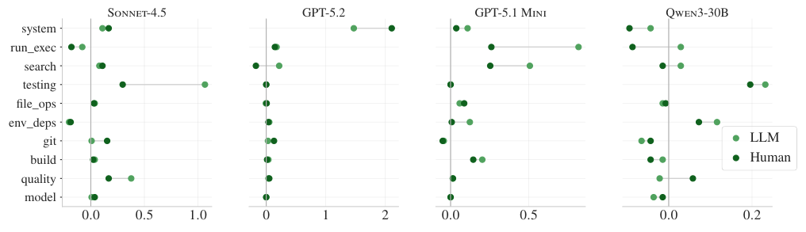


**----- Start of picture text -----**<br>
Sonnet-4.5 GPT-5.2 GPT-5.1 Mini Qwen3-30B<br>system<br>run_exec<br>search<br>testing<br>file_ops<br>env_deps<br>git LLM<br>build Hum an<br>quality<br>model<br>0 . 0 0 . 5 1 . 0 0 1 2 0 . 0 0 . 5 0 . 0 0 . 2<br>**----- End of picture text -----**<br>


_Figure 10._ Increase in the average tool use (grouped into high-level categories) when including LLM-generated (bright green) or developer-provided (dark green) context files, compared to the average tool use without context files. For the high-level categories, we use an LLM to categorize the various tool calls.


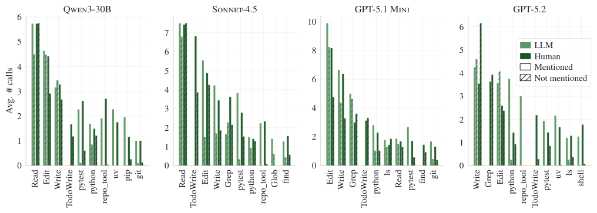


**----- Start of picture text -----**<br>
Qwen3-30B Sonnet-4.5 GPT-5.1 Mini GPT-5.2<br>6<br>10<br>6<br>7<br>5 LLM<br>6 8 5<br>Human<br>4 Mentioned<br>5 4<br>6 Not mentioned<br>3 4<br>3<br>3 4<br>2 2<br>2<br>2<br>1 1<br>1<br>0 0 0 0<br># calls<br>Avg.<br>Read Edit Write TodoWrite pytest python repo_tool uv pip git Read TodoWrite Edit Write Grep pytest python repo_tool Glob find Edit Write Grep TodoWrite python ls Read pytestfind git Write Grep Edit python repo_tool TodoWrite pytest uv ls shell<br>**----- End of picture text -----**<br>


_Figure 11._ Average number of tool calls depending on whether the tool name is mentioned in the context files. For tool names, we use the equivalence classes from Table 3, and consider a tool to be mentioned in the context file if any tool from the corresponding equivalence class is mentioned in the context file.

- **build** : Building, compiling, or packaging code and producing artifacts or distribution packages.

- **quality** : Code quality and correctness checks (linting, formatting, type checking, validation or verification, schema checks).

- **testing** : Running and reviewing tests (unit, integration, regression, sanity, pytest) and test results.

- **run_exec** : Executing workflows and scripts or commands (Python, shell, Django), including reproduction and debugging runs.

- **search** : Discovery and inspection actions (search, find, grep, glob, list, view, show, display, inspect, parse).

- **file_ops** : Direct file and filesystem operations (read, write, edit, copy, move, delete, create, permissions, paths).

- **system** : System and miscellaneous utilities (processes, disk usage, environment variables, HTTP checks, checksums, tool or device information, help).

In Figure 10, we show the difference in frequency of these categories with and without context files. The conclusion is similar to that of §4.3: the presence of context files significantly increases the number of tests run by coding agents, as well as the extent of codebase exploration and code quality checks.

**Evaluating AGENTS.md: Are Repository-Level Context Files Helpful for Coding Agents?**


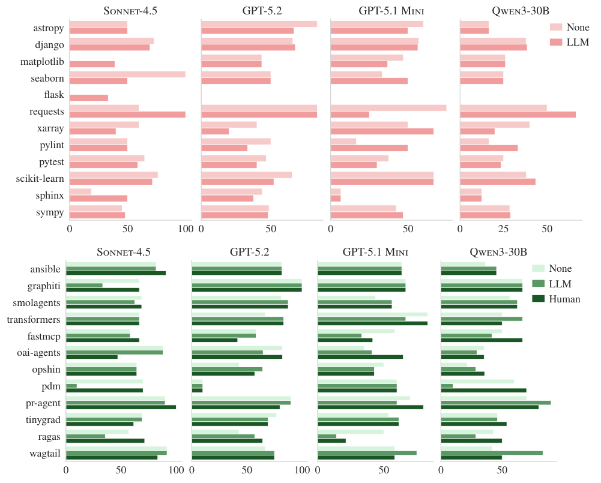


**----- Start of picture text -----**<br>
Sonnet-4.5 GPT-5.2 GPT-5.1 Mini Qwen3-30B<br>astropy None<br>django LLM<br>matplotlib<br>seaborn<br>flask<br>requests<br>xarray<br>pylint<br>pytest<br>scikit-learn<br>sphinx<br>sympy<br>0 50 100 0 50 0 50 0 25 50<br>Sonnet-4.5 GPT-5.2 GPT-5.1 Mini Qwen3-30B<br>ansible None<br>graphiti LLM<br>smolagents Human<br>transformers<br>fastmcp<br>oai-agents<br>opshin<br>pdm<br>pr-agent<br>tinygrad<br>ragas<br>wagtail<br>0 50 100 0 50 100 0 50 0 50<br>**----- End of picture text -----**<br>


_Figure 12._ Resolution rate grouped by repository for four different models: without context files, with LLM-generated context files, and with developer-written context files on SWE-BENCH LITE (top) and AGENTBENCH (bottom). For SWE-BENCH LITE in particular, the majority of instances come from the same repository ( `django` ), making per-repository estimates of the success rate noisy.

## **A.3. Per-repository Success Rate**

In Figure 12, we show the success rate of the different scenarios (NONE, LLM, and HUMAN) grouped by repository. For both SWE-BENCH LITE and AGENTBENCH, there is no single repository where the presence of context files has a significant impact. Nonetheless, for AGENTBENCH in particular, we see that the difficulty across instances is relatively balanced, validating our approach to building the instances.

## **B. Prompts**

In this section, we detail all prompts used throughout this work.

## **B.1. AGENTBENCH instances generation**

We detail below the prompts used for filtering pull requests, setting up the instances, describing the instances, and generating the test cases.

**Evaluating AGENTS.md: Are Repository-Level Context Files Helpful for Coding Agents?**

## **Filtering pull requests**

You are evaluating pull request `{pr[_] number}` for suitability as a regression-test task in SWE-bench style datasets. Decide whether the PR primarily introduces deterministic, testable behaviour. Such behaviors typically include bug fixes, but can also include feature additions as long as it is possible to write a precise specification that allows testing the new feature independently of the implementation.

**Repository:** `{repo[_] full[_] name}` **Title:** `{title}` **Author:** `{author}` **Merged at:** `{merged[_] at}`

## **PR description**

```
{body}
```

## **Diff excerpt**

```
{excerpt}
```

## **Deliverables**

1. Do **not** modify existing project code.

2. Create the JSON file `{decision[_] path}` with UTF-8 encoded content describing your decision using this schema:

1 `{` 2 `"pr[_] number": <` **`int`** `>,` 3 `"suitable": <` **`bool`** `>,` 4 `"needs[_] manual[_] review": <` **`bool`** `>,` 5 `"decision": "include" | "exclude" | "manual[_] review",` 6 `"rationale": "<short explanation>",` 7 `"key[_] files": ["relative/file.py", "..."],` 8 `"risk[_] factors": ["<short string>", "..."]` 9 `}`

   - Set `"decision"` to `"include"` only when you are confident the PR is a self-contained bug fix that can be validated via regression tests.

   - Use `"manual[_] review"` if you are uncertain.

3. Stage the JSON file and finish. Do not stage anything else.

## **Setting up the instance**

Your goal is to help developers set up their environment to run code in the repository and be able to run the current tests. You should write a list of all commands needed to (i) set up the environment from scratch, and (ii) run the existing tests. You need to make sure that the commands you provide actually work for you. The setup is considered valid if most of the tests are passing after running **exactly** your setup commands and the test commands you provide.

## **Test runner requirement**

To run the repository tests, create a file at the root of the repository called `run[_] tests.py` that:

- executes all tests,

- parses the test output,

**Evaluating AGENTS.md: Are Repository-Level Context Files Helpful for Coding Agents?**

- writes a JSON file at the repository root named `test[_] results.json` with schema:

1 `{"test[_] name": <` **`bool`** `>, ...}`

where each `test[_] name` is the name of a test and the boolean indicates whether the test passed ( `true` ) or failed ( `false` ).

## **Deliverables**

1. Create the JSON file `{decision[_] path}` with UTF-8 encoded content explaining the steps to set up the environment and run the tests (using the `run[_] tests.py` script you created):

1 `{` 2 `"setup[_] commands": ["<command1>", "<command2>", "..."],` 3 `"test[_] commands": ["<command1>", "<command2>", "..."]` 4 `}`

2. Create the script `run[_] tests.py` at the root of the repository.

3. Stage the JSON file and the script and finish. Do not stage anything else.

```
{example[_]files[_]section}
```

## **Describing the instance**

You are given a pull request (PR) and the related issues for a given GitHub repository. Your goal is to format this information into a clear GitHub Issue following the template below.

- For the **Steps to Reproduce** field, only write the steps you actually took to reproduce the issue in your specific environment. Make those steps **reproducible and minimal** .

- Developers should be able to implement a solution similar to the one provided in the PR, but the Issue should **not leak the solution** .

- Save your output in Markdown format in the file `{metadata[_] relpath}` .

## **Feature requests: Specification required**

Additionally, for issues about **adding a new feature** (rather than fixing a bug), include a **precise Specification** describing the desired behavior. It must be detailed enough to allow independent testing without relying on implementation details from the PR.

- Specify inputs (types, valid ranges, edge cases), outputs, side effects, and any required error handling.

- If the PR includes human-readable outputs (logs, UI text, error messages, ...), include them in the specification and state that fixes must use **exactly** those messages.

## **Issue template (copy into your Markdown output)**

**Evaluating AGENTS.md: Are Repository-Level Context Files Helpful for Coding Agents?**

1 **`#`** `## Description` 2 `(Provide a clear` **`and`** `concise description of the problem.)` 3 4 **`#`** `## Steps to Reproduce` 5 `1. [Step 1]` 6 `2. [Step 2]` 7 `3. ...` 8 9 **`#`** `## Expected Behavior (` **`if`** `applicable)` 10 `(Explain what you expected to happen.)` 11 12 **`#`** `## Actual Behavior (` **`if`** `applicable)` 13 `(Explain what actually happened.)` 14 15 **`#`** `## Specification (` **`if`** `applicable)`

16 `(Provide a precise specification of the desired behavior.)` 17

18 **`#`** `## Additional Information` 19 `(Add screenshots, logs,` **`or`** `other helpful details.)`

**Data for PR #** `{pr[_] number}` **in repository** `{repo}` **at commit** `{commit[_] sha}`

## **PR description**

```
{pr[_]description}
```

## **Referenced issues mentioned in the PR**

```
{referenced[_]issues[_]text}
```

## **PR patch**

```
{pr[_]patch}
```

## **PR test (if any)**

```
{pr[_]test[_]patch}
```

## **Key files identified during triage**

```
{key[_]files[_]text}
```

## **Generating the test cases**

You are generating regression tests for pull request `{pr[_] number}` in `{repo}` . The current checkout is the base (pre-fix) commit `{commit[_] sha}` .

## **Problem description**

```
{problem[_]description}
```

## **PR patch**

```
{pr[_]patch}
```

## **PR test (if any)**

```
{pr[_]test[_]patch}
```

## **Requirements**

1. Focus on **deterministic** tests that expose the bug fixed by this PR. Tests should target **expected behavior** and must **not** rely on internal implementation details (variables, hidden helpers, etc.). They should fail on the base

**Evaluating AGENTS.md: Are Repository-Level Context Files Helpful for Coding Agents?**

commit and pass on the merge commit (after applying the PR patch). You must verify this property. You may apply the provided patch using `git apply` . If a specification is provided in the problem description, tests must **exactly** align with it. Avoid tests that depend on incidental choices (variable names, function names, strings, . . . ) unless explicitly required by the specification.

2. Create `run[_] pr[_] tests.py` at the repository root that executes _only_ the tests you created, parses test output, and writes JSON results to `pr[_] test[_] results.json` with schema:

1 `{"test[_] name": <` **`bool`** `>, ...}`

You may use `run[_] tests.py` as a reference. Note: your script should only run the tests you created for this PR.

3. Ensure new tests match the project’s existing test style and conventions. First review existing tests to understand structure and framework. You may reuse tests from the PR if appropriate.

4. All new tests must be in **new files** created as part of this work. Do **not** modify any existing test files.

5. For `test[_] commands` , include any necessary steps (sourcing environments, setting variables, etc.) so tests run correctly in a fresh shell.

## **Deliverables**

1. Create the new test files with your proposed tests.

2. Create the JSON file `{metadata[_] relpath}` with UTF-8 content explaining how to run the tests:

1 `{` 2 `"test[_] commands": ["<command1>", "<command2>", "..."], # Commands to run the PR tests with ` run[_] pr[_] tests.py`` 3 `"test[_] files": ["path/to/test[_] file1", "path/to/test[_] file2", "..."]` 4 `}`

3. Create the script `run[_] pr[_] tests.py` at the root of the repository.

4. Stage the JSON file and the script and finish. Do not stage anything else.

## **B.2. Analyzing Traces of Coding Agents**

To analyze the tool calls made by the coding agents, we use GPT-OSS-120Bwith the prompt below.

## **Analyzing coding agent traces**

You are labeling a tool call with a single intent category.

- **Goal:** choose a category name that is:

- **Right-sized granularity:** more specific than “execute command” but not tied to exact arguments.

- **Reusable:** should apply to many future tool calls.

- **Clean:** do **not** include file paths, flags, quoted strings, IDs, repo names, or counts.

- **Format:** 2–5 words, lowercase, verb + object (e.g., `run tests` , `search codebase` ). Avoid too-generic names like `run scripts` ; specify what the script does (e.g., `compile code` ).

**Evaluating AGENTS.md: Are Repository-Level Context Files Helpful for Coding Agents?**

You must also explain which tool is being used (e.g., `pytest` , `rg` , ...) in a dedicated field.

## **You will be given**

- **tool_call:** the command or structured tool invocation

- **tool_output:** optional output text

**Existing categories (use one if it fits):** `{existing[_] tool[_] names}`

## **Decision rules**

1. If one existing category fits, use it **exactly** .

2. If none fit, create **one** new category that:

   - is **not** tool-specific (avoid `pytest` , `kubectl` , `terraform` , etc.)

   - would likely match **5+** future tool calls

3. If the tool call does multiple things, pick the **primary intent** as the category (mention secondary intents in reasoning).

## **Return JSON only**

1 `{` 2 `"tool[_] name": "<category>",` 3 `"tool[_] used": "<specific tool or executable being invoked>",` 4 `"reasoning": "<1-3 sentences: why this is the primary intent; include key clues from call/ output; mention secondary intents if any>"` 5 `}` **Tool call** `{tool[_] call}` **Tool output (if any)** `{tool[_] output}`
